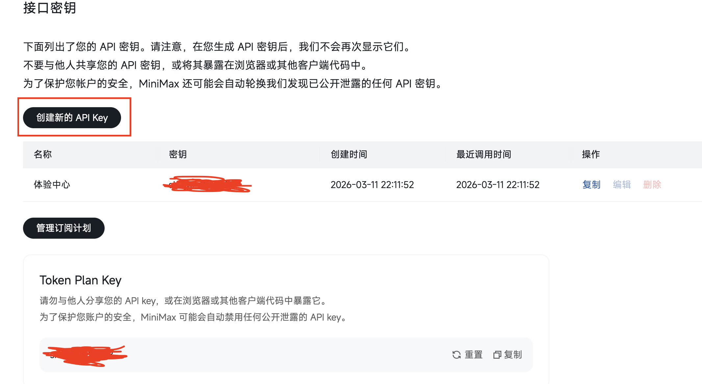
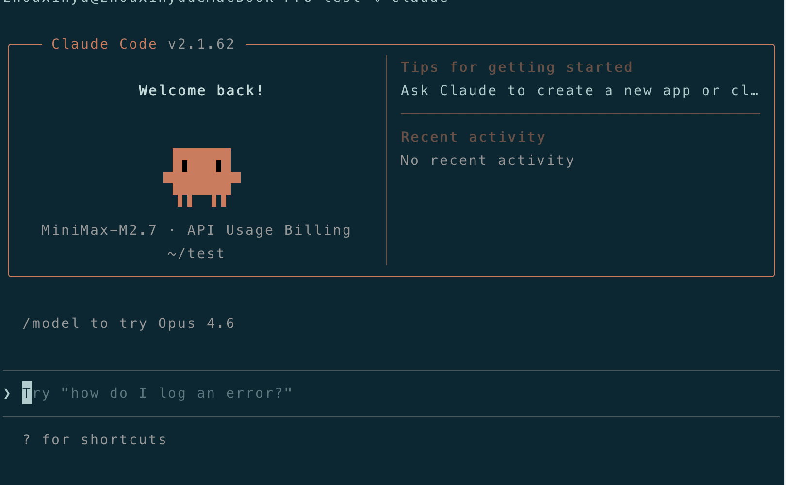
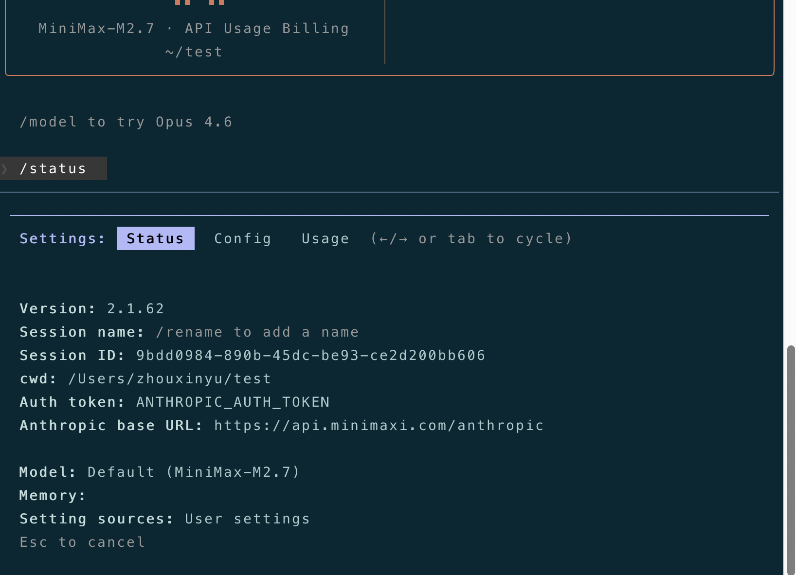
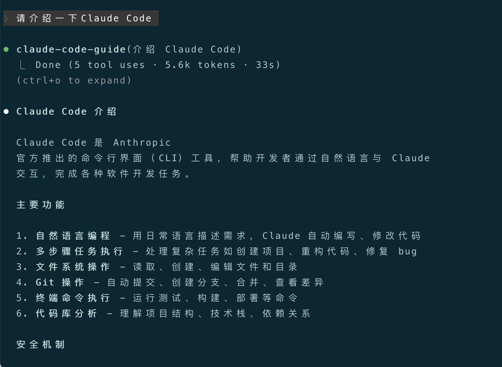
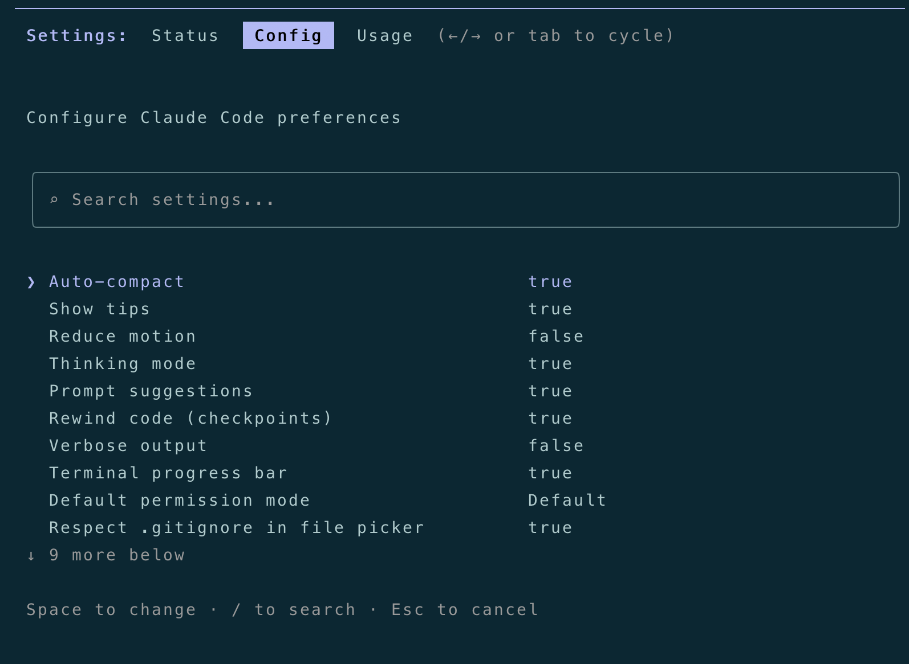

+++
date = '2026-03-23T23:49:40+08:00'
title = '玩转Claude Code（一）：基本介绍与环境搭建'
+++

**跟着我一起玩转Claude Code！**

# 1、基本介绍
Claude Code是Anthropic公司推出的CLI AI Agent（命令行AI智能体），最初锚向的是AI Coding工具，但发展到现在，我对它的理解，已经不仅仅只是一个"编程Agent"了。

纵观市面上主流的 AI Coding 工具，GitHub Copilot、Windsurf、Cursor等，百花齐放。"御三家" Codex（OpenAI的）、Gemini（Google的）、Claude Code（Anthropic的）均有各自的特点和擅长的赛道，但个人体验后，**我愿称Claude Code为"最强"**（纯个人观点，非引战）。

Claude Code的核心设计理念就是一个**"自主自治的工作流引擎"**，它能从整体上理解项目全局上下文，自主规划并执行复杂的端到端任务，拥有Hooks、Commands、Skills、MCP等丰富的自定义扩展能力，是团队中不可或缺的"自己搬砖的虚拟成员"。

- **缔造了"事实标准"**：Claude Code可以说是CLI AI Agent领域的开创者，许多"游戏规则"都是它定的，比如 "@"注入上下文、"!"执行shell命令、"/"发起斜杠命令等，后续的工具大多都借鉴效仿了其设计。
- **实现了完整方法论**：Claude Code将SDD方法论实现得最完整、最体系化，包括上下文管理、安全限制、MCP扩展等。掌握了它，也就掌握了底层的使用思想，可以无缝切换到其他工具。
- **拥有最繁荣的生态**：Claude Code凭借其强大的先发优势形成了正向的生态循环，吸引大量用户使用，催生出更多第三方工具和更多模型的支持，国内的主流模型都提供了对Claude Code的支持，比如minimax、GLM、Kimi等。掌握了它，你就接入了一个不断发展的AI生态。

AI时代，我认为每个开发者都要掌握Claude Code的使用。但相比开发者而言，**我更推荐产品经理来学习Claude Code，一旦你掌控了它，就拥有了一支由"架构师"+"技术leader"+"资深研发者们"组成的专业"虚拟研发团队"，配合你强大的产品思维，完全可以"一人成军"，踏上OPC（一人公司）之路**。

# 2、环境搭建
现在正式开始搭建环境，总体思路就是：**Claude Code Agent + 国产大模型**。

Anthropic公司原生的大模型真的太贵了，另外，它也封禁了国内ip（通过香港的vpn跳过去好像也不行）。国内用户一般做法是，给Claude Code这辆"超跑"换一个"国产引擎"（国产大模型），它的"驾驶操作"是一样的，无非就是"驾驶体验"要稍差一点，一旦你学会了如何"驾驶"，可以无缝切回它的原生"引擎"。

## 2.1 安装Claude Code
我的环境是macOS，以macOS为例来说明如何安装Claude Code。

我在macOS中采用Homebrew来安装Claude Code，先安装Homebrew，再用Homebrew来安装Claude Code。
打开终端，先安装xcode：

```
xcode-select --install
```

xcode安装后，用官方脚本安装Homebrew：

```
/bin/bash -c "$(curl -fsSL https://raw.githubusercontent.com/Homebrew/install/HEAD/install.sh)"
```

Homebrew安装后，根据终端的提示，把Homebrew的环境变量写到用户的配置里，M芯片的Mac用户执行以下命令：

```
echo 'eval "$(/opt/homebrew/bin/brew shellenv)"' >> ~/.zshrc
source ~/.zshrc
```

Intel芯片的Mac用户则执行以下命令：

```
echo 'eval "$(/usr/local/bin/brew shellenv)"' >> ~/.bash_profile
source ~/.bash_profile
```

Homebrew安装好后，可以验证一下是否能用：

```
brew --version
```

成功输出Homebrew版本，就说明安好了。

接下来就是用Homebrew安装Claude Code了，在终端输入如下命令：

```
brew install --cask claude-code
```

等待安装完成，这个过程有点长，跟网络状况有关，另外，可以先"科学上网"（开vpn翻墙），再执行安装命令。

安装完成后，验证一下Claude Code是否ok：

```
claude --version
```

成功输出claude版本号，本次安装就顺利结束了。

**特别说明：**

- 安装Homebrew时，可以使用国内镜像源加速安装过程，具体命令在豆包、元宝等AI工具中搜"如何使用国内镜像源安装Homebrew"，这里就不详述了。
- Linux用户安装Homebrew的方式，和macOS不太一样，也可以在豆包等AI工具中搜"
Linux用户如何安装Homebrew"，有详细的安装教程，这里也不再展开。安好Homebrew后，Linux中用Homebrew安装Claude Code的方式，和macOS就一样了。
- Claude Code官方对macOS/Linux/Windows提供了原生安装方式（官方推荐），国内因为封禁的缘故用不了，看能否通过海外vpn代理来使用官方的原生安装方式（我没试过），我把链接贴在这儿：https://code.claude.com/docs/en/setup#native-install-recommended，有通过原生方式成功安装Claude Code的朋友，可以在评论区分享一下。
- Claude Code官方已经声明，**npm安装方式已经弃用了**，国内Windows用户可以尝试使用npm方式安装Claude Code的历史版本，在元宝等AI工具中搜"国内Windows用户如何安装Claude Code"，也有详细的教程。

## 2.2 切换国产大模型
现在，来为这辆"超跑"切换"国产引擎"。

以minimax为例（目前我用的国产大模型），首先，你得先在minimax注册一个账户（https://minimaxi.com）；注册完成后，去minimax的"接口秘钥"管理页面（https://platform.minimaxi.com/user-center/basic-information/interface-key）创建一个API key，这个API key，就是你要配置在Claude Code中的密钥，也就是你的"车钥匙"，请务必妥善保管，不要泄露。



**建议（非广告）**：个人建议订阅minimax的Token Plan套餐，性价比高，量大管饱，有效缓解"token hungry"。这是我的邀请链接（9折）https://platform.minimaxi.com/subscribe/token-plan?code=9BE5kxxIhC&source=link，按需购买。

接下来，配置Claude Code。

**（1）新增或编辑 settings.json 文件**

macOS/Linux的文件路径为："~/.claude/settings.json"

Windows的文件路径为："用户目录/.claude/settings.json"

在 settings.json 中添加如下内容：

```json
{
  "env": {
    "ANTHROPIC_AUTH_TOKEN": "MINIMAX_API_KEY",
    "ANTHROPIC_BASE_URL": "https://api.minimaxi.com/anthropic",
    "API_TIMEOUT_MS": "3000000",
    "CLAUDE_CODE_DISABLE_NONESSENTIAL_TRAFFIC": "1",
    "ANTHROPIC_DEFAULT_HAIKU_MODEL": "MiniMax-M2.7",
    "ANTHROPIC_DEFAULT_SONNET_MODEL": "MiniMax-M2.7",
    "ANTHROPIC_DEFAULT_OPUS_MODEL": "MiniMax-M2.7"
  }
}
```

**（2）新增或编辑 .claude.json 文件**

macOS/Linux的文件路径为："~/.claude.json"

Windows的文件路径为："用户目录/.claude.json"

在 .claude.json 中添加如下内容：

```json
{
  "hasCompletedOnboarding": true
}
```

最后，我们来验证 "Claude Code + 国产大模型" 的配置是否成功。

打开终端，创建一个空目录，切进去，输入下面的命令启动Claude Code：

```
claude
```

选择"信任当前文件夹"，最终看到Claude Code的交互式工作界面：



输入 "/status" 命令，可以查看当前的模型信息：



可以看到，默认模型已经是MiniMax-M2.7，我们再输入一句话，看看Claude Code能否思考后回答：



Claude Code正常回复了，至此，环境搭建完成。

**tips**：在Claude Code回话中，用 "/config" 命令来进行一些配置的简单调整，以适配个性化需求，请自行探索。



下一篇，将介绍Claude Code最基本的交互范式，也是我们日常使用中与Claude Code进行人机协作的通用模式。

---

**感谢你点开这篇文章，欢迎关注我的公众号：10年码农，纯技术分享，一起在AI时代探索未来！**


---

**客官您满意的话，感谢打赏。**


