+++
date = '2026-03-25T12:58:45+08:00'
title = '玩转Claude Code（二）：基本交互范式"@"和"!"'
+++

这一篇，我们正式进入 Claude Code**（后文简称CC）**的世界。

CC提供了一套简洁强大的交互模型，它的核心交互范式就浓缩在两个异常简单的符号里：`@`和`!`。

- `@`：CC"感知"世界的感官，用来获取外部世界的信息。对用户来说，使用`@`给CC提供上下文信息，把以前的”粘贴复制“操作浓缩成一个`@`符号。例如，输入`@Test.java`，意味着告诉CC，"你先把Test.java文件看一遍，我们后面的讨论，都得基于你了解Test.java"。
- `!`：CC”改变“世界的"手"，用来"执行操作"，影响外部世界。这里所说的CC"执行操作"，大多是指执行Shell命令。通过`!`符号，把执行命令的操作无缝融入对话过程中，减少了用户的割裂感。

下面，让我们深入这两个指令。

# `@`：Claude Code的"眼睛"
在对话流中，`@`指令可以随时为CC提供上下文信息，让它能"看到”你项目的全局。

## `@`引用单个文件
这是`@`指令最常用的方式，可以引用任何文件，代码、配置、数据库sql、文档等等，用法如下：

```
@/path/file
```

`@`文件时，CC支持Tab自动补全（就像补全bash命令一样），`@`后输入前几个字符，再按下Tab就能自动补全了。下面，我们来看两个`@`单文件的例子。

### 解释代码
你拿到一个全新的代码文件，想迅速理解，可以直接`@代码文件`喂给CC，让它给你逐行解释：

```
@server/src/main/java/com/github/liyue2008/rpc/server/Server.java
请详细解释一下代码
```

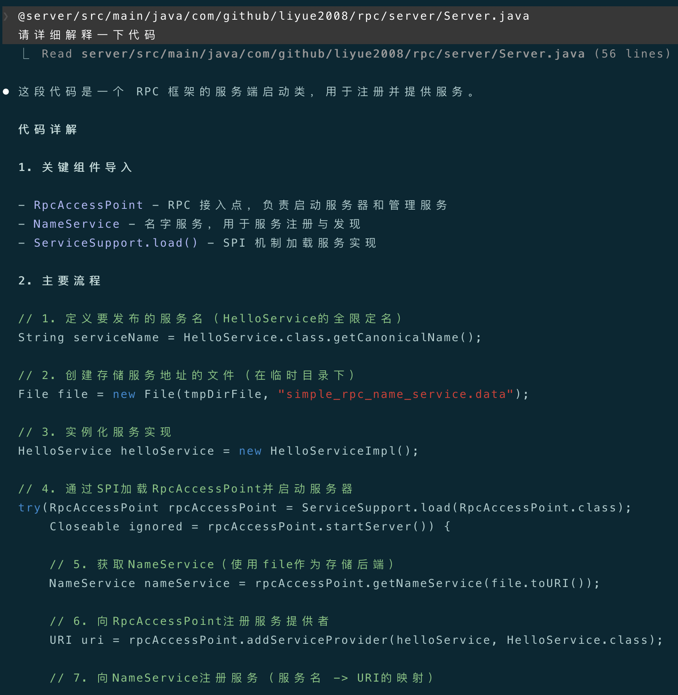
可以看到，CC会读取`Server.java`文件，输出一份"逐行注释"的代码解释，你不用手动复制粘贴代码了。

### 提取文件核心内容
你拿到一篇复杂的英文论文，想让CC帮你分析并提取核心内容，把提取的内容输出到一个结构化的文件中：

```
@raft.pdf    
请分析并提取该文件的核心内容，用中文组织输出，输出篇幅控制在2篇以内，生成一个`result.md`文件并写入当前目录
```

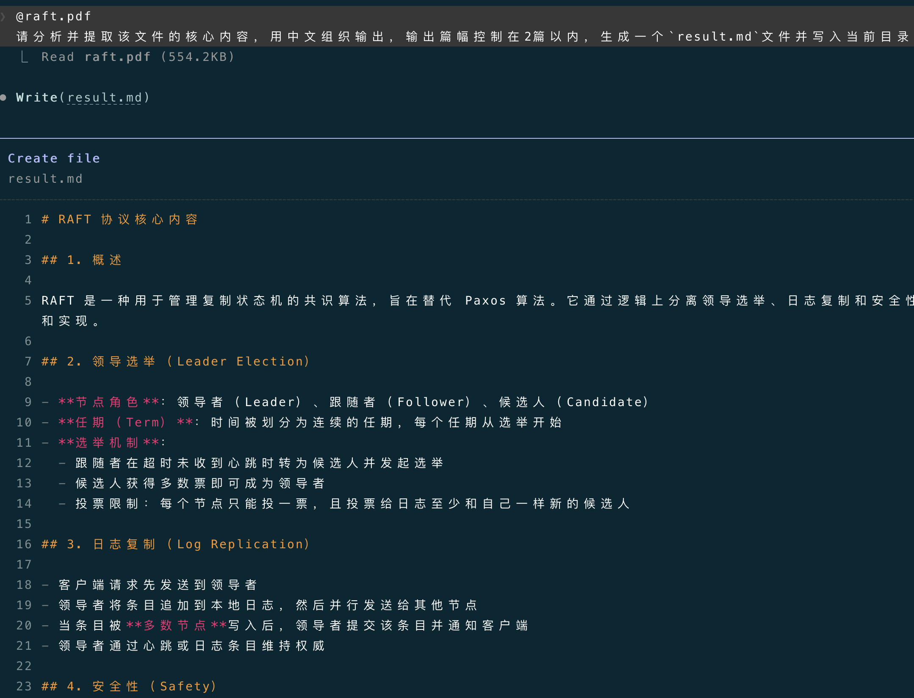
可以看到，CC会读取`raft.pdf`文件内容，分析后按要求用中文输出提取的核心内容，并尝试生成`result.md`结果文件，在获得我们的授权后，将结果文件写入当前目录下：
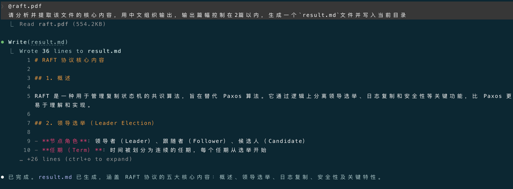

## `@`引用整个目录
当需要宏观视角时（横跨多个文件），此时，`@`可以引用整个目录：

```
@/path/directory
```

CC在用`@`读取目录时，默认**能感知Git**，它会先找到根目录下`.gitignore`文件，然后把`.gitignore`中指定的目录和文件全部忽略掉，不会去加载。这样既减少了token浪费，又避免了无关文件的干扰。我们同样来看一个`@`目录的例子。

### 分析新项目
你刚拿到一个全新的项目，对它一无所知，想快速上手，可以直接把整个项目目录喂给CC（不超过上下文最大窗口的前提下），让CC帮你分析新项目的整体架构、主要功能、核心流程等：

```
@./
请分析当前项目的整体结构、主要功能、核心流程和相关依赖
```

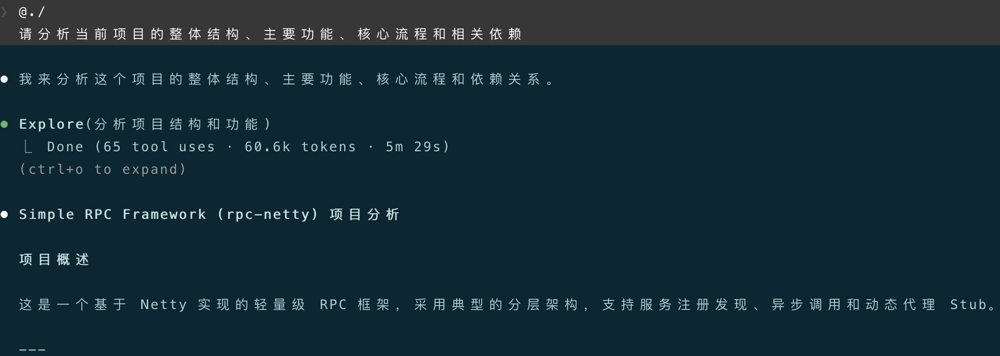
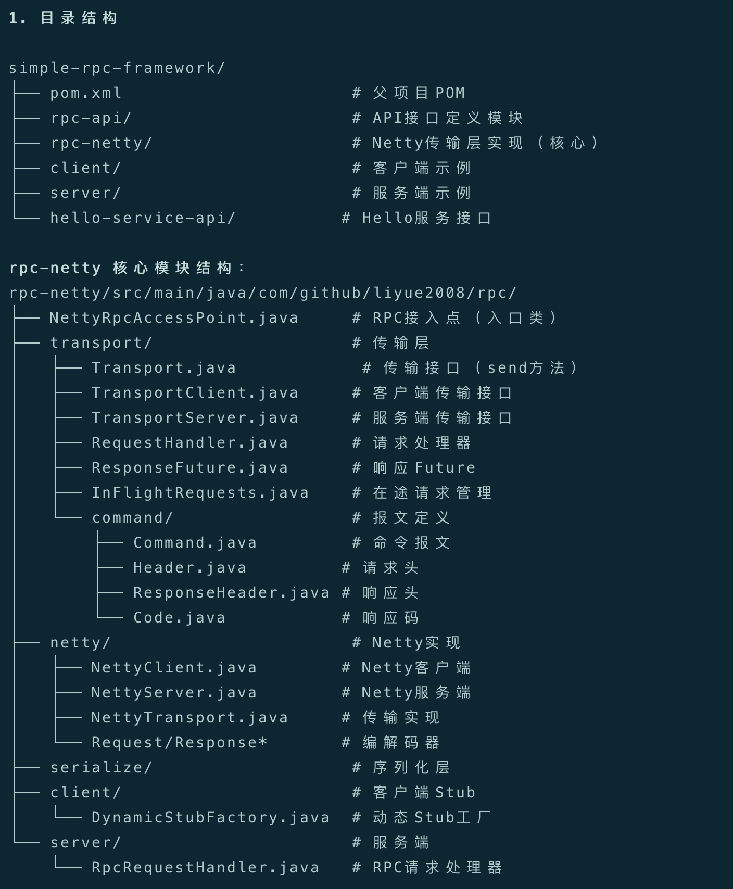
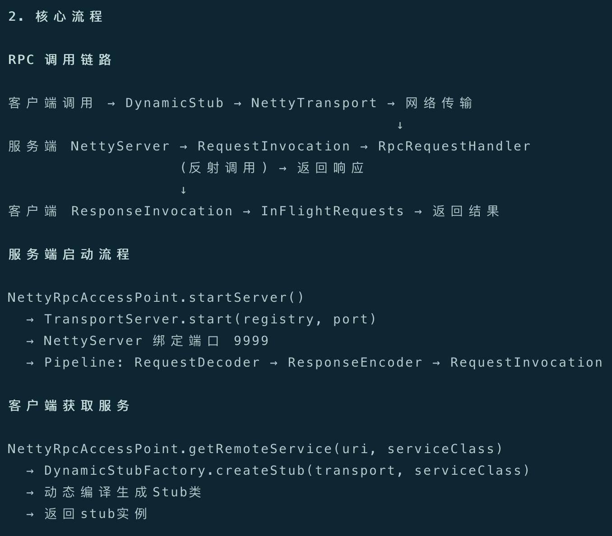
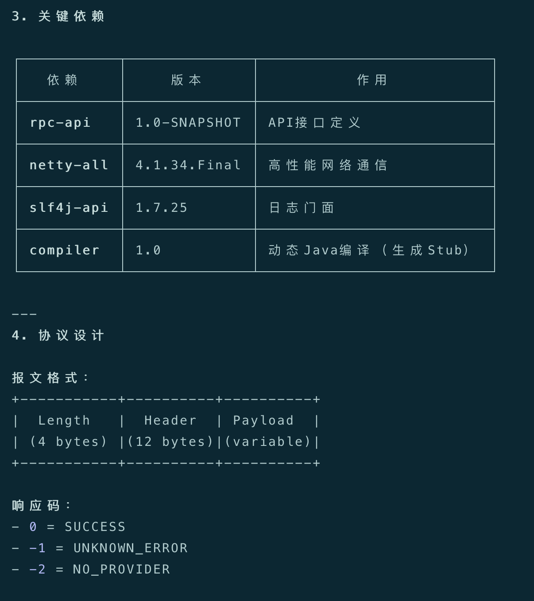
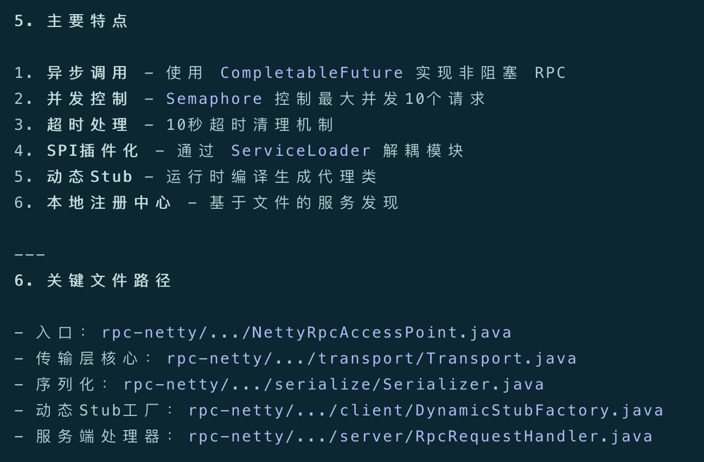
可以看到，CC扫描了整个项目，把相关Java代码都读了一遍，整体分析理解后，输出了详细的项目结构、核心流程、主要依赖等，堪比资深的研发同事为你做项目简介。

`@`作为CC的"眼睛"，将真实世界的信息转化为CC能够理解的上下文。掌握`@`，是掌握Claude Code的第一步。

# `!`：Claude Code的"手"
在对话流中，`!`指令可以随时执行Shell命令（无需退出CC），打通"想"（云端大模型）和"做"（本地环境）之间的壁垒。

## 手动执行命令
这是`!`直接的用法，在对话中手动执行Shell命令，用法如下：

```
! {shell_command}
```

我们来看一个例子。

### 查看当前目录所有文件
你想看一下项目的当前目录中有哪些文件，直接执行：

```
! ls -alh
```

终端会执行这个Shell命令，把结果返给CC：
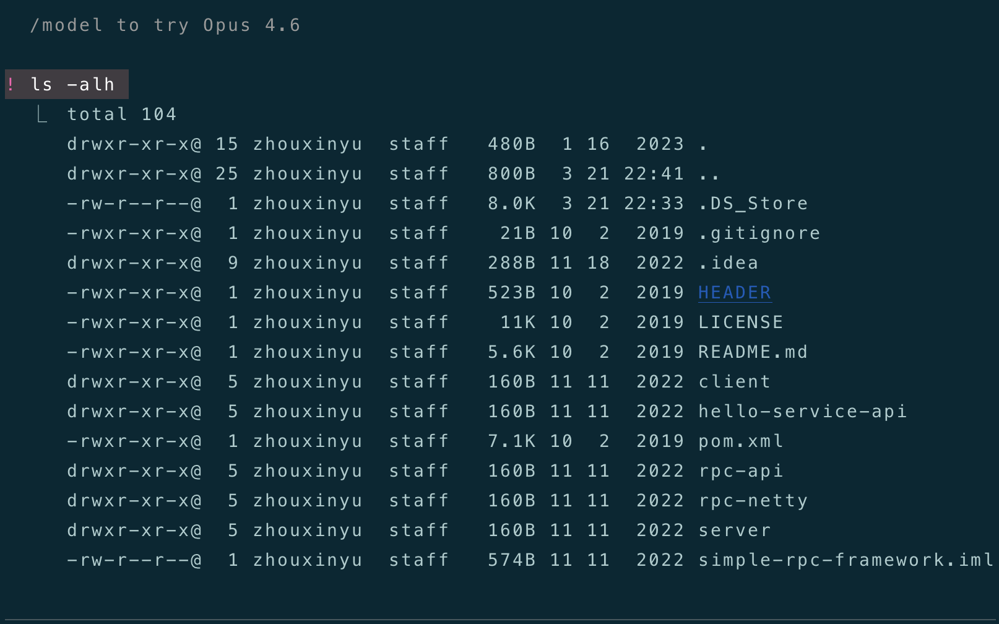

**`!`命令的输出，会自动加入当前对话的上下文中，被CC所感知**。这个特性很强大，后续对话可以基于`!`命令的输出，做进一步的操作。

上面的例子中，列出了当前目录下的所有文件，现在我们在`README.md`文件后加一句话：

```
在`README.md`文件后追加一句话: "测试!命令的输出能被感知到"。
```

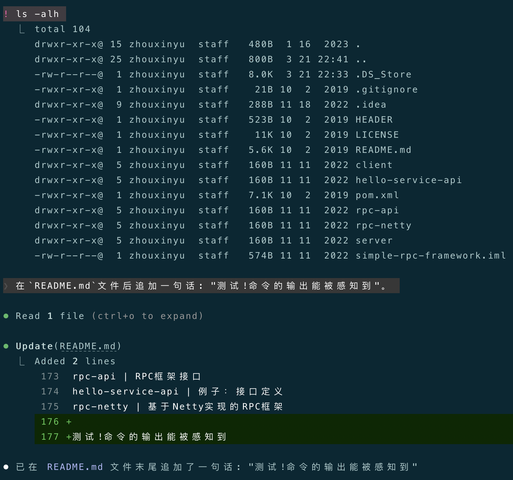
CC直接在`README.md`末尾加上了这句话。

## Claude Code自主执行命令
让CC自主决定执行什么命令（what）、什么时候执行（when），这才是`!`的AI原生用法。当CC判断需要执行Shell命令来完成任务，**它会主动发起Tool Call（工具调用）**，先找你审批，等你审批通过后，它才执行。

我们来看一个例子，我想知道当前连的局域网的公网ip是多少，可以直接问CC：

```
请帮我查一下，当前局域网暴露的公网ip是多少？
```

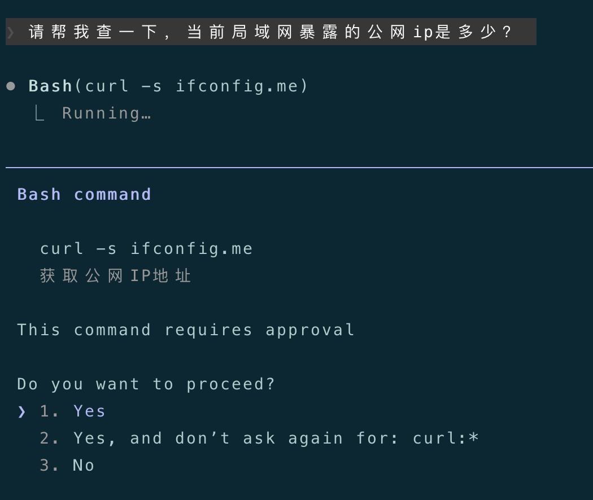
CC思考之后，想发起一个Bash调用（执行curl命令）查询公网ip，它先来找你审批，你同意后，它才执行Bash调用：
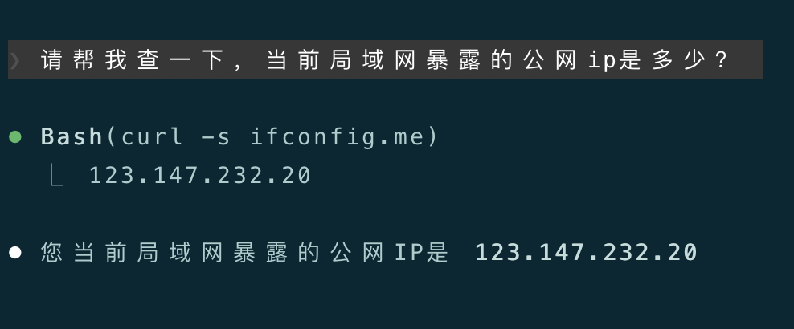
最后查到公网ip，结束本次任务。

以上，就是Claude Code的核心交互范式，掌握了`@`和`!`，你就拥有了与Claude Code协作的基础能力。
用户发出指令 -> CC用`@`看 -> 云端大模型思考 -> CC用`!`做 -> 执行结果反馈给用户，这个反馈循环，就是我们与Claude Code的协作日常。

下一篇，将介绍Claude Code实践中的关键配置：`CLAUDE.md`，即Claude Code的记忆系统（memory）。

---

**感谢你点开这篇文章，欢迎关注我的公众号：10年码农，纯技术分享，一起在AI时代探索未来！**


---

**客官您满意的话，感谢打赏。**


