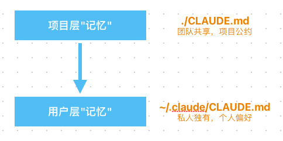
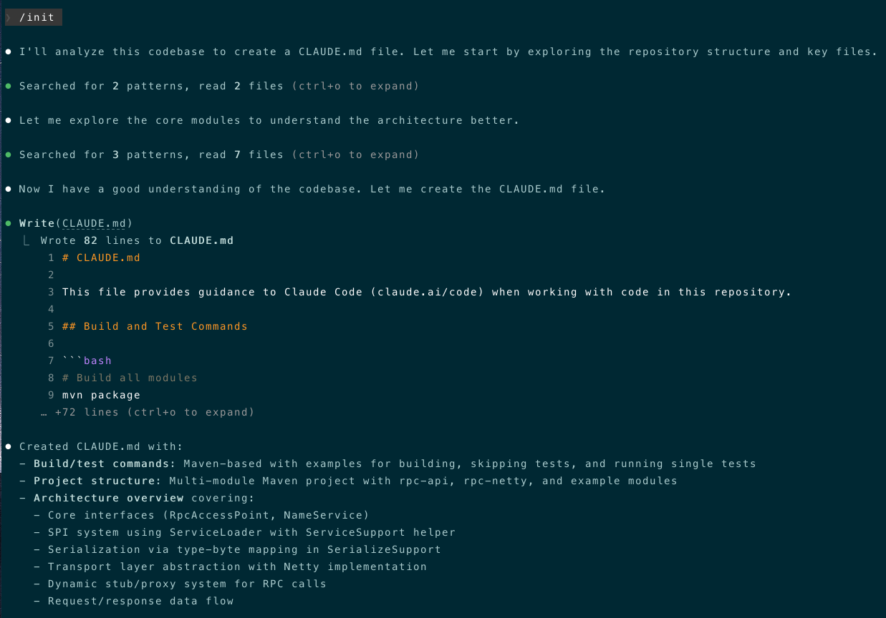
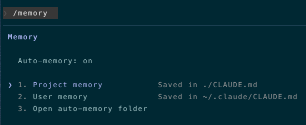
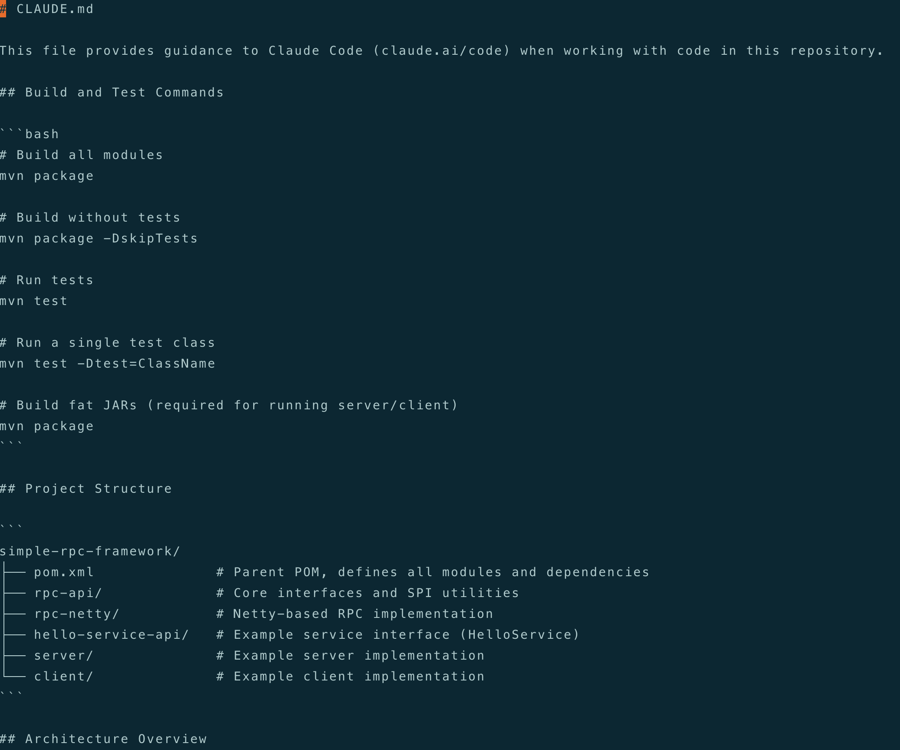

+++
date = '2026-03-27T12:35:33+09:00'
title = '玩转Claude Code（三）：记忆系统"CLAUDE.md"详解'
+++

大家好，我是bytezhou，上一篇详细介绍了`@`和`!`指令，本篇将深入分析Claude Code实践中的一个关键要素，Claude Code的"Memory系统" - `CLAUDE.md`。

# CLAUDE.md 是啥？
简单来说，`CLAUDE.md`是CC持久化的"记忆"。`CLAUDE.md`作为"背景知识库"，CC在启动时会自动加载它，其中的内容 会被自动注入到当前会话上下文中，无需你手动引入。

可以和`@`指令对比理解一下：

 - `@Server.java`：就像你让某个同事看一下 Server.java 文件，然后你们的讨论聚焦在这个文件上，要优化或修bug啥的，确认清楚后就完事了。
 - `CLAUDE.md`：像是你们团队的《研发规范》，来了新人，先让他了解《研发规范》，try catch不能吞异常、新功能要写单测等，在日常工作中不必时刻提醒他，他也知道该遵守什么、该禁止什么。

总的来说，把用户反复输入的"Prompt"，固化为CC应该自动遵守的"静态内容"（项目的规范、公约），这就是 **CLAUDE.md**，也是人机协作的"工程化"。

## 扩展内容：AGENTS.md
AI生态百花齐放，Claude Code有`CLAUDE.md`，Gemini有`GEMINI.md`，Cursor有`Rules`......不同Agent，都有一套自己的"Memory系统"，用户将面临Agent"战国时代"。值此背景下，社区和AI巨头联合推出了一个"行业标准"-**AGENTS.md**。

`AGENTS.md`作为"行业公约"，不和某个具体的AI Agent绑定，下面是官网的原文：**"Think of AGENTS.md as a README for agents: a dedicated, predictable place to provide the context and instructions to help AI coding agents work on your project."**

关于AGENTS.md更多的详细内容，感兴趣的朋友请前往**[官网](https://agents.md)**了解。

# 深入分析 CLAUDE.md

## 分层加载
CC在加载`CLAUDE.md`时，会采用一种"分层加载"机制：项目层CLAUDE.md -> 用户层CLAUDE.md，加载顺序的优先级如下：


- **项目层CLAUDE.md**：高优先级，一般位于当前项目根目录下，即"./CLAUDE.md"，或者"./.claude/CLAUDE.md"。它维护了团队公约和规范，是团队共享的"资产"。
- **用户层CLAUDE.md**：低优先级，一般位于当前用户的个人主目录下，即"~/.claude/CLAUDE.md"，或"用户目录/.claude/CLAUDE.md"（windows用户）。它维护的是个人偏好，对当前用户下的所有项目均生效，若和项目层CLAUDE.md中出现相同的配置项冲突，则 项目层 会覆盖掉 用户层。

除了上述总的"分层加载"机制，CC在查找`CLAUDE.md`时，还有两个强大的机制：**向上查找、向下发现**。

+ **向上查找**：启动CC时，它会从当前所在目录（pwd）一路"向上查找"，直到项目根目录（.git所在目录）、或者用户主目录（~/），沿途遇到的 `CLAUDE.md` 都会自动加载。
+ **向下发现**：CC还能动态发现 当前目录下 子目录的`CLAUDE.md`，但不会自动加载"子CLAUDE.md"，只有CC显示去读那个子目录中的文件时（通过`@文件` 或者 调用Shell工具），才会动态加载"子CLAUDE.md"。

这两个查找机制在`单一代码仓库`结构的项目中极为有用，可以构建一种"级联CLAUDE.md"，我们来看个例子。下面是一个经典的`单一代码仓库`项目：

```
/project
├── CLAUDE.md  # 项目的根CLAUDE.md，全局规范
├── A-project/
│   ├── CLAUDE.md  # A-project的CLAUDE.md
│   ├── A.java
├── B-project/
│   ├── CLAUDE.md  # B-project的CLAUDE.md
│   ├── B.java
└── utils/
      └── util.java
```

**情形一**：你在 A-project 目录下启动CC
1、当前工作目录（pwd）：/project/A-project。
2、启动CC。
3、CC会自动**向上查找**，自动加载 根CLAUDE.md 和 A-project的CLAUDE.md，合并项目的全局规范和A项目的独有规范。

**情形二**：你在 根目录 下启动CC，读取B项目的文件
1、当前工作目录（pwd）：/project。
2、启动CC，仅加载了 根CLAUDE.md。
3、当你指挥CC："@B-project/B.java 详细解释这个文件的代码逻辑"。
4、此时，CC会**向下发现**，动态加载 B-project的CLAUDE.md，知道了项目的全局规范和B项目的独有规范。

## `@`导入：模块化组织CLAUDE.md
大型项目中，所有的规范都塞进一个CLAUDE.md文件的话，就会像"屎山"代码一样，臃肿且难以维护。所以，CC提供了`@`导入方式，让你能模块化的组织你的CLAUDE.md文件。

```
@/path/another.md
```

例如，在我的用户层CLAUDE.md中（~/.claude/CLAUDE.md），通过`@`引入不同维度的个性化规范：

```
# 导入我的Java规范
@~/.claude/spec/my-java-style.md

# 导入我的常用框架规范
@~/.claude/spec/my-framework.md
```

通过这种方式，可以创建一个模块化、能复用的"知识库"，在不同项目中组合使用。

# 维护 CLAUDE.md
对于CLAUDE.md的维护，CC提供了两个命令：/init、/memory。

## /init：创建CLAUDE.md
当你拿到一个新项目，或者是一个没有CLAUDE.md的老项目时，直接手搓CLAUDE.md的话，有点无从下手。
此时，可以使用`/init`命令，它是CC提供的一个引导工具，专门用来引导用户创建CLAUDE.md，直接在项目根目录下启动CC，然后输入`/init`即可：


可以看到，CC会扫描当前项目，根据项目信息自动生成CLAUDE.md，基于此CLAUDE.md，后续再调整和维护。

## /memory：整理CLAUDE.md
在CC的对话流中，当需要实时调整、删除或者重写CLAUDE.md时，随时输入`/memory`命令：


这里CC会让你选择编辑哪个层级的CLAUDE.md（项目层 或 用户层），你选择之后，CC就会用默认编辑器打开对应的CLAUDE.md，让你实时编辑。


完成编辑、保存退出后，CC会自动加载最新的CLAUDE.md，并立即生效。

掌握了上述的`/init`、`/memory`命令，维护 CLAUDE.md 就变成了对话流中的一个自然环节。

# Java技术栈的CLAUDE.md示例
项目层CLAUDE.md，应该包含项目技术栈、团队研发规划和公约、人机协作最佳实践等。这里，我提供一份基于Java的CLAUDE.md示例，以供参考。

````

# [项目名] 项目规范

你是一位资深的Java工程师，熟悉Java工程最佳实践。你的目标是高质量完成本项目的研发交付。

## 1.技术栈

Java 17+, Spring Boot 3.x, Maven/Gradle, Redis, Kafka

## 2.项目结构

```
com.company.project
├── config/       # 配置类
├── controller/   # REST控制器
├── service/      # 业务逻辑(含impl/)
├── repository/   # 数据访问层
├── entity/       # 实体类
├── dto/vo/       # 数据传输对象
├── common/      # 公共组件(常量/枚举/异常/工具)
└── Application.java
```

## 3.命名规范

| 类型 | 规范 | 示例 |
|------|------|------|
| 类名 | UpperCamelCase | `UserService` |
| 方法名 | lowerCamelCase | `getUserById` |
| 常量 | UPPER_SNAKE_CASE | `MAX_RETRY_COUNT` |
| 数据库表 | 小写下划线 | `sys_user` |

## 4.RESTful API

```
GET    /users        # 列表
GET    /users/{id}   # 单条
POST   /users        # 创建
PUT    /users/{id}   # 更新
DELETE /users/{id}   # 删除
```

**统一响应**: `{"code": 200, "message": "success", "data": {}, "timestamp": ...}`

## 5.数据库规范

- 主键: `id` BIGINT自增
- 公共字段: `created_at`, `updated_at`, `deleted`
- 索引: `idx_` / `uk_` 前缀
- 禁止拼音命名

## 6.关键规范

- **异常**: 全局 `@RestControllerAdvice` 处理，`BusinessException` 业务异常
- **事务**: `@Transactional(rollbackFor = Exception.class)`，读操作不添加
- **日志**: SLF4J，禁止 `System.out`
- **敏感数据**: 加密存储，配置使用环境变量
- **性能**: 避免循环查询，N+1用JOIN/批量查询解决

## 7.Git提交

```
feat: 新功能 | fix: 修复 | docs: 文档 | refactor: 重构 | test: 测试
```

## 8.代码检查

- IDE: Checkstyle/PMD插件
- 构建: SpotBugs + SonarQube
- 提交前运行 `mvn verify` / `gradle check`

## 9.AI协作

- **优先规划**: 当要实现一个新功能时，你应该先`@`相关代码，理解现有逻辑，然后以列表形式提出你的计划，待我审查后再开始编码实现。
- **测试先行铁律**: 新功能开发或Bug修复，都必须从编写失败的测试开始，严格遵循TDD循环（Red-Green-Refactor）。
- **并发安全**: 当涉及到多线程并发时，必须明确指出并发竞争场景，解释使用的并发安全措施（如锁、CAS等）。
- **代码解释**: 生成复杂的代码段后，请用注释（或在对话中），解释其核心逻辑和设计思想。

````
以上，就是一个Java项目的CLAUDE.md示例，包含 **角色与目标设定、技术栈、项目结构、命名规范、API设计、数据库规范、Git格式、异常/事务/日志处理、AI协作原则等**，大家可以基于自己的项目特点，添加自己的"团队公约"。

下一篇，将介绍 **Slash Commands** - 斜杠命令，掌握了它，我们使用Claude Code的效率将进一步提升。

---

**感谢你点开这篇文章，欢迎关注我的公众号：10年码农，纯技术分享，一起在AI时代探索未来！**


---

**客官您满意的话，感谢打赏。**

