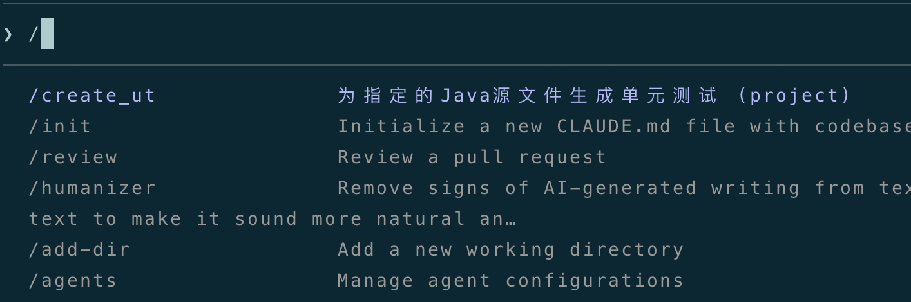
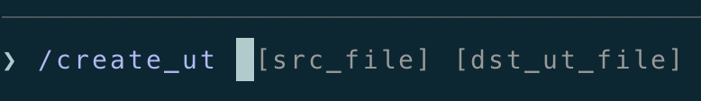
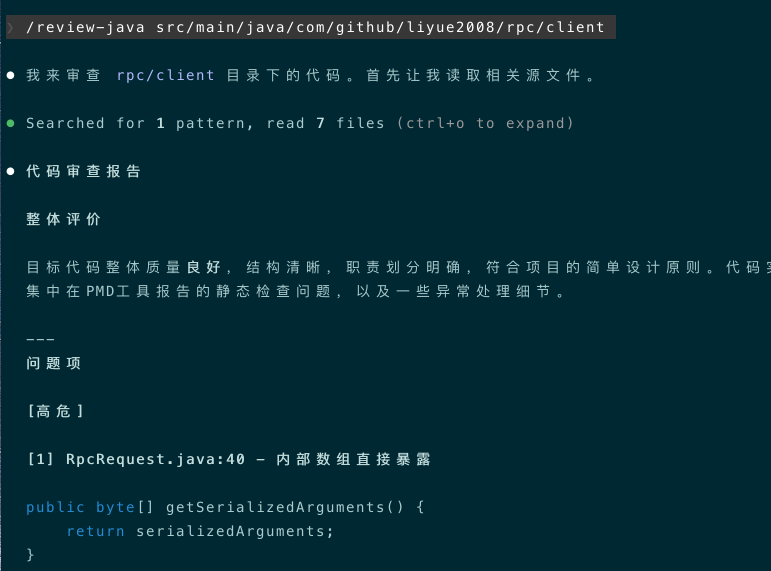

+++
date = '2026-03-29T21:21:30+10:00'
title = '玩转Claude Code（四）：Slash Commands详解'
+++

大家好，我是bytezhou，上一篇详细分析了`CLAUDE.md`，今天，将介绍Claude Code的一个核心工具：`Slash Commands`（斜杠指令），是我们日常使用CC提效的关键。

在使用CC时，我们经常会重复输入一些Prompt，例如：

- "请全面分析一下`@/src/main/java/com/example/service/moduleA`，包括该模块的核心逻辑、主要流程、上下文依赖、关键设计等，按照 `@~/.claude/template/analyse.md`模板 生成分析报告"。
- "请按照`CLAUDE.md`中的代码规范，审查`@com/example/listener/`中的Java代码，重点关注异常处理、事务处理、并发操作是否合规"。

每次手敲、或者粘贴复制这些Prompt，繁琐、且可能出错。`Slash Commands`就是用来解决这个问题，把我们日常重复、高频、还有可能较复杂的工作流Prompt，浓缩、封装成一个"斜杠命令"，直接 一键调用，大大提升了工作效率。

我先介绍Claude Code的`内置命令`，再详细讲解如何`自定义命令`。

# 内置`Slash Commands`
CC内置了几十个`Slash Commands`，我们只用掌握日常使用中最高频的命令，就能极大提效。

| 命令 | 功能 | 场景 |
| :---: | :---: | :---: |
| /clear | **清空当前会话的上下文**。这是每个用户需要掌握的最基础、最重要的命令 | 长会话中有大量对话历史，干扰AI的"注意力"且消耗token，/clear一键清空所有上下文历史。完成一个新功能开发、或者要开始修复一个bug等，赶紧使用/clear |
| /compact | 智能"压缩"当前会话的上下文，仅保留核心摘要 | 先和AI进行了多轮对话 讨论清楚了某个功能设计，要开始实现了，此时可以执行/compact，保留设计的关键信息，减轻上下文压力 |
| /rewind | "回滚"，包括对话和代码的回滚，后面会单独用一篇详细介绍 | 在SDD的任一步骤，都可以使用/rewind回滚对话或代码，直到你满意为止 |
| /config | 对话中打开一个交互式的配置界面，进行各种环境配置 | 改模型、改主题、改输出风格等，直接/config进行配置 |
| /model | 动态切换底层模型 | 简单任务用普通模型（便宜），复杂任务用/model动态切换到高级模型（贵） |
| /init | 详解`CLAUDE.md`时已经介绍了，用于初始化`CLAUDE.md` | 新项目、或老项目引用AI Coding时，初始化一份项目规范`CLAUDE.md`  |
| /memory | 详解`CLAUDE.md`时也介绍了，用来随时编辑调整`CLAUDE.md` | 随时查看CC现在加载的`CLAUDE.md`，或者即时编辑、即时生效 |
| /permissions | 交互式界面，管理CC的权限规则 | 出于安全考虑（误改系统文件、"不小心"读到环境变量的系统密码等），想对CC的行为更精细化的"管控"，可以添加`允许`、`禁止`、`询问`的操作规则（属于进阶用法了） |
| /review | 内置的审查代码命令（基于PR）| 要审查代码时，主动调用/review，CC会触发一个更专业细致的review流程（可能会调用专注审查的Sub-Agent，后面详细介绍） |
| /status | 显示当前CC的整体状况，包括版本、模型等 | 偶尔看看CC的当前状态，看看配置对不对 |
| /cost | 显示当前会话的token消耗 | 统计"当前任务的整体开销"，评估并优化自己的Prompt方式（与钱相关） |
| /context | 详细显示当前上下文窗口的具体组成，加载的系统Prompt、CLAUDE.md、MCP、Skills、Agent等各自占用了多少token | 当你发现CC开始"胡言乱语"、老是"失忆"、或者"注意力"不集中，/context看一下，到底是"谁"占用了宝贵的上下文窗口 |
| /help | CC的帮助入口，显示所有可用的`Slash Commands`和`Skills`，包括自定义的 | 你忘了某个命令或skill时，可以用/help查看一下 |

# 自定义`Slash Commands`
自定义`Slash Commands`，是Claude Code提供的第一个强大扩展能力，也是我们开发者转向"工作流编排"的第一步。
本篇开头举的两个例子，都是日常开发中高频、模板化的流程。把这些模板化的工作流程Prompt，固化成一个可以一键调用的"斜杠命令"，就是**自定义`Slash Commands`**。

## 项目级和个人级`Slash Commands`
和`CLAUDE.md`的分层加载类似，自定义命令也有两层作用域：项目级、个人级。

### 项目级`Slash Commands`

-  在项目根目录下 `./.claude/commands` 目录中。
-  每个`斜杠命令`是一个`md文件`，这些`md文件`会被提交到git仓库，任何一个团队成员均能clone并使用。
-  主要用来封装团队的最佳实践和公共流程，比如 `/生成单测`、`/审查代码`。

### 个人级`Slash Commands`

-  在当前用户根目录下 `~/.claude/commands` 目录中。
-  每个`斜杠命令`也是一个`md文件`，这些`md文件`是私人性质，只在你的机器上，不会也不应该提交到git仓库，但在你机器上的所有项目，都可以调用它们。
-  主要用来封装个人的私有偏好和使用习惯，比如 `/翻译成中文`、`/统计我的代码变更行数`。 

## 向`Slash Commands`传参
自定义`Slash Commands`可以传参，这才是其灵活扩展的基础。主要有2种传参形式，一起来看一下。

### `$ARGUMENTS`：替换所有参数
`$ARGUMENTS`占位符将被替换成你在命令后输入的所有参数。比如，我创建一个分析整合给定文件、提取关键信息、再结构化输出的命令`extract_content`：

```
请按下列步骤操作：
1. 请用`Read`工具读取所有`$ARGUMENTS`文件。
2. 请详细分析上述给到的所有文件，提取主要内容，根据相关性做整合。
3. 重新整合后的内容，请自行组织一个结构化的markdown格式，生成一个叫`result.md`的结果文件，写到当前目录下即可。
```

调用`extract_content`时，像下面这样传参：

```
/extract_content file_1.pdf file_2.md file_3.pdf
```
最终执行的Prompt就像这样："......请用`Read`工具读取所有`file_1.pdf file_2.md file_3.pdf`文件......"。

### `$1、$2、$3......`：替换单个参数
这种传参，类似于Bash脚本的位置参数，传参时 多个参数之间用空格分隔，`$1`表示第一个参数，`$2`表示第二个，以此类推。

比如，我创建一个根据指定源文件生成单元测试的命令`create_ut`，它接收2个参数，第一个是源代码文件，第二个是生成的单测文件的输出路径：

```
**生成单元测试**

请按下列步骤操作：
1. `@$1` 请详细分析该文件中每个方法的内部逻辑、输入输出、异常处理、第三方依赖等。
2. 根据分析结果，请为上述文件中的每个方法生成单元测试，覆盖正常功能、异常场景、边界条件等，生成的单测文件输出到`$2`中即可。
```

调用`create_ut `时，像下面这样传参：

```
/create_ut com/test/service/LocalFileNameService.java ./LocalFileNameServiceTest.java
```
最终执行的Prompt就像这样："......`@com/test/service/LocalFileNameService.java` 请详细分析该文件中每个方法......生成的单测文件输出到`./LocalFileNameServiceTest.java`中即可"。

总的来说：

- **$ARGUMENTS**：适合不定长度的、或者一大段人类语言描述的传参。
- **$1、$2、$3...**：适合结构化的、有固定顺序的传参。

## `Slash Commands`元数据：Frontmatter
可以使用Markdown  Frontmatter（即md文件开头`---`包围的区域）来定义`Slash Commands`的元数据，提供更丰富的信息和功能。

我们来看看上述`create_ut`的例子，它的完整定义是下面这样：

```
---
description: 为指定的Java源文件生成单元测试
argument-hint: [src_file] [dst_ut_file]
model: opus
allowed-tools: Read, Write
---

**生成单元测试**

请按下列步骤操作：
1. `@$1` 请详细分析该文件中每个方法的内部逻辑、输入输出、异常处理、第三方依赖等。
2. 根据分析结果，请为上述文件中的每个方法生成单元测试，覆盖正常功能、异常场景、边界条件等，生成的单测文件输出到`$2`中即可。
```
解读一下上面 Frontmatter区的内容：

- **description**：该命令的功能描述，你在CC的交互界面，要调用该命令时，`/`后就能看到这段描述。

- **argument-hint**：该命令的参数提示信息，在CC的交互界面输入了`/create_ut `后，CC就按照"argument-hint"提示用户接下来该输入`src_file `、`dst_ut_file `。

- **model**：为该命令指定一个特定的模型。
- **allowed-tools**：为该命令单独指定一套允许使用的工具，在生产级的工程实践中，精细化的权限管控非常重要。这里指定该命令只能调用`Read `、`Write`工具。

## `Slash Commands`中嵌入Shell命令
这是一个极其强大的功能，你可以在`Slash Commands`中嵌入`! shell命令`占位符形式的Shell命令。

当你调用自定义`Slash Commands`时，`! shell命令`占位符形式的Shell命令会被先执行，其执行输出结果 又会反过来替换掉 `! shell命令`占位符本身，然后拼成最终的Prompt发给AI。

我们来看个例子，某个"斜杠命令"中有如下内容：

```
......
**当前分支：**
!`git branch --show-current`

**最近一条提交日志：**
!`git log -1 --oneline`
......
```

1. 用户调用该`Slash Commands`。
2. CC解析该`Slash Commands`，发现有`!`。
3. 它执行`git branch --show-current`，执行结果是`feat/user_module`。
4. 它执行`git log -1 --oneline`，执行结果是`668d756 feat(user): 完善错误处理，删除未使用代码`。
5. 将这2个Shell命令的执行结果，替换回`Slash Commands`中的`!`占位符。
6. 最终，调用该`Slash Commands`拼成的Prompt如下（也是最终发给AI的Prompt）：

```
......
**当前分支：**
feat/user_module

**最近一条提交日志：**
668d756 feat(user): 完善错误处理，删除未使用代码
......
```

## 示例：创建一个`/review-java`自定义命令
最后，我将根据上面介绍的`Slash Commands`相关内容，创建一个审查Java代码的`/review-java`自定义命令。

### 编排`/review-java`工作流
首先，让我们确定一下，要审查一份Java代码的整体流程是啥样的：

1. 指定要审查的代码路径。
2. 先用主流的第三方工具（如pmd），对Java代码进行一次静态检查，找到一些明显的逻辑问题。
3. 把第三方工具的静态检查报告，加上Java代码本身，以及我们项目的项目规范，一起发给AI。
4. 让AI在充分了解这些信息的基础上，作为专业"代码审查官"，从最佳实践出发，给出一份代码审查报告。

### 创建`/review-java`
在项目根目录的 `./.claude/commands` 下，创建 `review-java.md`文件，内容如下：

```
---
description: 根据静态检查工具和项目规范，审查指定的Java代码(文件或目录)
argument-hint: [file_path]
model: opus
allowed-tools: Bash(pmd:*), Read, Grep, Glob
---

你是专业的"代码审查官"，现在请审查一份Java代码。

1. 仔细阅读并分析`@$ARGUMENTS`中的Java代码。

2. 代码静态检查，这是pmd工具对目标代码的静态检查报告：
!`pmd check -d $ARGUMENTS -R category/java/bestpractices.xml || true`

3. 审查要求：
结合上面的静态检查报告 以及 项目规范，深入审查目标代码。
你的审查必须关注以下几条规范：
  - **简单原则**：代码是否存在过度设计和抽象？
  - **单一职责**：文件和方法的职责是否高内聚？是否单一？
  - **异常处理**：所有方法的分支和返回，是否有完善的异常处理？捕获的异常是否被静默吞掉？

4. 审查报告输出要求：
请生成一份结构化的审查报告（markdown格式），包含以下部分：
  - **整体评价**：请整体评价目标代码质量。
  - **问题项**：
      - **[高危]**：必须改的问题（比如pmd工具报告的问题，或违反`单一职责`的问题）。
      - **[中危]**：建议修改的问题（比如设计模式优化）。
      - **[低危]**：代码风格或可读性问题。

对每一个**问题项**，请列出**文件名、行号、问题描述、修改建议**。
```

### 测试`/review-java`
现在，让我们找一个Java项目，测试一下`/review-java`命令：


可以看到，CC自动执行了整个review流程，最后生成了代码审查报告：

````
## 整体评价

目标代码整体质量**良好**，符合简单RPC框架的教学目的。代码结构清晰，职责划分基本合理，SPI机制的使用也恰当。但存在**4个高危问题**需要立即修复，主要涉及数组逸出导致的可变性问题，以及异常处理中栈轨迹丢失的问题。

---

## 问题项

### [高危]

#### 1. RpcRequest.java:28 - 数组直接存储（未做防御性拷贝）
- **文件**：`RpcRequest.java`
- **行号**：28
- **问题描述**：构造函数的参数 `serializedArguments` 数组直接存储，未做防御性拷贝。外部传入的数组引用被直接保存，调用者后续对该数组的修改会影响到 RpcRequest 内部的 estado。
- **修改建议**：
```java
public RpcRequest(String interfaceName, String methodName, byte[] serializedArguments) {
    this.interfaceName = interfaceName;
    this.methodName = methodName;
    this.serializedArguments = Arrays.copyOf(serializedArguments, serializedArguments.length);
}
```

#### 2. RpcRequest.java:40 - 方法返回内部数组（暴露内部可变状态）
- **文件**：`RpcRequest.java`
- **行号**：40
- **问题描述**：`getSerializedArguments()` 直接返回内部数组引用，调用者获取后可修改数组内容，导致 RpcRequest 内部状态被意外修改。
- **修改建议**：
```java
public byte[] getSerializedArguments() {
    return Arrays.copyOf(serializedArguments, serializedArguments.length);
}
```

#### 3. AbstractStub.java:49 - 异常栈轨迹丢失（PreserveStackTrace）
- **文件**：`AbstractStub.java`
- **行号**：49
- **问题描述**：`catch (ExecutionException e)` 中使用 `throw new RuntimeException(e.getCause())` 丢失了原始 ExecutionException 的栈轨迹信息。此外，如果 `e.getCause()` 返回 null，会导致 `NullPointerException`。
- **修改建议**：
```java
} catch (ExecutionException e) {
    throw new RuntimeException("Remote invoke failed", e.getCause());
} catch (Throwable e) {
    throw new RuntimeException("Remote invoke failed", e);
}
```

#### 4. ServiceStub.java:22 - 缺少 @FunctionalInterface 注解
- **文件**：`ServiceStub.java`
- **行号**：22
- **问题描述**：`ServiceStub` 是单抽象方法的接口，应添加 `@FunctionalInterface` 注解以明确其函数式接口的用途，便于 Lambda 表达式使用。
- **修改建议**：在接口声明前添加 `@FunctionalInterface` 注解。

---

### [中危]

#### 5. StubFactory.java:22 - 缺少 @FunctionalInterface 注解
- **文件**：`StubFactory.java`
- **行号**：22
- **问题描述**：同问题4，`StubFactory` 接口也是单方法接口，应添加 `@FunctionalInterface` 注解。
- **修改建议**：在接口声明前添加 `@FunctionalInterface` 注解。

#### 6. DynamicStubFactory.java:54 - 假设服务接口只有单一方法
- **文件**：`DynamicStubFactory.java`
- **行号**：54
- **问题描述**：`serviceClass.getMethods()[0]` 假设服务接口只有一个方法，这是不安全的设计。如果接口有多个方法，只会生成调用第一个方法的桩。
- **修改建议**：当前实现作为教学示例可接受，但应在注释中说明此限制，或考虑遍历所有方法生成对应的桩方法。

#### 7. AbstractStub.java:46 - 错误信息丢失
- **文件**：`AbstractStub.java`
- **行号**：46
- **问题描述**：`throw new Exception(responseHeader.getError())` 使用通用的 `Exception` 类，错误信息仅为字符串，丢失了异常类型信息。
- **修改建议**：考虑使用更具体的异常类型，或创建一个自定义的 RPC 异常类来保留错误信息。

---

### [低危]

#### 8. RequestIdSupport.java - 建议添加边界值处理
- **文件**：`RequestIdSupport.java`
- **行号**：24
- **问题描述**：`AtomicInteger.getAndIncrement()` 在达到 `Integer.MAX_VALUE` 后会回绕到 `Integer.MIN_VALUE`，长期运行的服务器可能出现 ID 冲突（虽然概率极低）。
- **修改建议**：可接受的限制，如需改进可考虑使用 `AtomicLong` 或添加越界检测。

#### 9. 代码风格 - DynamicStubFactory.java:26 接口命名与实现类命名
- **文件**：`DynamicStubFactory.java`
- **行号**：26
- **问题描述**：接口 `StubFactory` 与实现类 `DynamicStubFactory` 的命名暗示了 `StubFactory` 有多种实现，但项目中似乎只有这一种。
- **修改建议**：可接受的命名，如果 SPI 确实只计划有一种实现，可考虑简化命名。

---

## 总结

| 严重程度 | 数量 |
|---------|------|
| 高危    | 4    |
| 中危    | 3    |
| 低危    | 2    |

**必须修复**：问题 1、2、3、4 直接影响框架的正确性和健壮性，建议立即修复。

**建议修复**：问题 5、6、7 涉及设计改进和异常处理的完善，可在后续迭代中优化。

**可接受**：问题 8、9 属于边界情况或代码风格问题，不影响当前功能。
````

# 结语
掌握`Slash Commands`，是我们开发者"真正上手"使用Claude Code的开始，也是转向"工作流编排"的第一步。

Claude Code官方声明中，**`Slash Commands`正式合入了`Skills`体系**，但`Slash Commands`的定义和使用方式仍然保留。在我看来，这两种工具各有其特点，各自应对不同的使用场景，`Slash Commands`还是很有保留的必要。

下一篇，我将介绍`Skills`，这也是AI Agent体系中未来演进的主要方向，看看`Skills`和`Slash Commands`有什么异同。

---

**感谢你点开这篇文章，欢迎关注我的公众号：10年码农，纯技术分享，一起在AI时代探索未来！**


---

**客官您满意的话，感谢打赏。**

