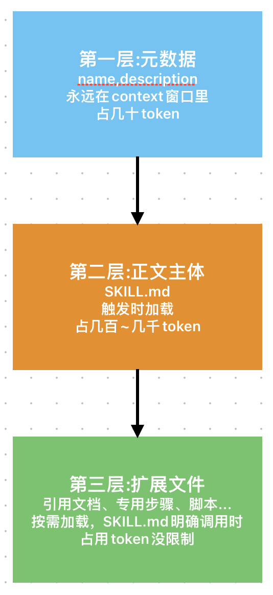
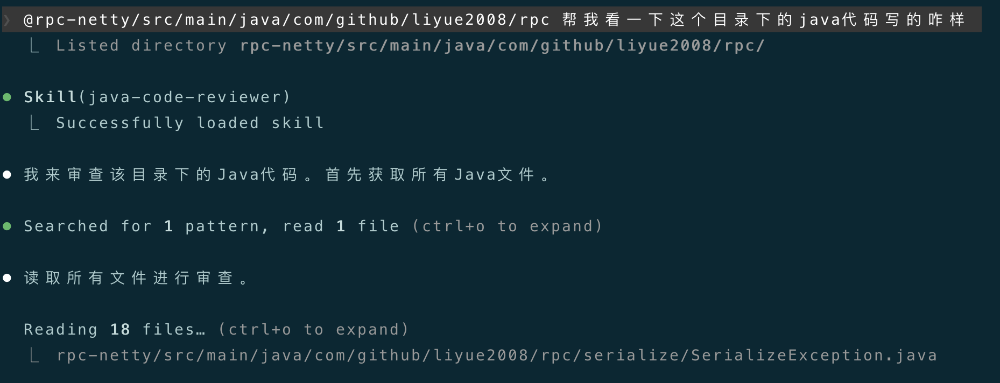
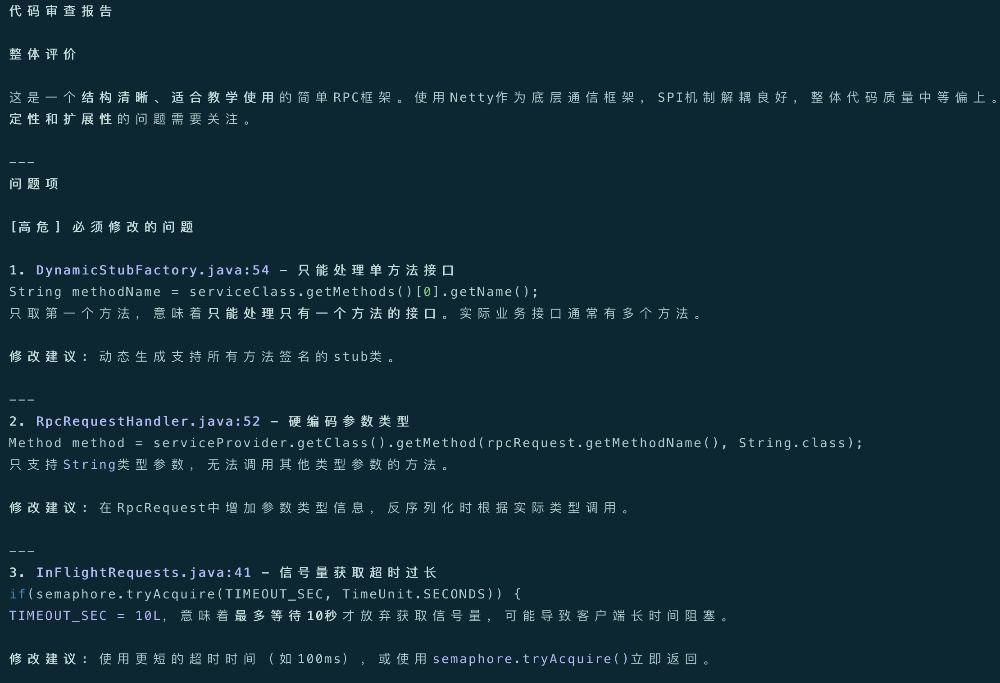
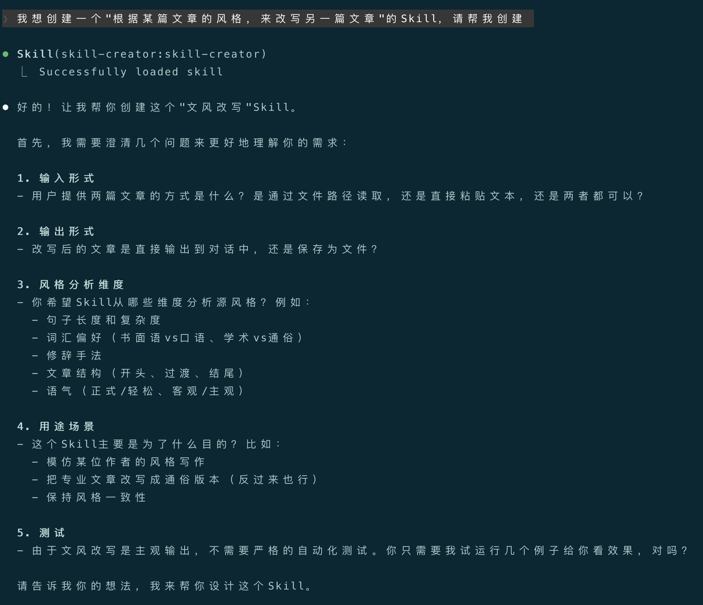

+++
date = '2026-04-10T19:37:30+10:00'
title = '玩转Claude Code(五)-Skills详解'
+++

大家好，我是bytezhou，玩转Claude Code(四)中介绍了`Slash Commands`，今天，我们来详细分析**AI Agent圈中一个如日中天的能力：`Skills`**。

我们之前用`Slash Commands`来封装工作流程，相比每次复制`Prompt`，确实"进化"了，但需要我们自己主动调用命令，总觉得差点意思。有没有一种更智能的方式，让AI自己去调用？这就是接下来要讲的`Skills`。

简单打个比方，**`Slash Commands`像是给AI员工派活；`Skills`则是给它建个"技能库"，它自己知道该用哪个。**

## 1.Skills：Agent"智能"的表现

要理解`Skills`，得先明白"命令"和"技能"有什么区别。

- **命令（Slash Command）**：由用户主动发起，我敲键盘，明确告诉 AI："去，把那段代码给我审一遍"。
- **技能（Skills）**：像个"自我介绍"。写好放那儿，它自己会向AI说："我擅长审查代码，有需要喊我"。

**差别在这儿：**

- **Slash Commands是人驱动的**，我不动，AI不动。
- **Skills是AI模型驱动的**，AI拿到需求后，会自己跑到"技能库"里查找，觉得匹配就自己加载、执行了。

**这就是Agent"智能"的表现。**我们不用记那么多命令，只需要像建图书馆一样，帮AI丰富它的"藏书"，它自己会去检索技能、应用技能。

## 2.Skill长啥样？

所谓的`Skill`，其实就是一套标准化的文件及目录结构。

### 2.1 基本结构：一个文件夹 + 一个`SKILL.md`

最基础的`Skill`，就是一个目录里塞一个`SKILL.md`：

```
my-skill/
└── SKILL.md
```

`SKILL.md`文件主要由两部分构成：

- **YAML元数据**：主要包括`name`和`description`。`name`是Skill的名称标识；**`description`非常重要，主要描述了该Skill的功能和触发时机，是给AI看的"索引关键词"，不能写糊弄了**。
- **Body正文**：该Skill具体的执行步骤。

```
---
name: skill-name
description: 功能描述和触发时机
---

# 执行步骤...

```

### 2.2 高级结构：带上工具箱

复杂的`Skill`，把不同的工具、模块化的处理步骤、其他文件引用、脚本等一起放进去：

```
market-analyse-skill/
├── SKILL.md          # 技能入口，负责整体调度
├── user.md           # 专门分析用户画像的详细步骤
├── sale.md           # 专门分析营销额的详细步骤
└── scripts/
    └── calc_marketing.py  # 计算营销额的python脚本，被SKILL.md调用
```

上面是一个"市场分析"的Skill，在这个结构中，`SKILL.md`是技能入口，负责整体调度，它会告诉AI："要进行用户画像分析，去查`user.md`；要计算营销额，去调用`calc_marketing.py`脚本"。

### 2.3 放哪儿：项目级 vs 用户级
和`CLAUDE.md`、`Slash Commands`一样，`Skills`分为 项目级 和 用户级：

- **项目 Skills（放 `项目根目录/.claude/skills/`）**：跟项目走，团队共享，可以提交到Git。
- **用户 Skills（放 `~/.claude/skills/`）**：自己用，对本地所有项目均生效，无需提交到Git。

## 3.核心加载机制：渐进式披露

下面介绍`Skills`的核心加载机制：**渐进式披露**，有效解决了"知识库无限大"和"上下文窗口有限"的矛盾。



**这是个"三层检索系统"：**

1. **第一层：看"索引"（发现层）**：CC启动时，只扫描所有Skill的元数据的`name`和`description`，塞进上下文窗口里，"脑子"里只记个索引目录，负担小，占用token非常低。
2. **第二层：翻"正文"（触发层）**：只有任务匹配上了某个Skill的`description`，CC才会去把那个Skill的`SKILL.md`正文加载进上下文窗口，现用现看，不看的时候不占token。
3. **第三层：查"附录"（深度执行层）**：`SKILL.md`里要显示调用某个脚本`func.py`，只有执行到那一步，CC才会去读那个脚本文件，这是深层次的按需加载，可以极大的扩展Skill的能力。

这个机制让Skill既强大（能装很多东西）、又高效（不占多余token），结合上面Skill的标准化文件及目录形式，可以跨项目移植。

## 4.Skills vs Slash Commands

| 对比维度 | Skills | Slash Commands |
| :---: | :---: | :---: |
|调用方|AI|用户|
|发现方式|AI通过匹配元数据中`description`自主发现|用户自己记忆，或者通过"/"查找|
|调用模式|声明式："我可以干...你在什么时候来调用..."|命令式："现在，去干..."|
|使用场景|让AI自主完成的开放式任务|确定的、由人主动发起的任务|

**我的个人经验：**

- 想一键主动触发固定流程 → **Slash Command**。
- 想让AI自动识别场景、自动触发调用 → **Skills**。

## 5.实例：写一个`java-code-reviewer`的Skill

把之前审查java代码的Slash Command，改写成Skill：`java-code-reviewer`。

**（一）创建一个用户级Skill：**

```bash
mkdir -p ~/.claude/skills/java-code-reviewer
```

**（二）写 SKILL.md**

把原来命令的工作流步骤，按Skill的格式重组。注意`description`字段，这是给AI检索用的"关键词"：

`~/.claude/skills/java-code-reviewer/SKILL.md`

```
---
name: java-code-reviewer
description: 专用于java代码审查。当用户提到审查java代码、看看代码写的咋样、检查代码质量、是否合规时触发该技能
---

# java-code-reviewer

## 功能
本技能用于对java代码进行专业深入的审查。

## 审查步骤
当用该技能对java代码进行审查时，必须遵循以下步骤：
1. 加载代码规范：从`CLAUDE.md`中获取java代码规范。若找不到用户明确定义的java代码规范，请参考网上java最佳实践。
2. 确定审查范围：明确用户要审查的代码范围（一般通过`@`指定），文件或目录。
3. 逐一审查代码：根据java代码规范、或java最佳实践，对目标代码逐一分析、审查。
4. 输出审查报告：按如下输出格式（必须遵守），生成一份markdown格式的审查报告。

## 输出格式
 - 整体评价：请整体评价目标代码质量。
 - 问题项：
      - [高危]：必须改的问题（比如有潜在隐患、或违反`单一职责`的问题）。
      - [中危]：建议修改的问题（比如设计模式优化）。
      - [低危]：代码风格或可读性问题。
 对每一个**问题项**，请列出**文件名、行号、问题描述、修改建议**。
```

**（三）测试**

把原来的Slash Command删了，重启CC，加载`java-code-reviewer`后，直接对CC说：

"@rpc-netty/src/main/java/com/github/liyue2008/rpc 帮我看一下这个目录下的java代码写的咋样"

CC会自动匹配上`java-code-reviewer`这个Skill：



最终输出符合要求的审查报告：



## 6.几点建议

折腾了一圈，关于写Skill有几点建议：

1. **一个Skill只干一件事**：别搞大杂烩，拆成几个小Skill，也别整一个"大而全"的Skill。职责单一，AI才匹配得准，上下文也越小。
2. **精心打磨description**：`description`是Skill的"索引"，写的越精确，AI才能精准触发。不要写"分析文件"这种废话；要写清楚能干啥、啥时候用，比如："用来分析pdf文件，提取表单内容。当提到处理pdf文件、提取表单内容、分析.pdf、分析文件、或提取文件内容时触发"。
3. **迭代Skill**：Skill也需要迭代，团队共用时，给Skill添加修改记录。

## 7.让AI来创建Skill

手搓`Skill`，和`古法编程`一样，均为下下策。AI时代，**让AI来生成`Skill`，才是正常玩法。**

Anthropic已经开源出了`skill-creator`，它也是一个Skill，但你可以理解成**Skill的Skill（元技能）**，专门用来引导用户创建Skill。用这玩意，你不用再学习SKILL.md的结构，直接在CC的对话流中，用人类语言交互来创建Skill。

2种方式安装`skill-creator`：

- **通过 plugins 安装**：先添加CC的官方插件市场，然后用`/plugin`命令，在官方插件中，找到`skill-creator`的插件，直接安装并启用即可（均在对话界面交互式操作完成）。
- **直接拷贝 skill-creator**：直接去Anthropic在github的官方插件仓库（https://github.com/anthropics/claude-plugins-official），找到插件中的`skill-creator`，把内层的"skill-creator"目录整体下载下来，再整体拷贝到项目级、或用户级的skill目录下即可。

现在来简单演示下，如何用`skill-creator`创建一个"根据某篇文章的风格，来改写另一篇文章的"Skill。

直接用人类语言告诉CC，你要创建一个Skill了：

```
我想创建一个"根据某篇文章的风格，来改写另一篇文章"的Skill，请帮我创建
```



可以看到，CC自动加载了`skill-creator`来创建"文风改写"Skill，并给出了一系列引导式提问。

补充了问题回答后，`skill-creator`就会帮你创建这个Skill，以下是最终生成的"文风改写"Skill：

````
---
name: style-rewrite
description: 用指定文章的文风改写另一篇文章。当用户说"用XXX的风格改写"、"模仿XX的语气"、"把某篇文章的风格应用到"、"这篇技术文档太生硬了，用更通俗的方式重写"时使用此Skill。两篇文章均通过文件路径提供，先分析风格特征，再进行改写，输出到对话确认后再保存文件。
---

# Style Rewrite Skill

根据指定文章的文风，改写另一篇文章。

## 输入

用户提供两个文件路径：
1. **风格源文件**（style_source.md）：要模仿的风格模板
2. **内容文件**（content.md）：需要被改写内容的原文

## 工作流程

### 第一步：读取文件

读取两个文件的内容：
- 风格源文件：分析其写作风格特征
- 内容文件：需要改写的内容

如果用户只提供了一个文件路径，询问另一个文件的路径。

### 第二步：风格分析

从以下维度分析风格源文件的特征，并在分析末尾注明字 数：

**1. 句子维度**
- 平均句长（字数）
- 句式结构（短句为主/长句为主/长短结合）
- 句式变化（是否频繁使用排比、问句、感叹句）

**2. 词汇维度**
- 用词风格（书面语/口语/混用）
- 专业术语密度
- 形容词和副词的使用频率
- 是否使用比喻、拟人等修辞

**3. 结构维度**
- 开头方式（直接切入/背景铺垫/提问引入）
- 段落过渡方式
- 结尾方式（总结/升华/留白/行动号召）

**4. 语气维度**
- 正式程度（严谨/轻松/幽默）
- 情感色彩（客观中立/主观表达/感召力）
- 与读者的距离感（亲切/权威/平等对话）

**5. 其他特征**
- 是否有独特的个人风格标记（如特定的口头禅、常用表达）

输出格式：

```
## 风格分析报告

**风格源文件**：[文件名]
**内容文件**：[文件名]

### 句子维度
- 平均句长：X字
- 句式结构：...
- 句式变化：...

### 词汇维度
- 用词风格：...
- 术语密度：...
- 修辞手法：...

### 结构维度
- 开头方式：...
- 过渡方式：...
- 结尾方式：...

### 语气维度
- 正式程度：...
- 情感色彩：...
- 读者距离：...

### 其他特征
- 特色表达：...

**总字数**：XXX字
```

### 第三步：文风改写

将内容文件按照风格源文件的风格进行改写。

**改写原则：**
1. **保留核心信息**：原文的核心观点、关键数据、逻辑链条必须保留
2. **风格迁移**：尽量模仿源文件的句式、词汇、结构特征
3. **自然流畅**：避免生硬的句式翻译，让文字读起来自然
4. **适度调整**：如果原文某些表达在目标风格下显得突兀，可以适当调整

**改写步骤：**
1. 理解原文的核心内容和逻辑结构
2. 按照源风格的句子维度调整句式
3. 按照源风格的词汇偏好选择用词
4. 应用源风格的开头、过渡、结尾方式
5. 检查是否保留了源风格的关键特征

### 第四步：输出结果

将改写后的文章完整输出到对话中，格式：

```
## 文风改写结果

**风格源**：[文件名]
**原文**：[文件名]

---

[改写后的全文]

---

**改写说明**：
- 简要说明做了哪些主要调整
- 如果有与源风格差异较大的地方，说明原因
```

### 第五步：保存确认

输出完成后，询问用户：

> 改写完成。是否需要保存到文件？如需保存，请提供文件名（默认：`[原内容文件名]_改写版.md`）。

- 如果用户确认保存：写入文件并告知保存路径
- 如果用户要求修改：了解需要修改的部分，进行针对性调整后重新输出

## 注意事项

- 如果两个文件中有重复或相关的内容，在分析时注明
- 如果内容文件较短而风格源文件较长，重点关注风格源文件中与内容相关的部分
- 改写时优先保证内容准确性，其次才是风格匹配度
````

## 结语

`Skills`真正的给AI赋能，以前给它写"脚本"（Prompt），现在给它建"能力库"。

掌握`Skills`，意味着用更高级的方式"编程"AI，它不再戳一下动一下，开始学会自己翻"工具箱"了。

下一篇，将介绍`MCP`，真正的扩展了AI的能力边界。

---

**感谢你点开这篇文章，欢迎关注我的公众号：10年码农，纯技术分享，一起在AI时代探索未来！**


---

**客官您满意的话，感谢打赏。**


