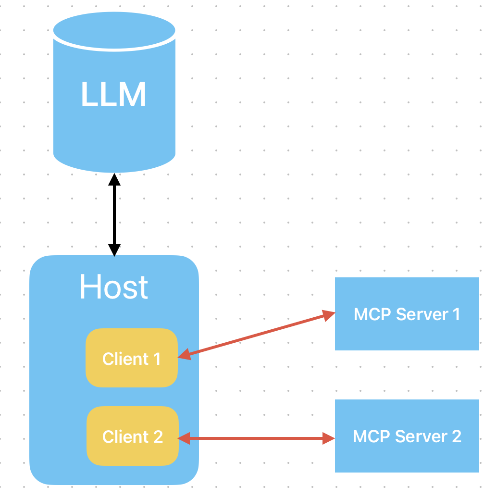
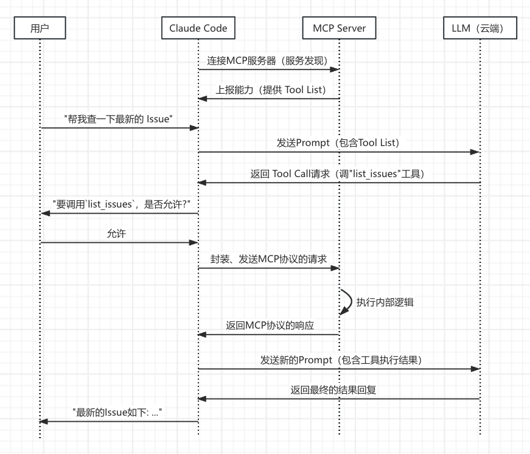
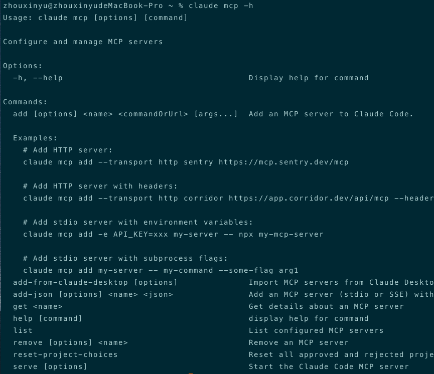
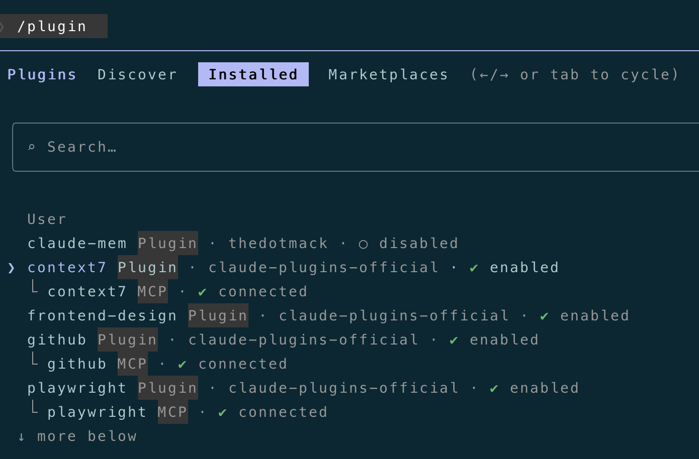
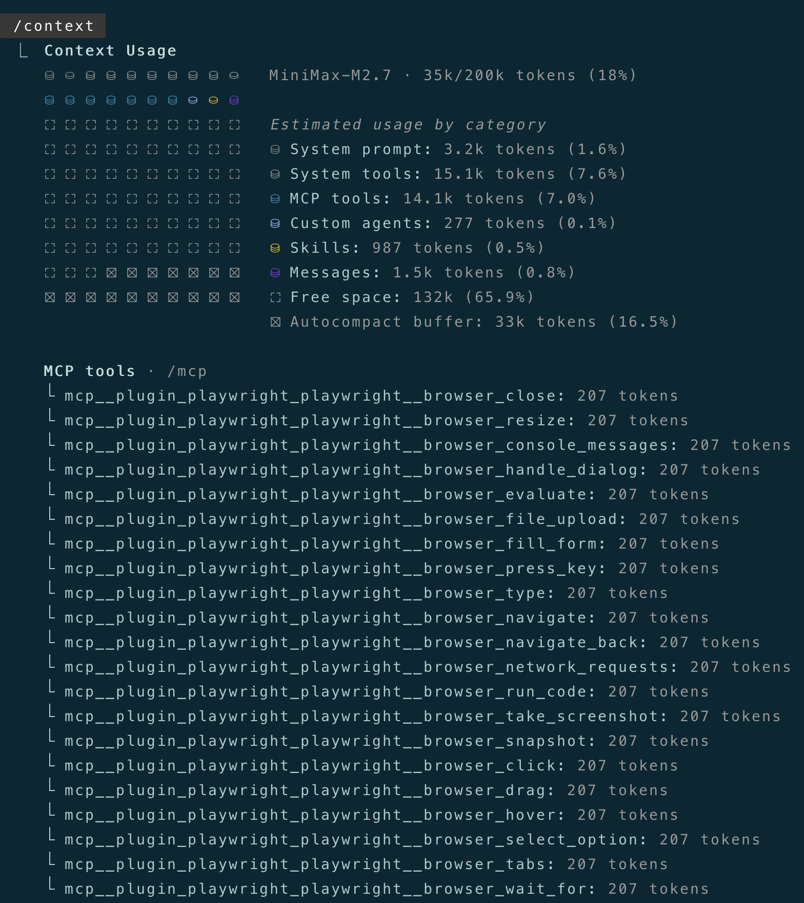
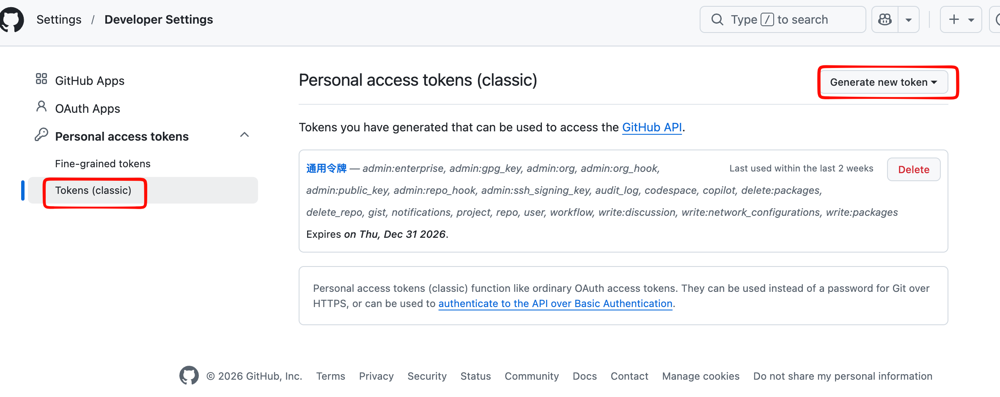
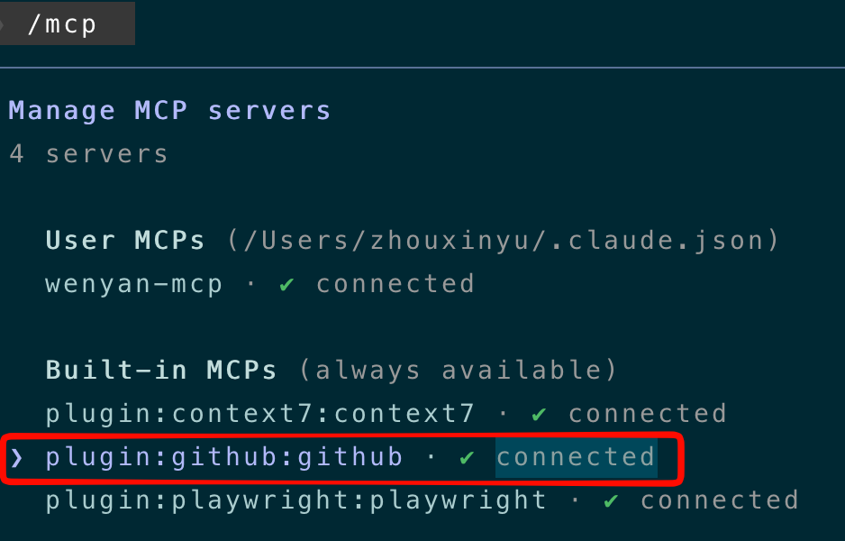
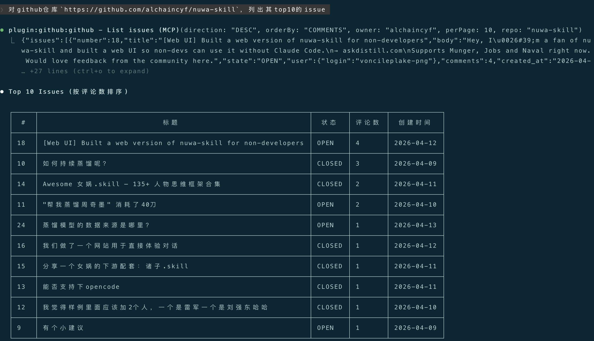
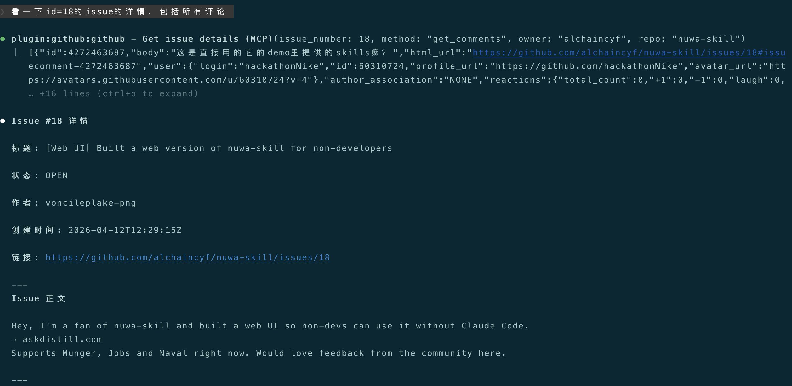
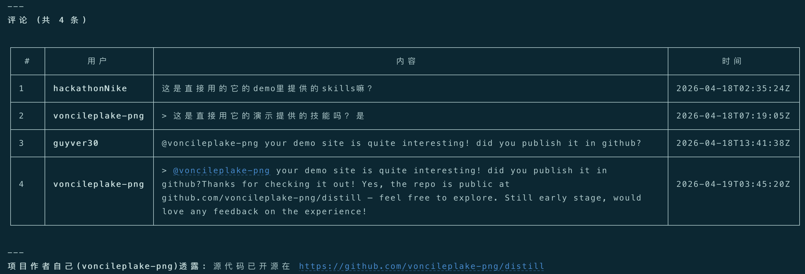

+++
date = '2026-04-19T23:03:30+10:00'
title = '小白也能玩转Claude Code(六):MCP详解(1)'
+++

大家好，我是bytezhou，玩转Claude Code系列已经来到第六篇了，本篇我们将解锁AI能力扩展的秘密武器：**MCP（Model Context Protocol），模型上下文协议**。

# 为什么需要MCP？

Claude Code作为Coding Agent来说，已经非常强大了，可以读写文件、执行Shell命令等，但它的能力边界，也就仅限于它的内置工具集，那问题来了：

- 想让CC写完代码后自动在GitLab上提个MR，咋整？
- 想让CC自己去深度查找不同第三方组件的最新文档，咋弄？
- 想让CC自己去连接数据库并操作相关的表，咋办？

这些任务，CC的内置工具根本撑不住，它们需要AI具备一种全新的能力与外部世界通信和交互，这，就是今天要介绍的**MCP**。

总的来说，**MCP是一套专门为AI Agent设计的通信协议**，它定义了一套标准的"语言"，让AI可以与外部世界进行结构化通信。可以简单理解为，**MCP是AI与外部世界的一个"适配器"**。

# MCP原理
先介绍一下MCP工作原理。MCP中有3个关键的角色定义：**Client（客户端）、Server（服务器）、Host（主机）**，它本质上是`Client-Server`模型，但增加了一个"Host"角色。

**Host（主机）："总指挥"**，用户直接使用的Agent应用，这儿的话，Host就是Claude Code本身，它主要负责：

- 直面用户，处理用户请求。
- 管理不同的Client实例。
- 作为云端LLM与所有Client之间的"总指挥"，分发任务。

**Server（服务器）："能力提供方"**，独立的第三方服务，可以是本地的一个进程，也可以是远端服务。GitHub MCP Server、Playwright MCP Server等，都是服务器。

作为"能力提供方"，Server最重要的职责是向Host暴露自己的能力，**即Tools（工具），也就是AI可以直接调用、执行的动作**，比如 GitHub MCP的`list_issues`就是一个工具。

**Client（客户端）："连接器"**，Host内部管理的实例，专门处理与对应Server的通信和交互，用户无感。

每一个MCP Server，在Host内都有一个专门的Client与其对应。该Client与Server建立1v1的连接、会话，处理底层协议、消息分发等，如下：



搞懂了这3个角色，咱们重新理一下**"Claude Code与MCP Server交互的过程"**：

> Claude Code收到云端大模型的"Tool Call"调用请求后，通过内部管理的特定Client，将该请求封装成一个遵循MCP协议的请求，发给对应的Server。Server执行完成后，将结果返给Client，再由Claude Code把结果展现给用户、或者发给云端大模型进一步处理。



上述流程就是CC与MCP Server交互的完整示例，可以看到：

- **服务发现：**CC启动时，就会根据配置去连接MCP Server，MCP Server会主动向CC上报自己的"能力"，告诉它自己有哪些工具（Tool List）可以使用。
- **职责分离：**云端大模型只负责思考和发出"指令"，根据可用Tool List，发出"调用工具"的指令。Claude Code及内部管理的Client，负责将“调用工具”的指令封装成标准MCP协议的请求。MCP Server则响应对应的"Tool Call"，执行相关的工具逻辑。

# 配置MCP服务器

CC里配置MCP Server，有几种方式：一是直接通过`claude mcp add`命令手动添加，二是把别人配置好的mcp json直接拷贝到我们的配置文件里，三是直接通过插件市场安装对应的plugin即可。

咱们先介绍下`claude mcp add`命令，其中一个关键参数是`--transport`，即传输协议，主要有2种：

- `--transport http`：连接**远程、通过HTTP交互**的 MCP Server。
- `--transport stdio`：连接**本地、通过 stdin/stdout（标准输入输出）进行交互**的 MCP Server。

另一个重要参数是`--scope`，决定了该MCP配置的作用域，主要也是2种：

| 参数配置 | 作用域 | 存放位置 | 使用场景 |
| :---: | :---: | :---: | :---: |
| --scope user | User（用户级） | ~/.claude.json | 个人私有的mcp配置，不上传git，不共享，对本地的所有项目生效 |
| --scope project | Project（项目级） | 项目根目录/.mcp.json | 团队公共的mcp配置，上传git，团队共享，仅对当前项目生效 |

这里MCP配置的"作用域"，和前几篇介绍的`CLAUDE.md`、`Slash Command`、`Skills`的**作用域**的概念和设计，是一脉相承的。

我们可以通过如下`add-json`命令直接添加一个"Project级"的GitHub MCP：

```
claude mcp add-json mcp_github '{"type":"http","url":"https://api.githubcopilot.com/mcp/","headers":{"Authorization":"Bearer ${GITHUB_TOKEN}"}}' --scope project
```

然后，你的项目根目录下的`.mcp.json`文件中，会多出这么一段内容：

```
{
  "mcpServers": {
    "mcp_github": {
      "type": "http",
      "url": "https://api.githubcopilot.com/mcp/",
      "headers": {
        "Authorization": "Bearer ${GITHUB_TOKEN}"
      }
    }
  }
}
```

> 关于`claude mcp`命令的相关参数，可以通过`claude mcp -h`命令查看帮助文档
> 
> 

前面说了，还可以把别人配置好的mcp json直接拷贝到我们的配置文件里，用户级的配置拷贝到`~/.claude.json`，项目级的配置拷贝到`项目根目录/.mcp.json`，比如，我把`everything-claude-code`项目（一个非常好用的CC神器）中的`mcp-configs`内容，拷贝到我相应的配置文件里即可，`mcp-configs`内容概览如下：

```
{
  "mcpServers": {
    "jira": {
      "command": "uvx",
      "args": ["mcp-atlassian==0.21.0"],
      "env": {
        "JIRA_URL": "YOUR_JIRA_URL_HERE",
        "JIRA_EMAIL": "YOUR_JIRA_EMAIL_HERE",
        "JIRA_API_TOKEN": "YOUR_JIRA_API_TOKEN_HERE"
      },
      "description": "Jira issue tracking — search, create, update, comment, transition issues"
    },
    "github": {
      "command": "npx",
      "args": ["-y", "@modelcontextprotocol/server-github"],
      "env": {
        "GITHUB_PERSONAL_ACCESS_TOKEN": "YOUR_GITHUB_PAT_HERE"
      },
      "description": "GitHub operations - PRs, issues, repos"
    },
    "supabase": {
      "command": "npx",
      "args": ["-y", "@supabase/mcp-server-supabase@latest", "--project-ref=YOUR_PROJECT_REF"],
      "description": "Supabase database operations"
    },
    "vercel": {
      "type": "http",
      "url": "https://mcp.vercel.com",
      "description": "Vercel deployments and projects"
    },
    "context7": {
      "command": "npx",
      "args": ["-y", "@upstash/context7-mcp@latest"],
      "description": "Live documentation lookup — use with /docs command and documentation-lookup skill (resolve-library-id, query-docs)."
    },
    
    ......
    
  }
}
```

最简单的MCP配置方式，还是直接通过CC的插件市场安装对应的`plugin`，交互式界面直接选择添加插件，CC自动安转插件，安装完成并启用后，就可以直接使用对应的 MCP Server：



在CC中，可以通过`/context`命令看到当前加载的所有MCP Server的所有工具列表：



# 实战：集成GitHub MCP Server

我们在CC中配置GitHub MCP Server，给CC集成直接操作GitHub的能力，如创建Issue、fork仓库、拉取评论等。

## 1.配置GitHub MCP Server

启动CC，添加官方插件市场：

```
/plugin marketplace add https://github.com/anthropics/claude-plugins-official
```

添加插件市场后，在`Discover`面板中找到`github`插件，直接进行安装（建议选`user scope`）。插件安装完成后，就可以在`Installed`面板中看到github MCP了：


## 2.创建并设置GitHub Token

想要成功连上GitHub MCP Server，还缺一个东西：GitHub Token，你的github“通行证”，我们先创建一个。

点击你的github主页右上角 -> 选择 Settings -> 拉到页面下方，选择Developer settings，然后你看到下面这个页面：



点击"Generate new token"（classic的），跟着页面引导一步一步操作，最后会生成一个"通用令牌"，这个"通用令牌"就是你的GitHub Token，请记下该token，务必不要泄露！

有了GitHub Token后，我们回来配置环境变量：`GITHUB_PERSONAL_ACCESS_TOKEN`。

Linux/macOS中，一般在`~/.bash_profile`文件中添加环境变量：

```
export GITHUB_PERSONAL_ACCESS_TOKEN=你的GitHub Token
```

添加后重启终端，然后启动Claude Code，输入`/mcp`，看到github mcp是`connected`状态，即代表配置、连接成功：



## 3.用人类语言操作GitHub

GitHub MCP Server集成完毕，接下来，我们在CC中直接使用人类语言来操作GitHub。

```
对github仓库`https://github.com/alchaincyf/nuwa-skill`，列出其top10的issue
```



可以看到，CC自动调用了GitHub MCP的`List issues`工具，找到了top10的issues，我们继续：

```
看一下id=18的issue的详情，包括所有评论
```




可以看到，CC自动调用了GitHub MCP的`Get issue details`工具，列出了id=18的issue详情和评论。

**这就是MCP扩展的威力**，通过Claude Code中的简单配置和一个环境变量，就把AI和强大的远端GitHub MCP Server无缝连接，让我们在本地可以直接用人类语言操作GitHub，太强了。

# 结语

本篇从MCP原理出发，详细介绍了如何在Claude Code中配置MCP，最后演示了如何集成GitHub MCP Server、并用人类语言进行相关操作，可以看到，MCP极大扩展了AI Agent的能力。

下一篇，**我们将自己动手写一个自定义的MCP Server**，给Claude Code插上"我们的翅膀"。

---

**感谢你点开这篇文章，欢迎关注我的公众号：10年码农，纯技术分享，一起在AI时代探索未来！**


---

**客官您满意的话，感谢打赏。**

