+++
date = '2026-04-22T18:05:00+10:00'
title = '小白也能玩转Claude Code(七)-写个微信公众号的MCP Server'
+++

大家好，我是bytezhou，本篇我们将自己动手写一个操纵微信公众号的MCP Server，该Server部署在本地，通过`--transport stdio`的方式暴露给Claude Code。通过该MCP Server，可以在CC中直接用人类语言操作我们的公众号，非常强大。不废话，下面直接进入主题。

# 1.环境

本次开发采用Java技术栈，所有的`需规、设计、实现、测试、bug修复、部署`均由 Claude Code 100%完成，我仅进行流程编排与审核，整体环境如下：

- everything-claude-code插件: 1.10.0（https://github.com/affaan-m/everything-claude-code）
- JDK: 17
- Spring AI: 1.1.4
- Spring Boot: 3.4.4
- weixin-java-mp: 4.8.0 (https://github.com/binarywang/WxJava，很出名的微信开发 Java SDK)

上述组件说明如下：

- everything-claude-code插件确实是CC的一个神器，但过于"全"、反而有些"臃肿"，根据个人情况，可能要去掉一些Hook、或MCP配置（都可以让CC代劳）。
- Spring AI是Spring专门为AI应用开发封装的一套SDK（https://spring.io/projects/spring-ai），主流的功能都支持，比如向量数据库、MCP集成、RAG等。（所有的文档查阅、使用方法检索这些，都可以让CC代劳）
- weixin-java-mp是进行微信公众号开发的一个SDK，高star项目，目前最新的稳定版本是4.8.0，封装了几乎所有的公众号开放API。

最后，大致的结构如下：

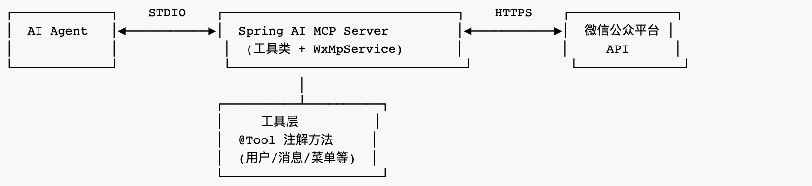

# 2.架构、配置、核心代码

## 项目依赖与配置

首先，你可以直接让CC创建一个Spring AI的标准demo项目，然后去掉文本生成（即聊天）相关的依赖，`集成MCP Server开发的依赖（stdio方式），添加weixin-java-mp组件（4.8.0）的依赖，`再调整项目配置和代码，最终的pom文件的主要依赖如下：

```
    <dependencyManagement>
        <dependencies>
            <dependency>
                <groupId>org.springframework.ai</groupId>
                <artifactId>spring-ai-bom</artifactId>
                <version>1.1.4</version>
                <type>pom</type>
                <scope>import</scope>
            </dependency>
        </dependencies>
    </dependencyManagement>

    <dependencies>
        <!-- Spring AI - MCP Server -->
        <dependency>
            <groupId>org.springframework.ai</groupId>
            <artifactId>spring-ai-starter-mcp-server</artifactId>
        </dependency>

        <dependency>
            <groupId>com.github.binarywang</groupId>
            <artifactId>weixin-java-mp</artifactId>
            <version>4.8.0</version>
        </dependency>

        <!-- Test -->
        <dependency>
            <groupId>org.springframework.boot</groupId>
            <artifactId>spring-boot-starter-test</artifactId>
            <scope>test</scope>
        </dependency>
    </dependencies>
```

主要的项目配置如下：

```
spring:
  application:
    name: spring-ai-demo

  ai:
    mcp:
      server:
        name: spring-ai-mcp-server
        version: 1.0.0
        transport: stdio
```

## 整体架构

有了标准项目结构后，就可以按照`SDD范式`开发了（不清楚的朋友，可以看看往期SDD的文章）。

比如，你要先让CC帮你把这个微信公众号MCP Server的需求规范理出来，很简单，直接告诉它参考相关api文档就行：

```
1.请查阅微信公众号的开发文档和api手册。
2.@pom.xml 请参考pom文件中的第三方依赖`weixin-java-mp`的相关文档和使用方式的封装。

根据上述2种方式综合得到的信息，提取出微信公众号的基本操作能力，作为当前Spring AI项目的MCP Server的主要工具能力。
请综合规划，根据上述要求生成当前项目MCP Server的需求规范文档。
```

后面的技术方案规划、TDD循环方式的开发过程等，我就不赘述了。

**完整架构如下：**

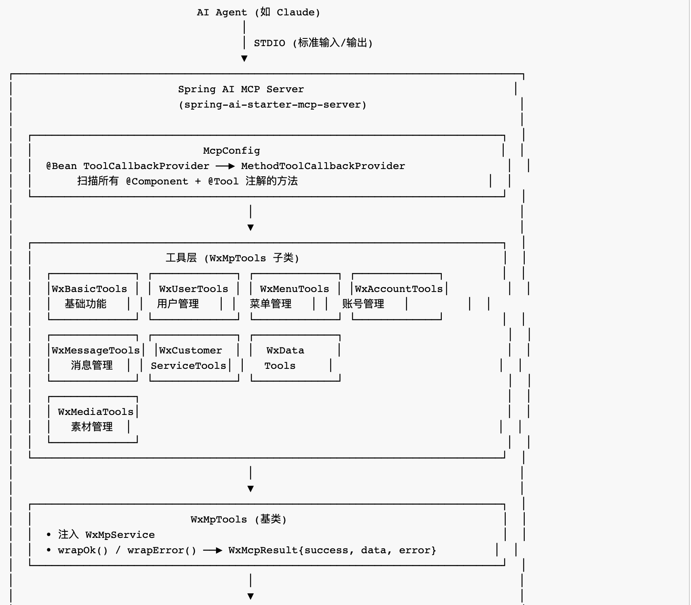
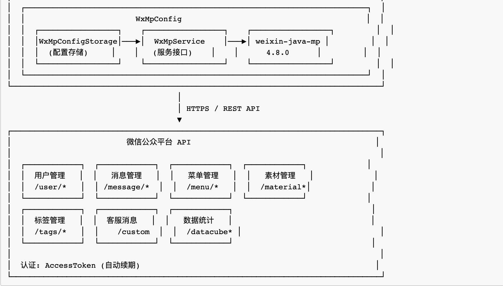

**整个交互流程如下：**

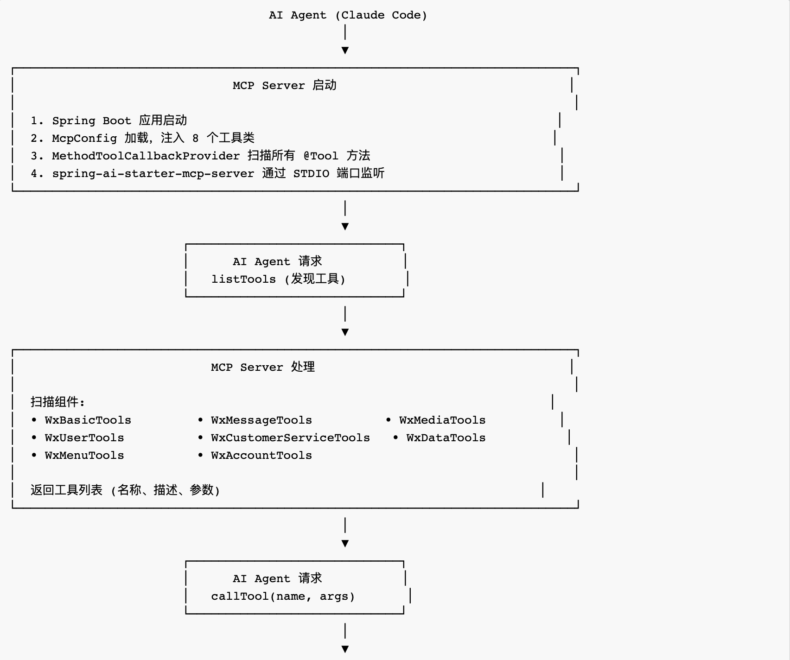
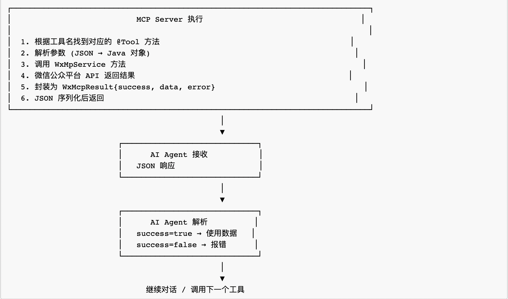

## 核心代码

### `Tool`的实现

我们来看一个`Tool`的实现例子：获取用户信息

```java
@Component
public class WxUserTools extends WxMpTools {

    @Tool(description = "获取用户基本信息")
    public String getUserInfo(
            @ToolParam(description = "用户 OpenID") String openid,
            @ToolParam(description = "语言 (zh_CN/zh_TW/en)", required = false) String lang) {
        try {
            String language = (lang != null && !lang.isBlank()) ? lang : "zh_CN";
            WxMpUser user = wxMpService.getUserService().userInfo(openid, language);
            return wrapOk(user);
        } catch (me.chanjar.weixin.common.error.WxErrorException e) {
            return wrapError(e);
        }
    }

    ......
    
}
```

- @Tool 注解：标明该方法是MCP Server提供的一个工具，该工具可被AI Agent自动发现、调用。其中，工具的元数据`description`字段很重要，是该工具向LLM的"自我介绍"，LLM判断要调用哪个工具时，根据该`description`字段的信息进行匹配判定。比如，用户说"查一下公众号的用户信息"，Claude Code在所有工具的`description`里进行语义匹配，最终判定`getUserInfo`工具最合适，就触发调用`getUserInfo`工具。和前面介绍的Skill的元数据中 `description`的作用类似。
- @ToolParam 注解：标明工具的参数。LLM在决定调用某个工具时，该字段就是LLM要填充的调用参数。其中，`required = false`表示非必填参数(可有可无)。

### `Tool`的注册

```
@Configuration
public class McpConfig {

    /**
     * Registers all @Tool-annotated methods from tool classes as MCP tools.
     * Add more tool objects to MethodToolCallbackProvider.builder() as needed.
     */
    @Bean
    public ToolCallbackProvider toolCallbackProvider(
            WxBasicTools wxBasicTools,
            WxMessageTools wxMessageTools,
            WxUserTools wxUserTools,
            WxMenuTools wxMenuTools,
            WxAccountTools wxAccountTools,
            WxCustomerServiceTools wxCustomerServiceTools,
            WxDataTools wxDataTools,
            WxMediaTools wxMediaTools
    ) {
        return MethodToolCallbackProvider.builder()
                .toolObjects(
                        wxBasicTools,
                        wxMessageTools,
                        wxUserTools,
                        wxMenuTools,
                        wxAccountTools,
                        wxCustomerServiceTools,
                        wxDataTools,
                        wxMediaTools
                )
                .build();
    }
}
```

Spring AI通过`MethodToolCallbackProvider`把所有`带@Tool注解的方法`，注册成该MCP Server的工具，然后在AI Agent连接过来、初始协商完成后，把所有注册的工具（包括工具元数据）返给AI Agent，完成工具自动发现的闭环。

## CC进行MCP配置

最后，在Claude Code这边进行MCP连接配置（项目级MCP配置），在当前项目根目录下 `.mcp.json`中，添加MCP配置：

```
{
  "mcpServers": {
    "wx-mcp": {
      "command": "java",
      "args": [
        "-jar",
        "target/spring-ai-demo-0.0.1-SNAPSHOT.jar"
      ],
      "env": {
        "WEIXIN_APP_ID": "${WEIXIN_APP_ID}",
        "WEIXIN_APP_SECRET": "${WEIXIN_APP_SECRET}",
        "WEIXIN_TOKEN": "${WEIXIN_TOKEN}",
        "WEIXIN_AES_KEY": "${WEIXIN_AES_KEY}"
      }
    }
  }
}
```

其中，`WEIXIN_APP_ID`等4个环境变量，需要在微信公众号里获取，然后通过`export WEIXIN_APP_ID=your_APP_ID`来设置。`transport`方式默认是`stdio`，这里没有显示设置。

MCP配置好后，启动claude，输入`/mcp`看一下配置的`wx-mcp`连接情况，若是"connected"就表示ok了，点进去还可以看到注册的30多个工具、以及每个工具的详情：

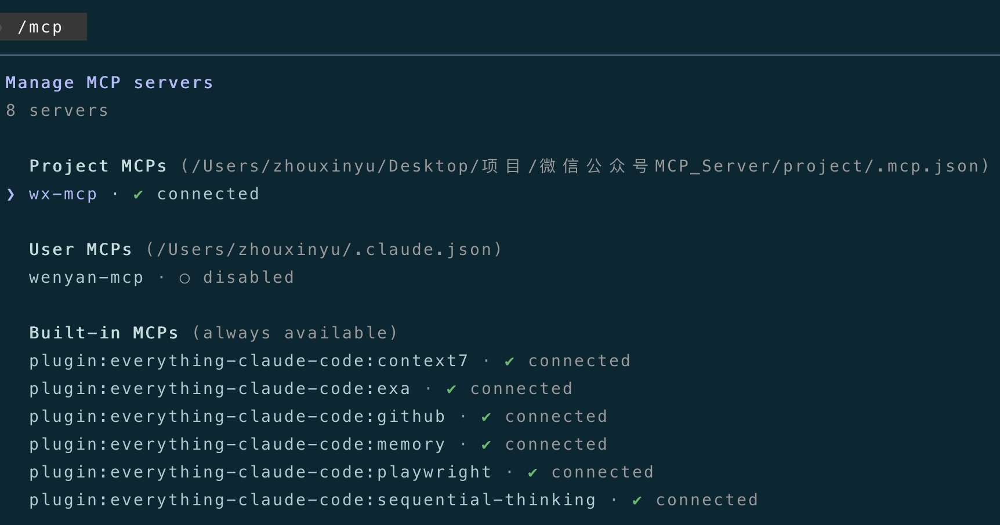

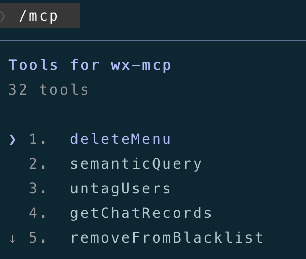

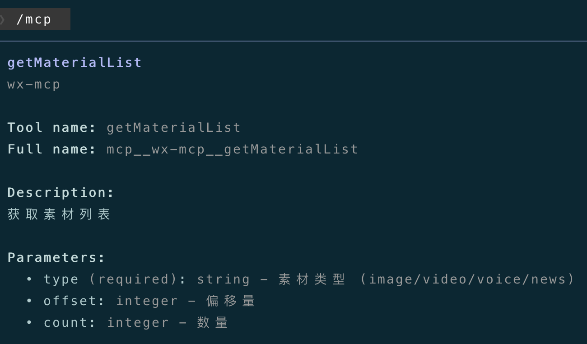

# 3.使用效果

下面，我们在CC中直接用人类语言操作公众号，看一下效果

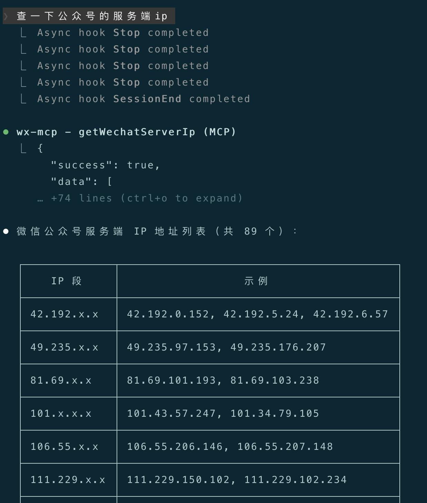

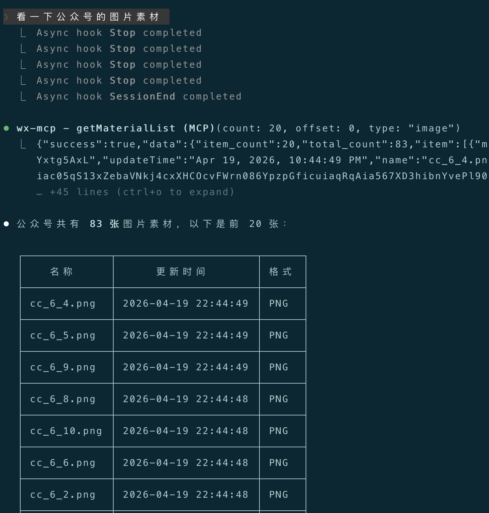

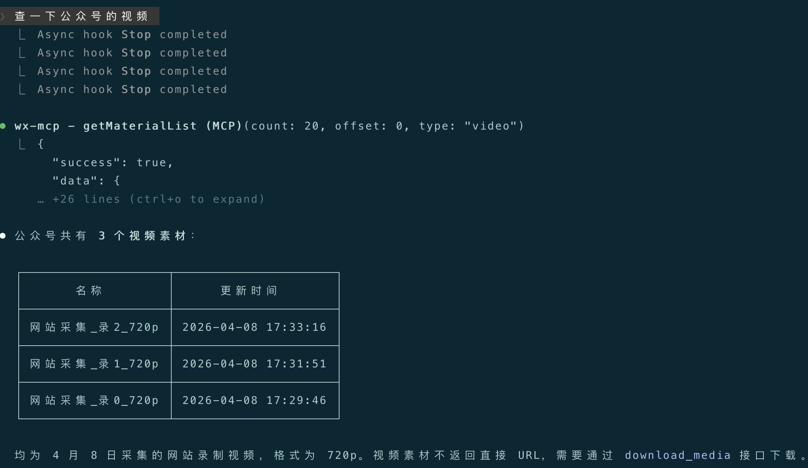

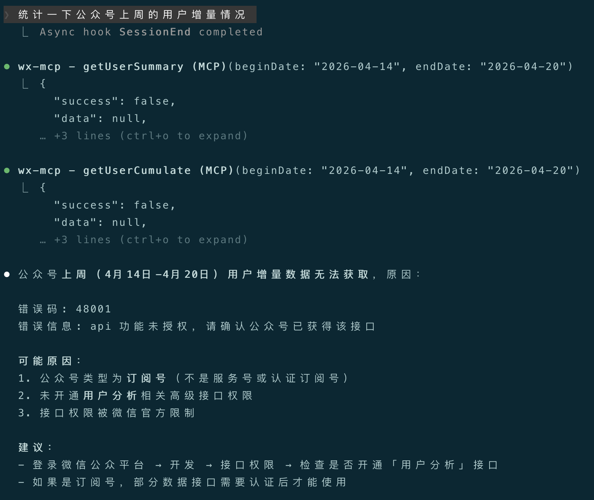

可以看到，CC准确的理解了我们的语言意图，调用了相关的公众号MCP Tool来完成我们的请求（最后一个api调用，因为权限问题未能成功）。

# 4.结语

本篇介绍了用Java技术栈来开发一个自定义的微信公众号MCP Server，让Claude Code可以直接操作我们的公众号，等于"自定义"了CC的能力。下一篇，我将介绍Claude Code的"分身"——**SubAgent**。

---

**感谢你点开这篇文章，欢迎关注我的公众号：10年码农，纯技术分享，一起在AI时代探索未来！**


---

**客官您满意的话，感谢打赏。**

