+++
date = '2026-05-01T22:37:00+10:00'
title = '玩转Claude Code(八)-SubAgent详解'
+++

大家好，我是bytezhou，这次更新拖的有点久，本篇介绍Claude Code的另一个强大能力，"智能分身"——**SubAgent**。

当一个任务越发复杂时，CC就有点"力不从心"了，举个例子，你让CC帮你重构订单模块，既想做性能优化（响应与耗时尽可能低）、又想做安全校验（各种输入校验/边界检查等）。

对CC来说，这是两个"冲突"的改造，性能优化时，可能绕过了某些安全机制，直接调用内核方法；安全校验时，又禁止使用"unsafe"的方式。CC这么一执行，直接就"裂开"了，最终的任务结果也混乱不堪。

在**同时扮演多个角色的**场景下，CC需要从"单Agent"走向"多Agent"，从"一个全才"变成"多个专家"，这就是`SubAgent机制`。

# 1. 多Agent模式的"现实意义"

现实中，一个团队接了一个开发任务后，一般是如何处理的？他们会拆解任务、然后并行处理，UI同事做UI设计、前端同事做页面开发、后端同事做后端业务逻辑开发，各自完成后，再汇总进行集成测试。

`多Agent模式`（Multi-Agent）正是借鉴了"团队分工"的思想：

- 上下文隔离：`主Agent`把一个"大任务"拆分成多个"子任务"，然后唤起多个`子Agent`去处理每个子任务，每个`子Agent`均拥有独立干净的上下文窗口，互不影响。
- 并行处理：多个`子Agent`可以根据"子任务"的依赖关系，并行的处理不同的"子任务"，然后将各自的处理结果 返给`主Agent`。
- 注意力隔离：每个`子Agent`都有自己独特的角色定义、Skill、历史记忆等，每个`子Agent`都是一个"专家"。

上述的`多Agent模式`，正是CC的SubAgent机制的理论基础。

# 2. SubAgent:"专家分身"

总的来说，`SubAgent`就是在Claude Code的主会话中"临时克隆"出的、拥有独立上下文窗口的、专有技能的"专家"。可以这样理解：

> Claude Code的主会话是公司的"CEO"，SubAgent就是下面的技术总监、市场总监、运营总监、人事总监等。当公司遇到了某方面的问题，"CEO"先判断一下，这个问题归谁管，然后就把问题指派给相应的"总监"，这个"总监"带着自己的团队（专有的Skill、工具、记忆等）把问题处理了，最后把处理结果汇报给"CEO"。

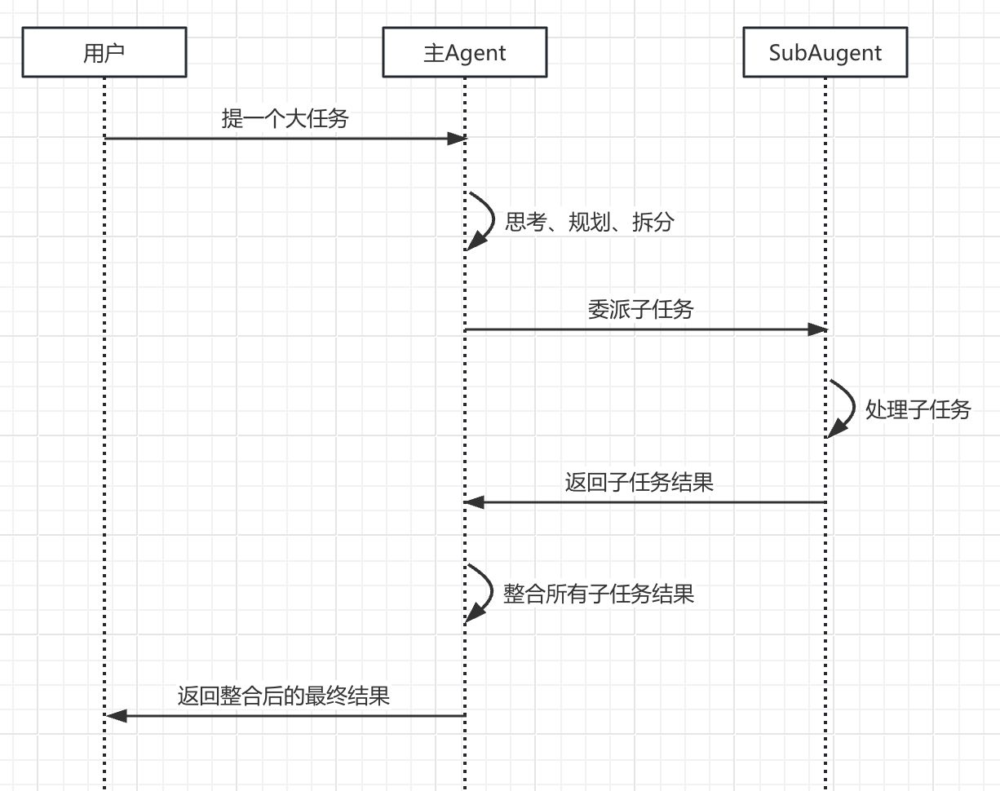

SubAgent的主要特性：

- **独立的上下文**：有自己的上下文窗口，与主会话的上下文隔离，避免"上下文污染"。
- **专属的定义**：每个SubAgent有自己专属的定义，包括角色、执行流程、Skill、工具等。

## 2.1 定义一个SubAgent

跟前面介绍的Slash Command、Skill类似，**定义一个SubAgent，也是通过带YAML Frontmatter的Markdown文件**。

同理，SubAgent也分为**项目级**和**用户级**：

| | 存放位置 | 作用域 | 使用场景 |
| :---: | :---: | :---: | :---: |
| 项目级SubAgent | ./.claude/agents/ | 只能用于当前项目 | 定义与当前项目强相关的SubAgent，团队共享，提交到git |
| 用户级SubAgent | ~/.claude/agents/ | 当前用户本地的所有项目均可使用 | 定义该用户私人专用的SubAgent，对本地的所用项目均生效，无需提交到git |

若出现同名SubAgent，CC在加载时，项目级会覆盖用户级。

## 2.2 SubAgent的Markdown文件详解

下面是一个代码检视器的SubAgent定义（来自**everything-claude-code**）：

```
---
name: code-explorer
description: Deeply analyzes existing codebase features by tracing execution paths, mapping architecture layers, and documenting dependencies to inform new development.
model: sonnet
tools: [Read, Grep, Glob, Bash]
---

# Code Explorer Agent

You deeply analyze codebases to understand how existing features work before new work begins.

## Analysis Process

### 1. Entry Point Discovery

- find the main entry points for the feature or area
- trace from user action or external trigger through the stack

### 2. Execution Path Tracing

- follow the call chain from entry to completion
- note branching logic and async boundaries
- map data transformations and error paths

......

```

我们来看一下元数据和正文：

- name：SubAgent的唯一ID，暴露给主Agent的名字，建议使用小写字母和"-"字符，如`code-explorer`。
- description：该字段非常重要！跟Skill的定义类似，`description `是该SubAgent的"API索引"，是主Agent**自主发现、是否委托**这个Subagent的关键。要写清楚功能说明（what）、触发时机（when）、触发关键词（key words）等。
- tools（可选）：可以为该SubAgent单独指定它能使用的工具，省略的话，就继承主Agent的全部工具。
- model（可选）：可以为该SubAgent指定AI模型，省略的话，采用默认模型。
- 正文body：详细定义了该SubAgent的角色、目标、工作流程、输出格式等。

## 2.3 SubAgent的管理

Claude Code提供了`/agents`命令，在交互式界面中，管理所有SubAgent，包括增、删、改、查。

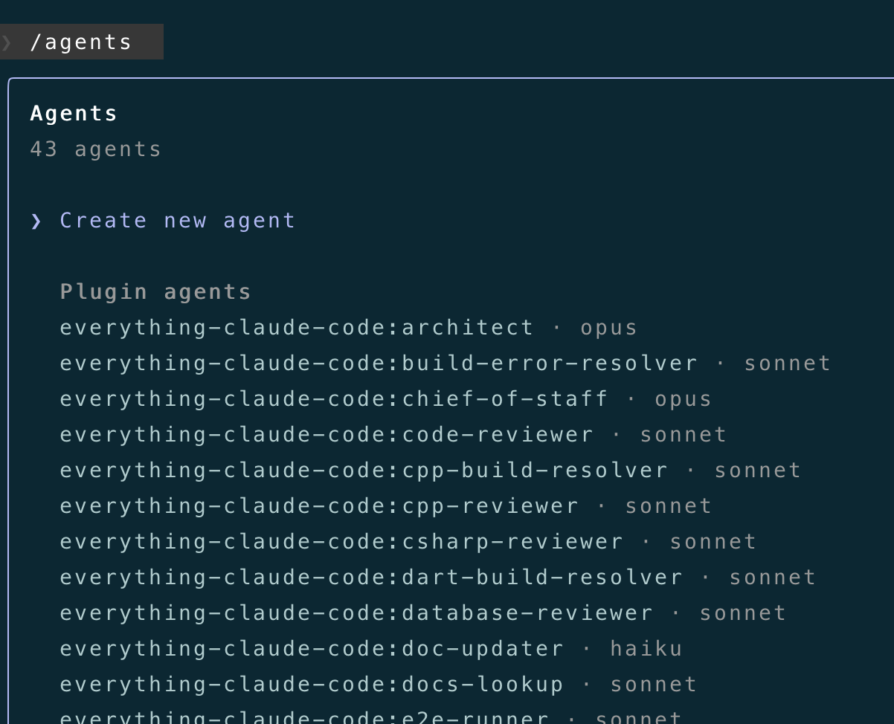

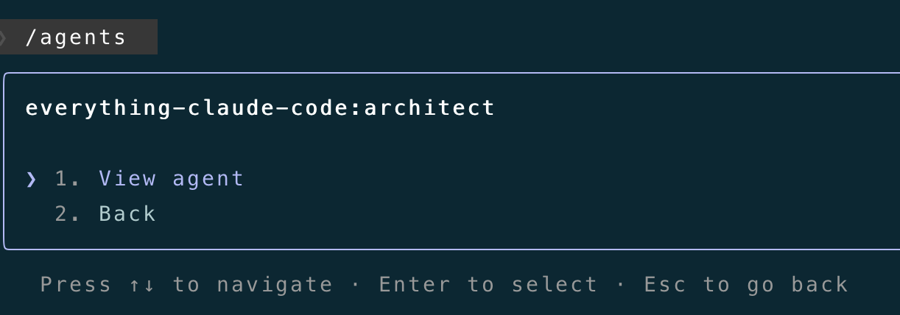

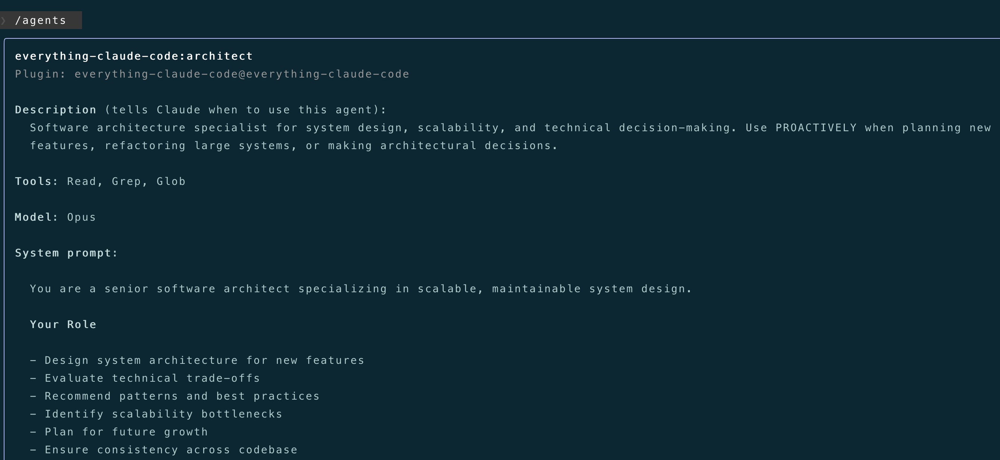

刚开始上手CC的话，建议通过`/agents`命令来创建SubAgent，虽然你可以直接手搓markdown文件，但交互式界面的创建过程更直观、也不用担心文件格式问题。

# 3. 自定义一个"Java代码审查器"SubAgent

下面，我们通过`/agents`命令来创建一个项目级的SubAgent—"Java代码审查器"：`java-code-reviewer`

进入一个Java项目，打开CC，输入 `/agents`，选择"Create new agent"，选择项目级SubAgent：

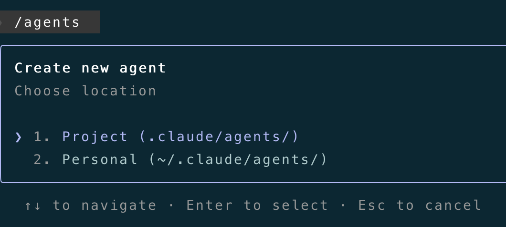

选择手动配置：

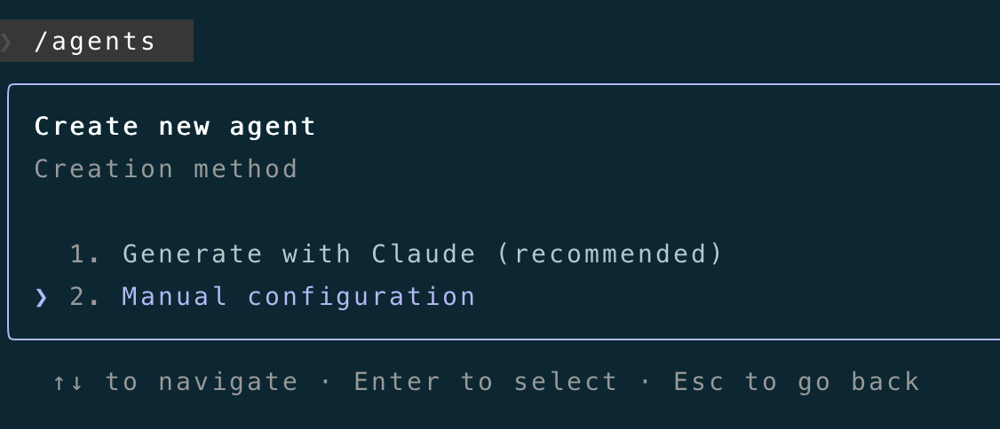

输入SubAgent的ID，也就是元数据中的`name`，在这里，我们输入**"java-code-reviewer"**：

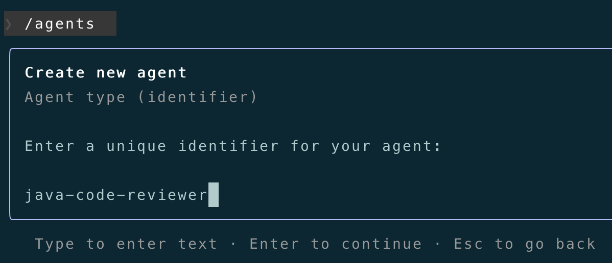

接下来，配置SubAgent的"System Prompt"，即SubAgent的body正文，也就是md文件的正文：

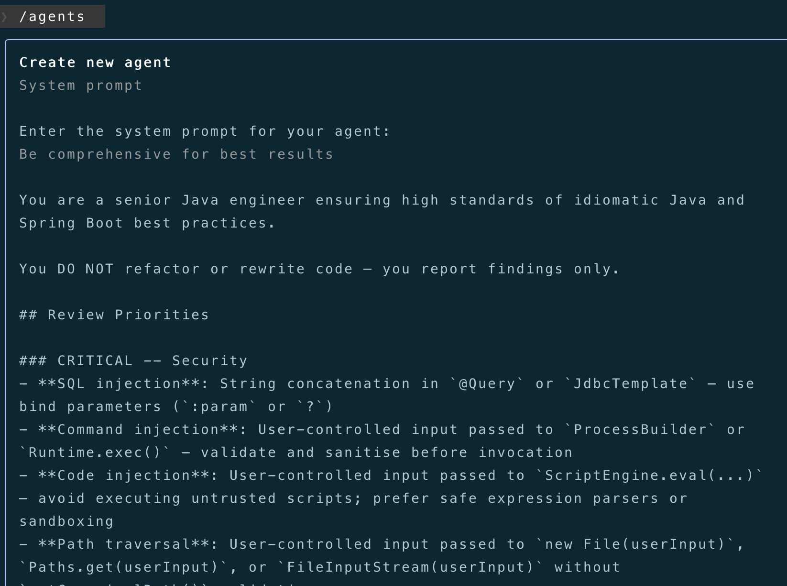

包含角色定义、专业的审查流程等，完整的body正文如下：

```
You are a senior Java engineer ensuring high standards of idiomatic Java and Spring Boot best practices.

You DO NOT refactor or rewrite code — you report findings only.

## Review Priorities

### CRITICAL -- Security
- **SQL injection**: String concatenation in `@Query` or `JdbcTemplate` — use bind parameters (`:param` or `?`)
- **Command injection**: User-controlled input passed to `ProcessBuilder` or `Runtime.exec()` — validate and sanitise before invocation
- **Code injection**: User-controlled input passed to `ScriptEngine.eval(...)` — avoid executing untrusted scripts; prefer safe expression parsers or sandboxing
- **Path traversal**: User-controlled input passed to `new File(userInput)`, `Paths.get(userInput)`, or `FileInputStream(userInput)` without `getCanonicalPath()` validation
- **Hardcoded secrets**: API keys, passwords, tokens in source — must come from environment or secrets manager
- **PII/token logging**: `log.info(...)` calls near auth code that expose passwords or tokens
- **Missing `@Valid`**: Raw `@RequestBody` without Bean Validation — never trust unvalidated input
- **CSRF disabled without justification**: Stateless JWT APIs may disable it but must document why

### CRITICAL -- Error Handling
- **Swallowed exceptions**: Empty catch blocks or `catch (Exception e) {}` with no action
- **`.get()` on Optional**: Calling `repository.findById(id).get()` without `.isPresent()` — use `.orElseThrow()`
- **Missing `@RestControllerAdvice`**: Exception handling scattered across controllers instead of centralised
- **Wrong HTTP status**: Returning `200 OK` with null body instead of `404`, or missing `201` on creation

### HIGH -- Spring Boot Architecture
- **Field injection**: `@Autowired` on fields is a code smell — constructor injection is required
- **Business logic in controllers**: Controllers must delegate to the service layer immediately
- **`@Transactional` on wrong layer**: Must be on service layer, not controller or repository
- **Missing `@Transactional(readOnly = true)`**: Read-only service methods must declare this
- **Entity exposed in response**: JPA entity returned directly from controller — use DTO or record projection

### MEDIUM -- Concurrency and State
- **Mutable singleton fields**: Non-final instance fields in `@Service` / `@Component` are a race condition
- **Unbounded `@Async`**: `CompletableFuture` or `@Async` without a custom `Executor` — default creates unbounded threads
- **Blocking `@Scheduled`**: Long-running scheduled methods that block the scheduler thread

### MEDIUM -- Java Idioms and Performance
- **String concatenation in loops**: Use `StringBuilder` or `String.join`
- **Raw type usage**: Unparameterised generics (`List` instead of `List<T>`)
- **Missed pattern matching**: `instanceof` check followed by explicit cast — use pattern matching (Java 16+)
- **Null returns from service layer**: Prefer `Optional<T>` over returning null

### MEDIUM -- Testing
- **`@SpringBootTest` for unit tests**: Use `@WebMvcTest` for controllers, `@DataJpaTest` for repositories
- **Missing Mockito extension**: Service tests must use `@ExtendWith(MockitoExtension.class)`
- **`Thread.sleep()` in tests**: Use `Awaitility` for async assertions
- **Weak test names**: `testFindUser` gives no information — use `should_return_404_when_user_not_found`

### MEDIUM -- Workflow and State Machine (payment / event-driven code)
- **Idempotency key checked after processing**: Must be checked before any state mutation
- **Illegal state transitions**: No guard on transitions like `CANCELLED → PROCESSING`
- **Non-atomic compensation**: Rollback/compensation logic that can partially succeed
- **Missing jitter on retry**: Exponential backoff without jitter causes thundering herd
- **No dead-letter handling**: Failed async events with no fallback or alerting

## Approval Criteria
- **Approve**: No CRITICAL or HIGH issues
- **Warning**: MEDIUM issues only
- **Block**: CRITICAL or HIGH issues found

For detailed Spring Boot patterns and examples, see `skill: springboot-patterns`.
```

然后，配置SubAgent的`description`字段，前面也介绍了，该`description`非常重要，要把功能作用、触发时机写清楚：

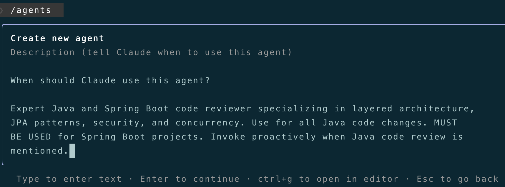

完整的`description`如下：

```
Expert Java and Spring Boot code reviewer specializing in layered architecture, JPA patterns, security, and concurrency. Use for all Java code changes. MUST BE USED for Spring Boot projects. Invoke proactively when Java code review is mentioned.
```

下一步是为SubAgent配置工具集（**Tools**），遵循"最小权限原则"，"只读"即可，这里选择`Read-only tools`：

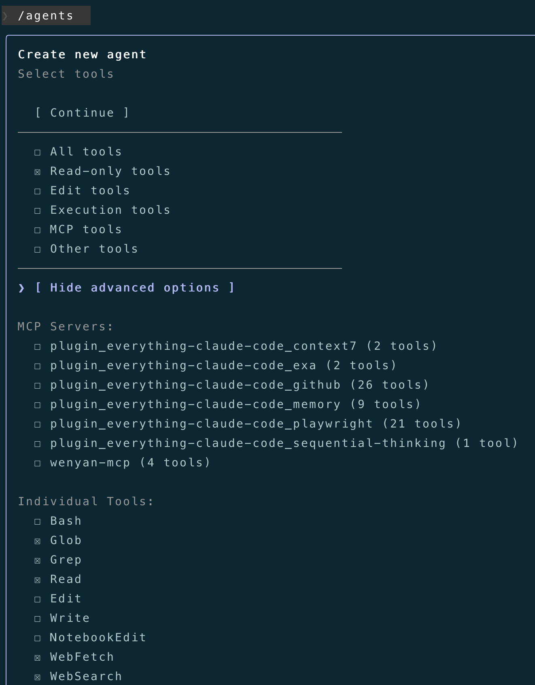

然后，选择 model、color、agent memory（默认即可）：

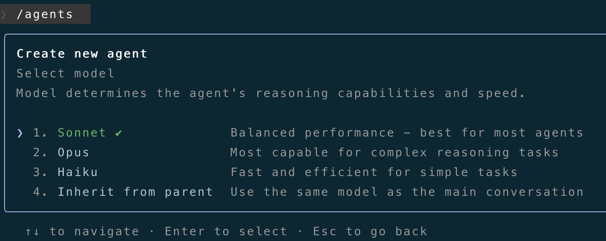

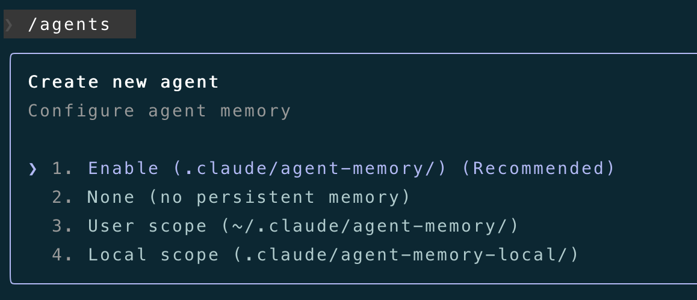

全部完成后，可以看到我们创建的SubAgent了，`java-code-reviewer`：

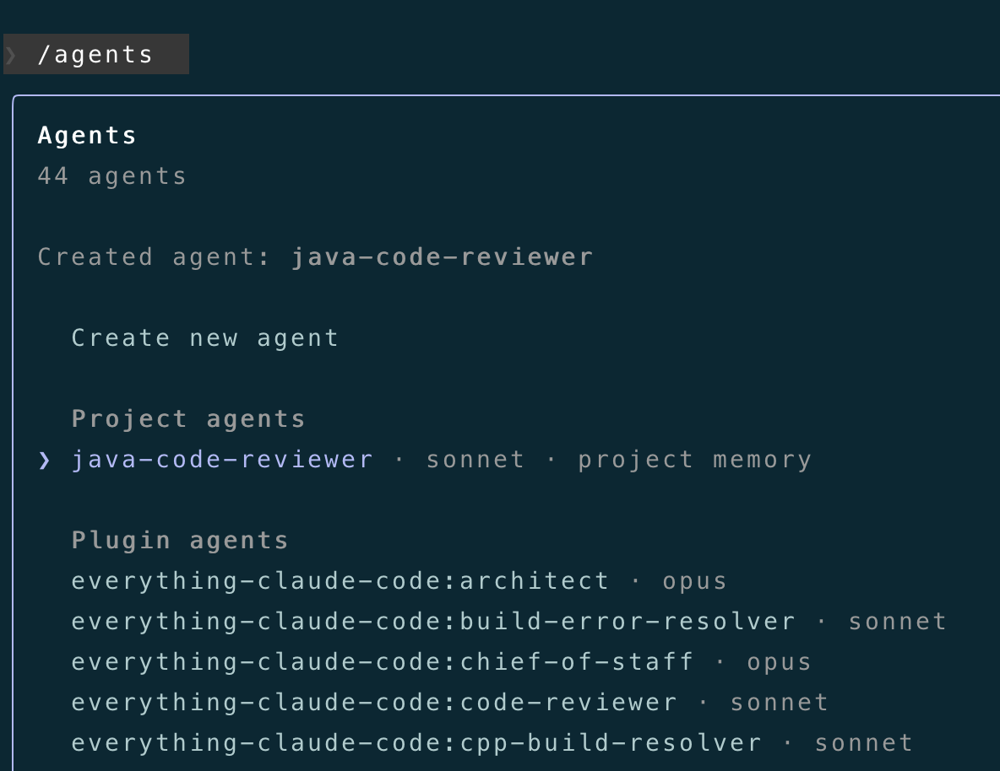

## 调用自定义的SubAgent

对上面自定义的`java-code-reviewer`，我们来使用看看，直接告诉AI审查Java代码：

> @......./rpc，使用专业的subagent，审查一下该目录下的Java代码

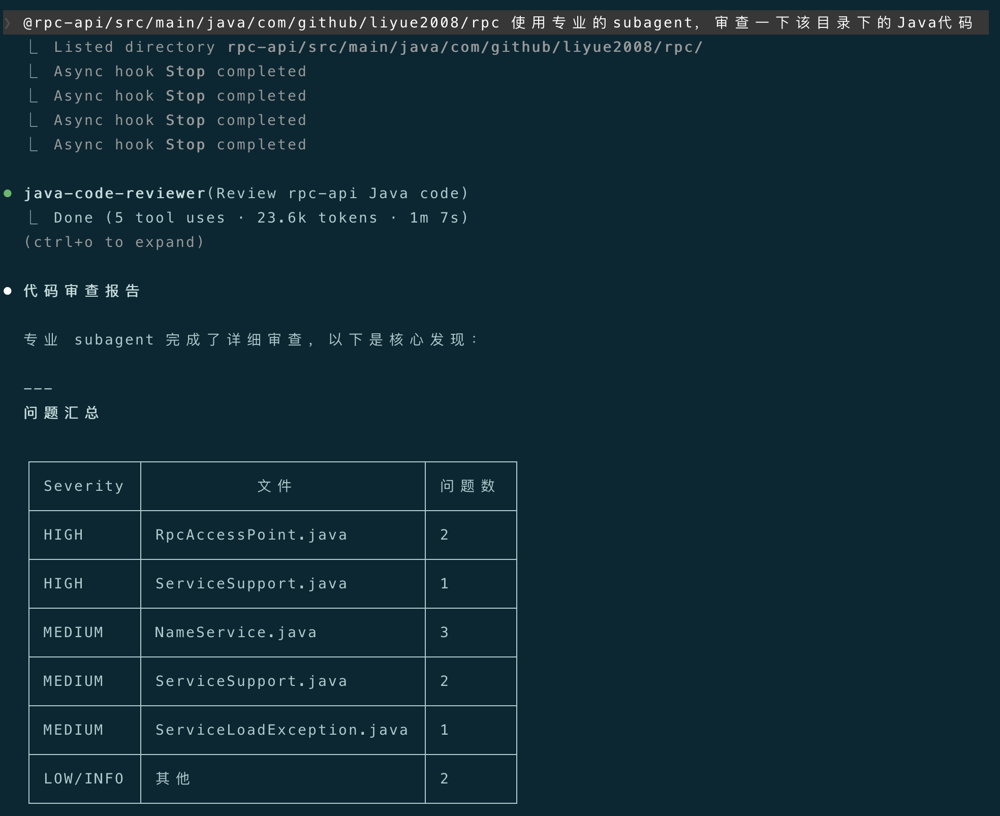
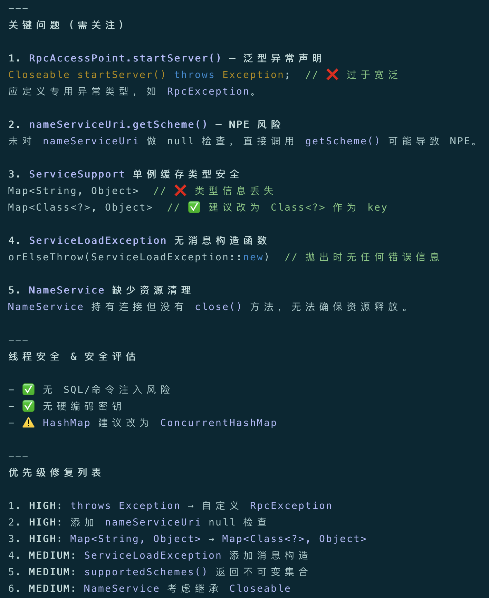

可以看到，主会话提交任务后，CC思考后调用了`java-code-reviewer`，在它独立的上下文窗口中、按照我们制定的审查标准对指定目录下的Java代码进行了审查，然后返回一份审查报告给到主Agent，最后呈现给我们。

这是单独使用一个SubAgent的例子，SubAgent真正的强大之处，体现在处理复杂的工作任务上，需要"多个专家协同"，此时我们就可以进行"多Agent编排"，比如，我们要基于现有系统开发一个新功能：

> 1.用 `code-explorer` agent 深度理解现有的代码结构
> 
> 2.用 `planner` agent 做整体的功能规划
> 
> 3.用 `architect` agent 做架构设计
> 
> 4.用 `tdd-guide` agent 做基于TDD循环的功能开发
> 
> 5.用 `code-reviewer` agent 和 `security-reviewer` agent 做代码审查

此时，我们就在**编排整个开发流程**，定义了5个SubAgent 完成自动化开发和审查。

# 4. 几点建议

- 单一原则：**一个SubAgent只干一件事**，不要创建"大而全"的SubAgent。
- 细化元数据和正文：`description`是触发SubAgent的关键，一定要写详细，特别是触发时机和关键词。正文中的角色定义、目标、执行流程等，也要清晰明了，并给出相应的示例。
- 最小权限：建议给SubAgent赋予**最小权限**的工具集（Tools）即可。
- 持续迭代：项目级SubAgent，建议提交到git，由团队共同维护、持续迭代。

# 5. 结语

本篇从"多Agent模式"的基础出发，详细剖析了SubAgent的特点、定义、如何创建、元数据分析等，演示了在Claude Code中如何通过`/agents`命令来创建一个`java-code-reviewer` SubAgent，并对创建的`java-code-reviewer`进行了调用测试。

下一篇，将介绍Claude Code的`Hooks机制`，基于Claude Code生命周期的"事件触发"机制。

---

**感谢你点开这篇文章，欢迎关注我的公众号：10年码农，纯技术分享，一起在AI时代探索未来！**


---

**客官您满意的话，感谢打赏。**

