+++
date = '2026-05-10T16:58:00+10:00'
title = '玩转Claude Code(九)-Hooks详解'
+++

大家好，我是bytezhou，本篇介绍Claude Code的`Hooks`，一种"事件触发"机制。

流行的开发框架都有"生命周期回调"，Claude Code的`Hooks机制`，也是一种**基于生命周期的回调机制**。简单来说，我们在CC会话的生命周期的一些节点处，预先埋下"钩子"，等CC的会话执行到那个节点时，就会自动触发"钩子"的操作，这就是`Hooks`。

# 1."人驱动"与"事件驱动"

我们把`Hooks`和前面介绍的`Slash Commands`简单对比一下：

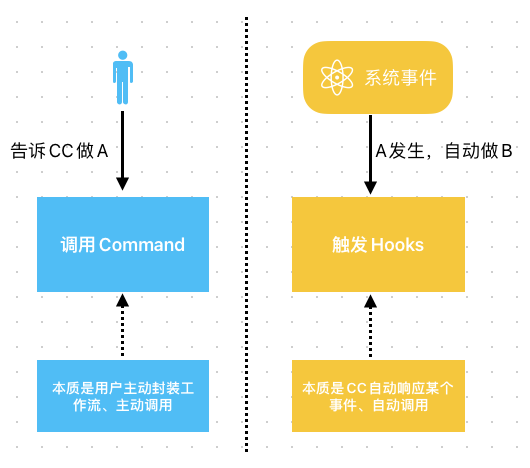

- Slash Commands："人驱动"，用户主动发指令。
- Hooks："事件驱动"，就像CC会话中埋下的"传感器"，一旦生命周期事件发生了，"传感器"上的动作就会被触发。

# 2.Claude Code生命周期中的Hook事件

Claude Code生命周期的主要节点示例如下（每个节点均可配置相应的Hook事件回调）：

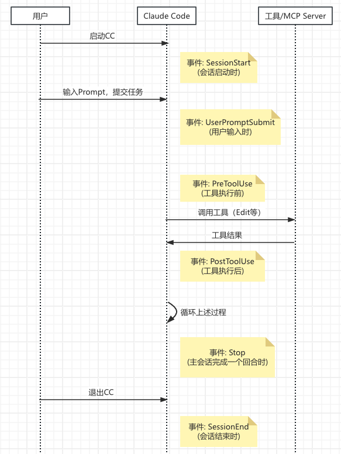

> 启动CC → SessionStart → 用户输入Prompt → UserPromptSubmit → 
> CC调用工具 → PreToolUse → 工具执行，返回结果 → 
> PostToolUse  → 主回合结束 → Stop → 退出CC → SessionEnd

常用的Hook事件如下：

| 事件 | 触发时机 | 使用场景 |
| :---: | :---: | :---: |
| SessionStart | 会话启动时 | 执行一些初始化动作，加载特定"记忆"等 |
| UserPromptSubmit | 用户输入Prompt、CC还没执行时 | 可以对用户输入做一些安全校验、过滤等 |
| PreToolUse | CC调用工具前，**准备执行但还未执行** | 可以获取传给工具的参数，做一些个性化操作，甚至拦截某次工具调用 |
| PostToolUse | 工具执行后 | 可以获取工具执行结果，做一些扫尾动作 |
| Stop | 主会话中的一轮对话结束时 | 进行"总结式"动作，记日志、存储结论性的结果等 |
| SessionEnd | 会话结束时 | 一些清理工作，或者保存当前状态等 |


## 2.1 Hooks的配置格式

跟前面介绍的`Slash Commands`、`Skills`类似，`Hooks`的配置也分为项目级、用户级：

- 项目级Hooks配置：位于 `项目根目录/.claude/settings.json` 文件中
- 用户级Hooks配置：位于 `~/.claude/settings.json` 文件中

具体的格式如下：

```
{
  "hooks": {
    "{Event}": [  // Hook事件名字，如 PreToolUse
      {
        "matcher": "{工具匹配模式}",  // 要匹配哪些工具、或MCP方法，如 Edit
        "hooks": [
          {
            "type": "command|prompt",
            "command": "python3 count.py",  // type=command，事件触发时，要执行的具体Shell命令
            "prompt": "发给LLM的提示词",  // type=prompt，事件触发时，要发给LLM的prompt
            "timeout": 30  // 超时时间（秒）
          }
        ]
      }
    ]
  }
}
```

- {Event}：事件名字，如 PreToolUse、PostToolUse等。

- matcher：指定匹配模式，一般`PreToolUse`、`PostToolUse`这2个事件会指定特有的工具匹配，进行精细化的工具调用管控。

  - `""`或`"*"`：匹配所有工具。
    - `Read`：只能匹配"Read"工具。
    - `Write|Edit`：匹配这2个工具中的一个即可。
    - `Bash(git:push:*)`：只能匹配 `git push`及其子命令。
    - `mcp__github__.*`：匹配所有github mcp server的工具。

- type：一般用`command`，事件触发时，执行命令。

- command：要执行的具体Shell命令，Hook回调的核心。

这里举个例子（来自**everything-claude-code**）：

```
{
  "hooks": {
    "PreToolUse": [
      {
        "matcher": "Write",
        "hooks": [
          {
            "type": "command",
            "command": "node -e \"let d='';process.stdin.on('data',c=>d+=c);process.stdin.on('end',()=>{const i=JSON.parse(d);const c=i.tool_input?.content||'';const lines=c.split('\\n').length;if(lines>800){console.error('[Hook] BLOCKED: File exceeds 800 lines ('+lines+' lines)');console.error('[Hook] Split into smaller, focused modules');process.exit(2)}console.log(d)})\""
          }
        ],
        "description": "Block creation of files larger than 800 lines"
      }
    ]
  }
}
```

这个Hook的作用是，在调用Write工具创建文件前，获取文件内容、并判断文件行数是否大于800，若该文件超过了800行，就拦截掉，不让调用Write工具创建文件。

## 2.2 向Hook命令传参

Claude Code通过`stdin`向Hook命令传参，以json形式，传递当前事件的上下文信息，包括事件名、当前工作目录等，通用字段如下：

```
{
    "session_id": "abc123",
    "transcript_path": "/path/to/transcript.txt",
    "cwd": "/current/working/dir",
    "permission_mode": "ask|allow",
    "hook_event_name": "PreToolUse"
}
```

不同的事件，有额外的附加字段，我们主要关注 `PreToolUse`、`PostToolUse` 事件（最常用）：

```
{
    "session_id": "abc123",
    "transcript_path": "/path/to/transcript.txt",
    "cwd": "/current/working/dir",
    "permission_mode": "ask|allow",
    "hook_event_name": "PreToolUse",
    "tool_name": "Write",  // 工具名字，如 Edit、Bash等
    "tool_input": {  // 工具的入参
       "command": "命令字符串",  // Bash工具：执行的命令
       "content": "文件内容",  // Write工具：文件内容
       "file_path": "文件路径",  // Edit/Write/Read工具：操作的目标文件路径
       "old_string": "旧内容",  // Edit工具：被替换的旧内容
       "new_string": "新内容"  // Edit工具：用来编辑的新内容
    },
    "tool_response": {  // PostToolUse事件 独有字段
		"type": "create",
		"filePath": "文件路径",  // Edit等编辑工具
		"content": "文件内容",  
		"stdout": "命令执行结果的输出",  // Bash工具
		"stderr": "命令执行错误的输出"  // Bash工具
    }
}
```

我们可以添加一个项目级的`PostToolUse`的Hook事件，把CC传过来的原始参数打印到文件里看一下，Hook配置如下：

```
{
  "hooks": {
    "PostToolUse": [
      {
        "matcher": "Write|Edit",
        "hooks": [
          {
            "type": "command",
            "command": "echo $(cat) >> log.txt"
          }
        ]
      }
    ]
  }
}
```

调用Write工具触发`PostToolUse`后，该Hook打印出来的原始入参如下：

```
{
	"session_id": "07514e36-2bd1-43a7-9bed-d2d10e703d18",
	"transcript_path": "/Users/zhouxinyu/.claude/projects/-Users-zhouxinyu-ai-project-AI---------/07514e36-2bd1-43a7-9bed-d2d10e703d18.jsonl",
	"cwd": "/Users/zhouxinyu/ai-project/AI",
	"permission_mode": "default",
	"hook_event_name": "PostToolUse",
	"tool_name": "Write",
	"tool_input": {
		"file_path": "/Users/zhouxinyu/ai-project/AI/test2.txt",
		"content": "this is another test line"
	},
	"tool_response": {
		"type": "create",
		"filePath": "/Users/zhouxinyu/ai-project/AI/test2.txt",
		"content": "this is another test line",
		"structuredPatch": [],
		"originalFile": null
	},
	"tool_use_id": "call_function_3isgijspbxp0_1"
}
```

## 2.3 Hook命令的输出结果

Hook命令通过exit code（退出码）控制Hook回调后的行为：

| 退出码 | 说明 |
| :---: | :---: |
| 0 | 允许CC继续操作，通过`stdout`把输出结果传递给CC |
| 2 | 阻止CC继续操作，通过`stderr`把错误信息反馈给CC |
| 1 | 不阻止CC，但把错误信息显示给用户 |

简单点讲，`0`-放行，`2`-拦截。

举个例子，这有一个拦截危险命令的`PreToolUse`事件的Hook脚本：

```
#!/bin/bash
input=$(cat)
command=$(echo "$input" | jq -r '.tool_input.command')

# 检查危险命令
if [[ "$command" == *"rm -rf"* ]]; then
    echo "Error: Dangerous command blocked"
    exit 2  # 阻止执行，拦截工具调用
fi

exit 0  # 允许执行，CC继续进行工具调用
```

> exit 0  // 允许执行，继续进行工具调用 
> 
> exit 2  // 阻止执行，拦截工具调用，通过`stderr`传递错误信息

# 3.Hook配置示例

## 3.1 自定义一个操作日志记录的Hook

接下来进行完整的Hook配置演示，自定义一个项目级的`PostToolUse`的Hook，用python脚本实现简单的操作日志记录。

在当前项目的目录下面，创建python脚本，路径为`$CLAUDE_PROJECT_DIR/.claude/hooks/log.py`，其中，`$CLAUDE_PROJECT_DIR`环境变量，在Hook命令执行时，Claude Code会自动注入，python脚本内容如下：

```
#!/usr/bin/env python3
"""
PostToolUse Hook - 日志记录器
exit 0: 记录成功
exit 1: 记录失败（不阻止 Claude）
exit 2: 记录失败（阻止工具调用）
"""

import json
import sys
from datetime import datetime
from pathlib import Path

LOG_FILE = Path("~/.claude/hook_logs/tool_use.log").expanduser()


def log_event(tool_name: str, tool_input: dict, success: bool, error: str = None):
    """写入日志"""
    timestamp = datetime.now().isoformat()
    log_entry = {
        "timestamp": timestamp,
        "tool": tool_name,
        "input": tool_input,
        "success": success,
    }
    if error:
        log_entry["error"] = error

    LOG_FILE.parent.mkdir(parents=True, exist_ok=True)
    with open(LOG_FILE, "a") as f:
        f.write(json.dumps(log_entry, ensure_ascii=False) + "\n")


def main():
    try:
        input_data = json.load(sys.stdin)
    except json.JSONDecodeError:
        print("Error: Invalid JSON input", file=sys.stderr)
        sys.exit(1)

    tool_name = input_data.get("tool_name", "")
    tool_input = input_data.get("tool_input", {})

    # 过滤敏感字段
    safe_input = {}
    sensitive_keys = {"password", "token", "secret", "key", "credential"}
    for k, v in tool_input.items():
        if k.lower() in sensitive_keys:
            safe_input[k] = "[REDACTED]"
        else:
            safe_input[k] = v

    log_event(tool_name, safe_input, success=True)
    print(f"Logged: {tool_name}", file=sys.stderr)
    sys.exit(0)


if __name__ == "__main__":
    main()
```

给`log.py`脚本加上"可执行"权限：

```
chmod +x ./.claude/hooks/log.py
```

下面，启动CC，进入CC的会话界面，利用交互式命令`/hooks`来创建该Hook，选择`PostToolUse`：

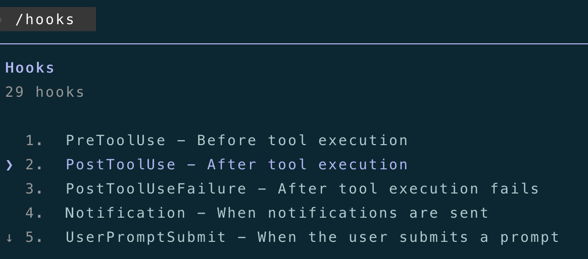

选择 "Add new matcher"：

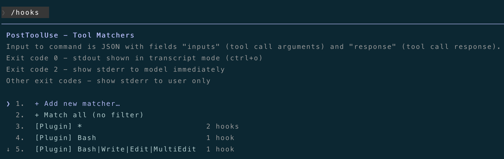

要匹配的工具，主要记录"写操作"相关的工具，**Write|Edit|Delete|Bash**：

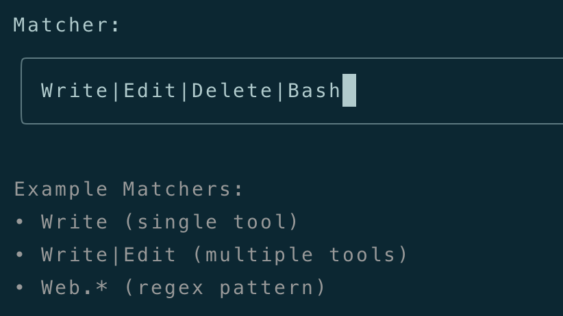

再选择"Add new hook"：

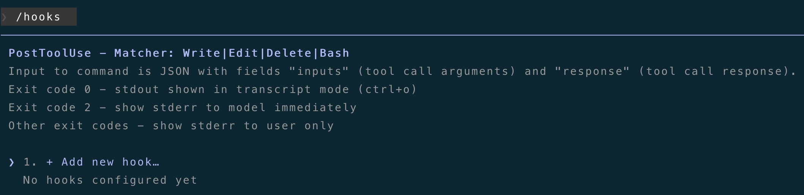

这里配置Hook要执行的命令：

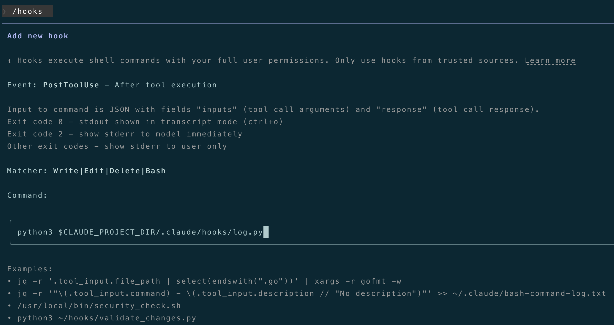

最后，选择项目级配置即可：

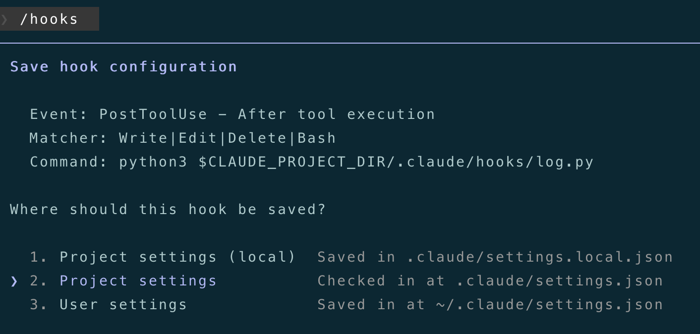

我们看一下配好后的`./.claude/settings.json`中的内容：

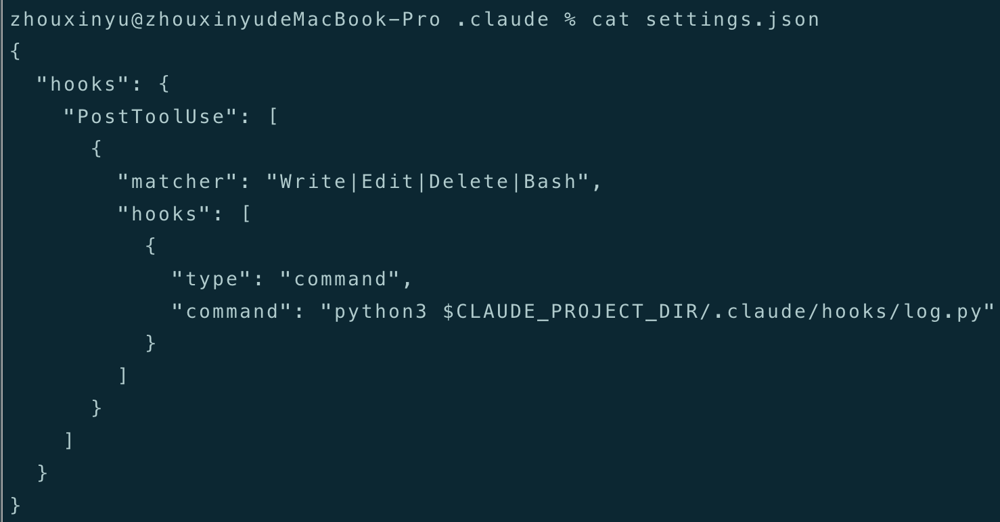

下面，我们来测试一下，在CC中调用"Write|Edit|Delete|Bash"工具做一些操作：

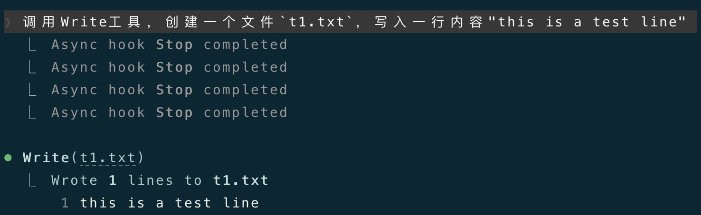
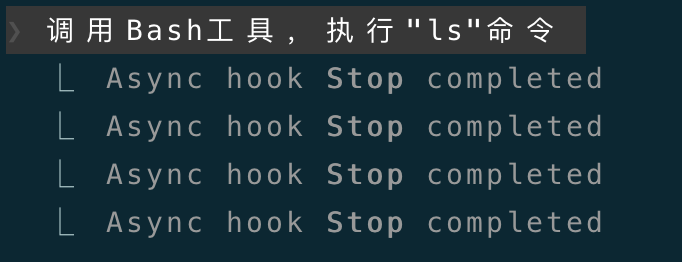

操作完成后，我们看一下脚本记录的日志文件`~/.claude/hook_logs/tool_use.log`：

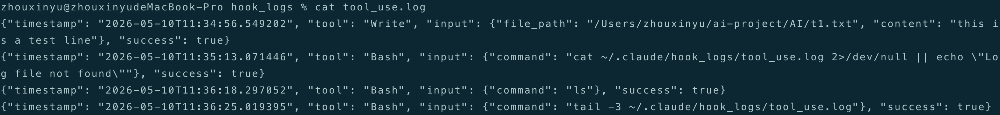

可以看到，相关的操作都通过该Hook脚本成功的写到日志文件了。

## 3.2 debug Hook

我们可以打开Claude Code的debug模式，看一看更详细的Hook执行日志。下面是以debug模式启动CC的命令：

`claude --debug`

打开debug后，可以看到debug文件路径：

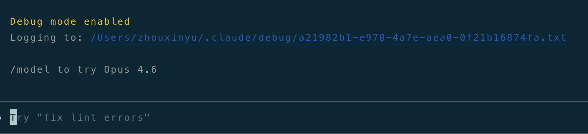

然后，另外开一个终端，`tail -f` debug文件的实时输出：

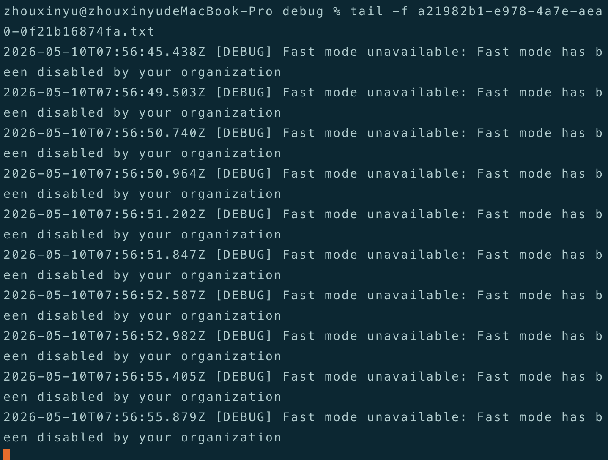

再次触发一下Hook，看看debug文件的输出：

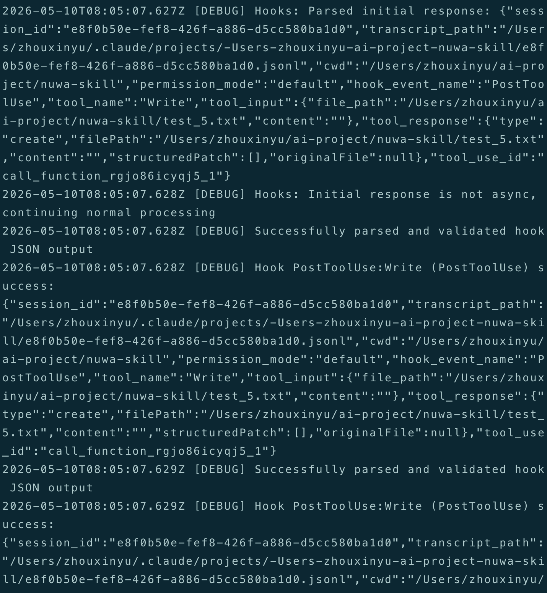

可以清晰看到，Hook被触发执行、响应结果等，通过这种方式，来调试Hook。

# 4.结语

本篇详细介绍了Claude Code生命周期中的主要Hook事件、如何配置Hook、Hook的输入输出，最后，演示了如何自定义一个Hook以及如何debug Hook。

下一篇会介绍Claude Code的权限体系。

写到这儿，已经是Claude Code系列的第9篇文章了，大概还有2~3篇就结束了。自认为对Claude Code的拆解和介绍，还是比较系统全面的，会坚持写完的。

---

**感谢你点开这篇文章，欢迎关注我的公众号：10年码农，纯技术分享，一起在AI时代探索未来！**


---

**客官您满意的话，感谢打赏。**

