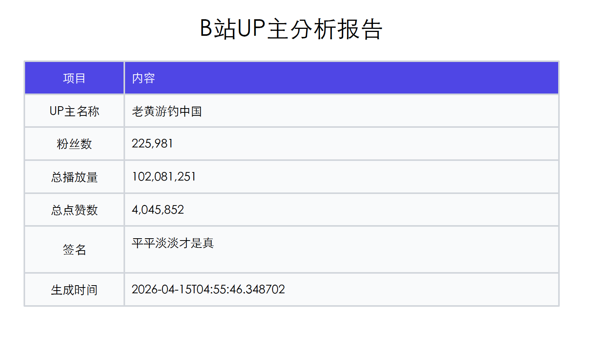

+++
date = '2026-04-15T14:43:10+08:00'
title = '我做了一个B站up主分析工具，一键看清up账号'
+++

最近准备去B站发视频，想对标一些热门up主，看能不能借鉴模仿，就**做了个B站up主分析工具，一键生成该up主的分析报告，帮我在10分钟内看清一个up主的账号全景，提供一些起号建议。**

mvp版本的核心功能如下：

- **四维雷达图**: 内容力、粉丝力、影响力、商业力评分
- **关键指标卡片**: 粉丝数、涨粉、播放量、互动率、更新频率，商单占比
- **爆款词云**: 基于视频标题的关键词提取
- **趋势分析**: 播放量/互动率双轴趋势图，标注爆款峰值
- **内容策略拆解**: 时长分布、封面风格、标题特征、系列化检测
- **深度内容分析**: 封面色彩/构图、弹幕情感/高潮点、评论热词/情感
- **内容公式生成**: 基于多维度数据的内容公式、标题/封面模板
- **音视频分析**: 剪辑节奏、平均镜头时长、切镜频率、均值对比；语音风格、平均语速、情绪倾向、BGM 风格标签 
- **流量增长分析**: 粉丝曲线、流量来源推断
- **商业化洞察**: 变现模式，商单识别、分区报价参考、变现潜力评估
- **增强起号建议**: 综合诊断、三维行动建议（优势/劣势/机会）、变现路径规划
- **原始数据下载**: 支持下载弹幕、评论原始数据、原始视频
- **PDF导出**: 一键生成可分享报告

现阶段我自己用是够了，后续可能会扩充功能，比如一个up主所有投稿的全量分析、多up主横向对比等。

# 分析演示

我比较喜欢的一个生活区up主：`老黄游钓中国`，分析他

直接输入up主的B站uid，要等一会才出报告（默认取最近50条视频，除了下载评论、弹幕，还要进行音视频分析，有点耗时）

上面就是B站up主`老黄游钓中国`的完整分析报告，目前还获取不到up主的近30日的每日粉丝增量数据，另外商单信息也没有公开获取渠道（暂时只能通过评论区的关键词推算），流量增长、和商业化方面的分析有点问题，不过，up主的内容本身的分析还是没问题的，包括弹幕、评论这些。

最后，可以导出pdf：

嘿嘿，你们想要哪个up主的报告，我可以帮你们生成一个
