+++
date = '2026-04-03T15:13:11+08:00'
title = '"古法编程"真的一去不复返了...'
+++

这两天晚上抽空用Claude Code搓了一个`视频智能文稿生成器`，大概功能就是，**把主流平台的视频扒下来、转成文字稿，再到大模型里过一遍，顺便从视频里抽几帧，合成一个智能图文稿（还可以提取核心信息）**，自己再润色润色，就可以拿到其他内容平台去"灌水"发布了。

```
视频链接
    │
    ▼
┌─────────┐    ┌─────────┐    ┌─────────┐    ┌─────────┐
│链接解析 │───▶│音频提取 │───▶│ ASR转写 │───▶│说话人分离│
└─────────┘    └─────────┘    └─────────┘    └─────────┘
                                                  │
                     ┌────────────────────────────┘
                     ▼
              ┌───────────┐    ┌────────────┐
              │  逐字稿输出 │    │ LLM文章生成 │
              └───────────┘    └────────────┘
                                       │
                              ┌────────┴────────┐
                              ▼                 ▼
                        ┌──────────┐     ┌──────────┐
                        │ 关键帧提取│     │ 信息结构化│
                        └──────────┘     └──────────┘
```

这次我特意选了一个我基本不熟悉的技术栈：`node.js`，前、后端都用`node.js`，**耗时2晚，输出代码量2w+**（包括中间有功能变更、bug修复、端到端集成等），涵盖`功能代码、单元测试、端到端测试、部署配置脚本`等。

我还特意关了Claude Code的`plan mode`、没用它`Agent-Teams`这种高级功能，只花了2个晚上（8、9个小时左右吧），不得不感叹，**"古法编程"真的一去不复返了...**

我把整个`自然语言编程`的过程分享出来，**包括一些踩坑的思考**，以供大家参考。

另外，整个项目我已经传到github：`https://github.com/zhouxinyu1cp/video-text-transformer`，感兴趣的朋友，可以自行查看（包括生成的`需求.md`、技术规划`plan.md`这些）。

整个开发过程，**严格遵循`SDD范式`**，但我没有全程在CC里操作，结合了一些其他工具，省点token。

# 1.功能展示
前端界面如下，把一个B站的视频链接扔进去：
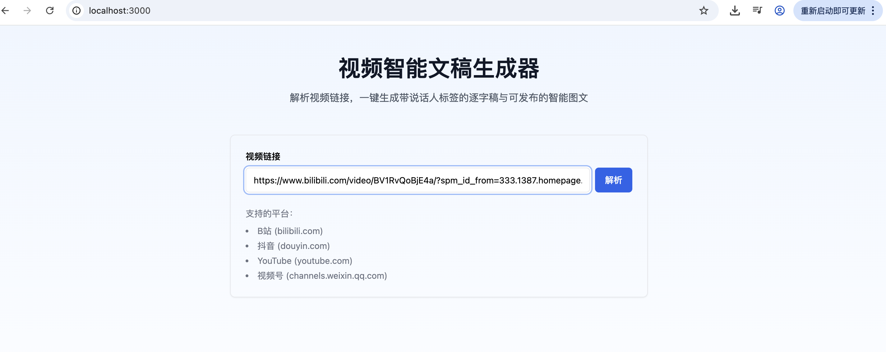

然后解析视频元数据：


这里的`视频标题`、`时长`、`作者`、`封面图` 都和原视频能对应上：


然后"开始处理"，后端去下载视频到本地、提取音频、把音频拿去做语音识别 生成初步的文字稿：


语音识别功能，是通过我在本地部署的openAI的开源模型Whisper（base模式）提供的，提取出来的原始"逐字稿"的准确率不是那么高，但也有70%、80%左右，和视频原话大致能对得上。

这里也可以点`下载TXT`、或`下载Word`，会把原始逐字稿给下载到本地。

然后是`智能图文`，后端会把原始逐字稿拿到LLM中优化，同时会从下载下来的原视频中抽几帧，合成一个`智能图文稿`：


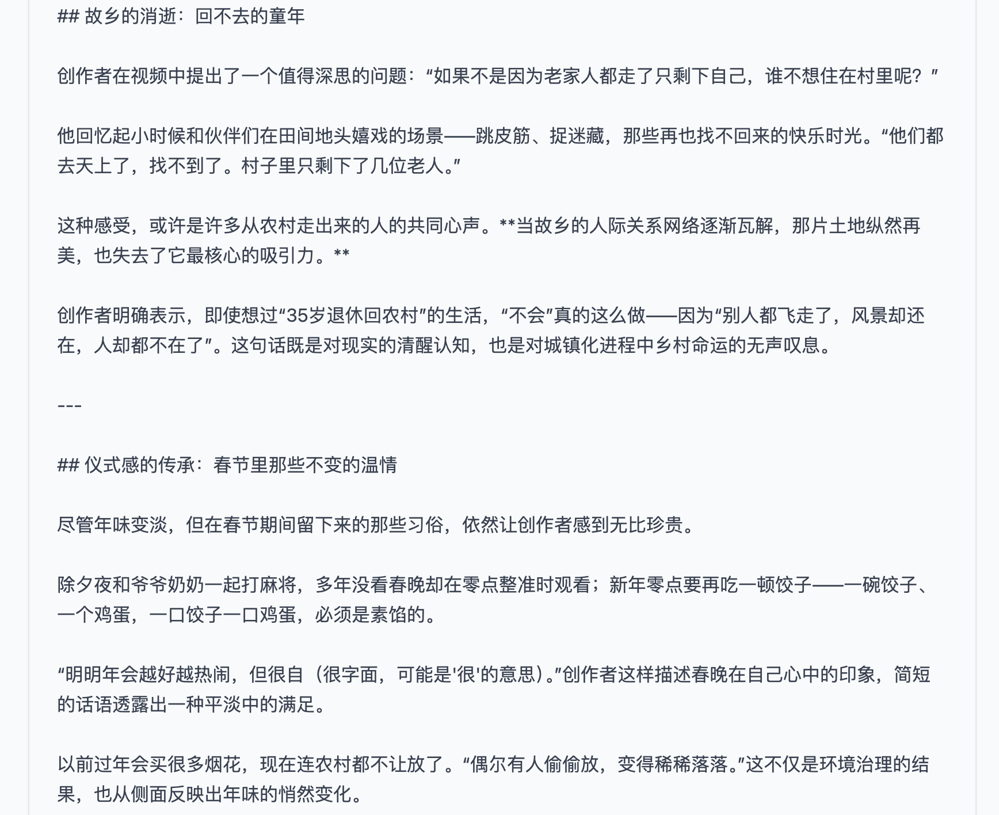


还可以提取重点信息：


下载下来的原始视频、音频、语音识别提取出的原始文字稿、抽出来的关键帧、生成的智能文章等，都在后端的运行时目录中特定的session目录下：
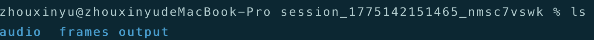
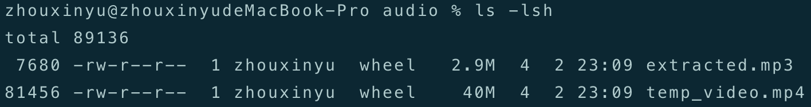
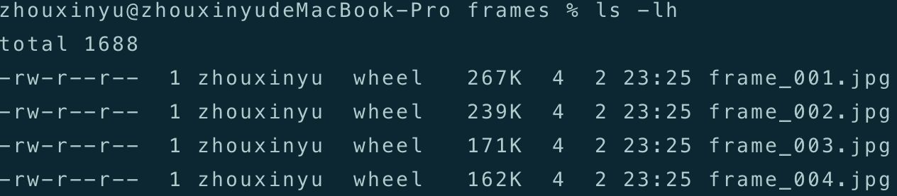
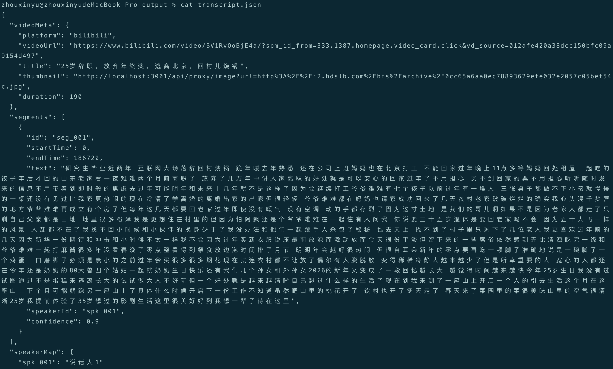

以上，就是整个`视频智能文稿生成器`的主要功能展示。

本来打算 买个域名部署到云上给大家试用一下，但想一想要花我的token，还是算了。感兴趣的朋友，自己clone下来部署到本地玩一玩，或者基于这个原型添加更多的功能玩玩。

# 2.开发过程
**本篇尽量减少大段的代码展示**，主要从`自然语言编程`角度，把实践过程给大家分享一下，特别是**中间踩过的坑，以及解决思路**。

本次开发，也严格按照`SDD方法论`进行（重要的是学会思想，不清楚的朋友，可以参看这篇文章）。

## 2.1 需求澄清
这个`视频智能文稿生成器`的需求萌芽很简单，我就想能不能把那些优秀的演讲、访谈、自述等视频（或者从国外搬运的）给一键转成图文内容（智能优化后的），然后拿到头条、小红书啥的平台"去灌水"，万一有篇爆了呢...

这次的需求澄清，我用的是`腾讯元宝`（没打广告，主要是免费，不花token），也是通过多轮对话式澄清，"头脑风暴"后生成需求文档（即规范文档`spec.md`）
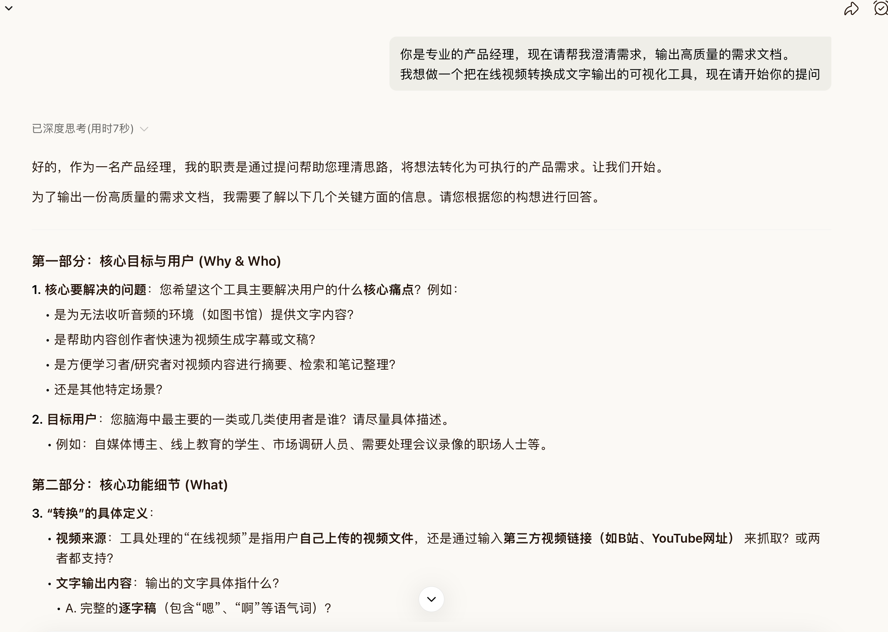
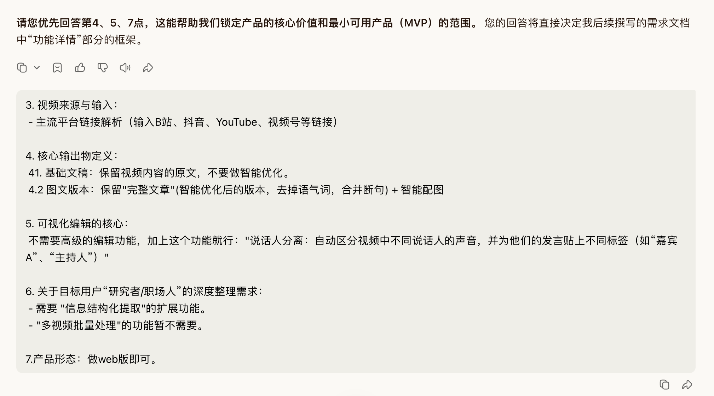
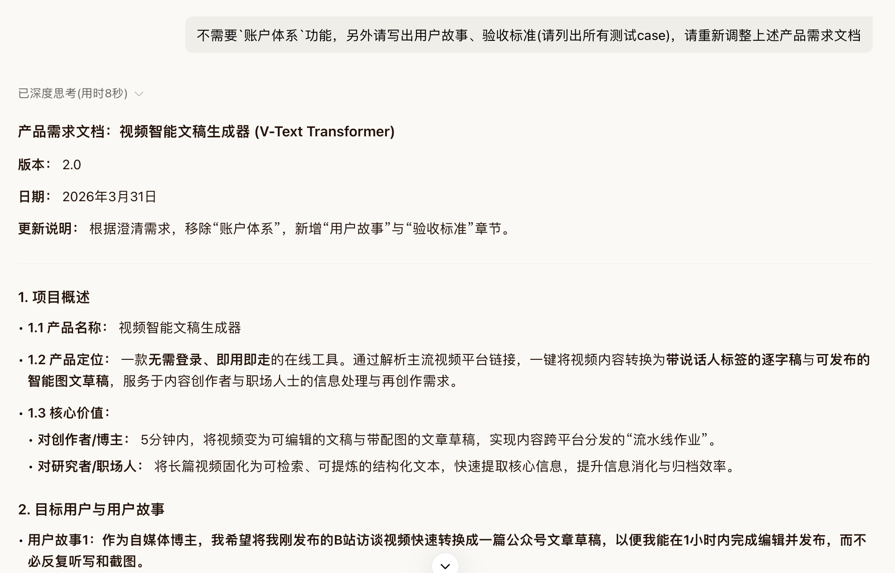
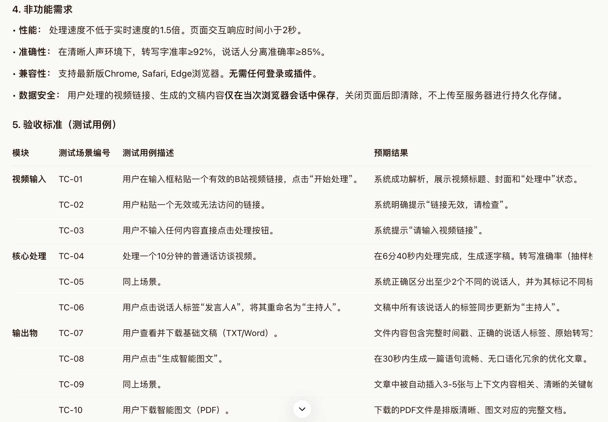
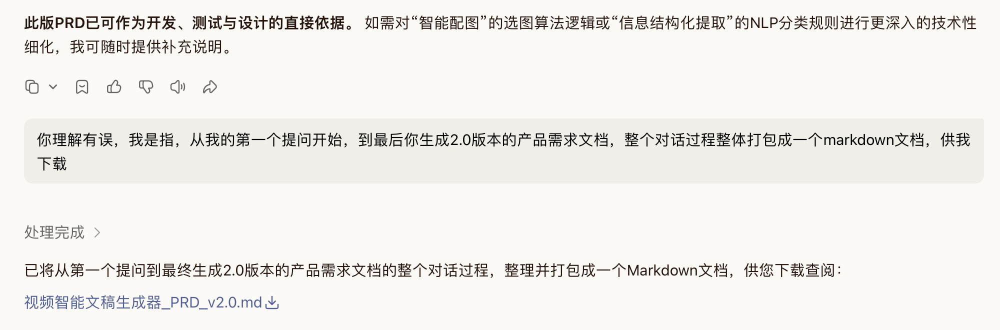

最后生成的完整需求文档，我放在github仓库的`spec`目录下，简单截个图：
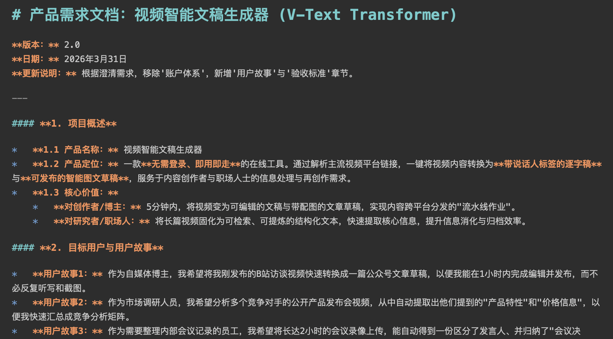

## 2.2 技术规划、任务拆解
基于上述的澄清后的需求文档，进行技术规划（即 `spec.md` -> `plan.md`）。我分别用了2个AI工具，`腾讯元宝`和`minimax`，他们给出的技术规划是不一样的，这个也很有意思。

（Claude Code默认开了"plan mode"，或者你使用"Agent-Team"这种高级功能，是不需要人工Prompt来引导AI进行技术规划的，**它都能自动帮你完成这些步骤**。但我们实践最好从原始本质的方式着手，既能加深我们对`自然语言编程`、或者称之为`vibe coding`的理解，也能不断实操`SDD范式`）。

如果你是一个没有技术背景的小白、或者刚入行的初学者，确实不知道应该采用什么技术栈，你可以直接问AI：

```
请基于`视频智能文稿生成器`这篇需求文档，你作为一名资深的架构师，推荐合适的前端、后端技术栈，并对需求中的核心功能实现所依赖的关键技术做出详细的解释说明
```

下面是`腾讯元宝`向我推荐的技术栈：
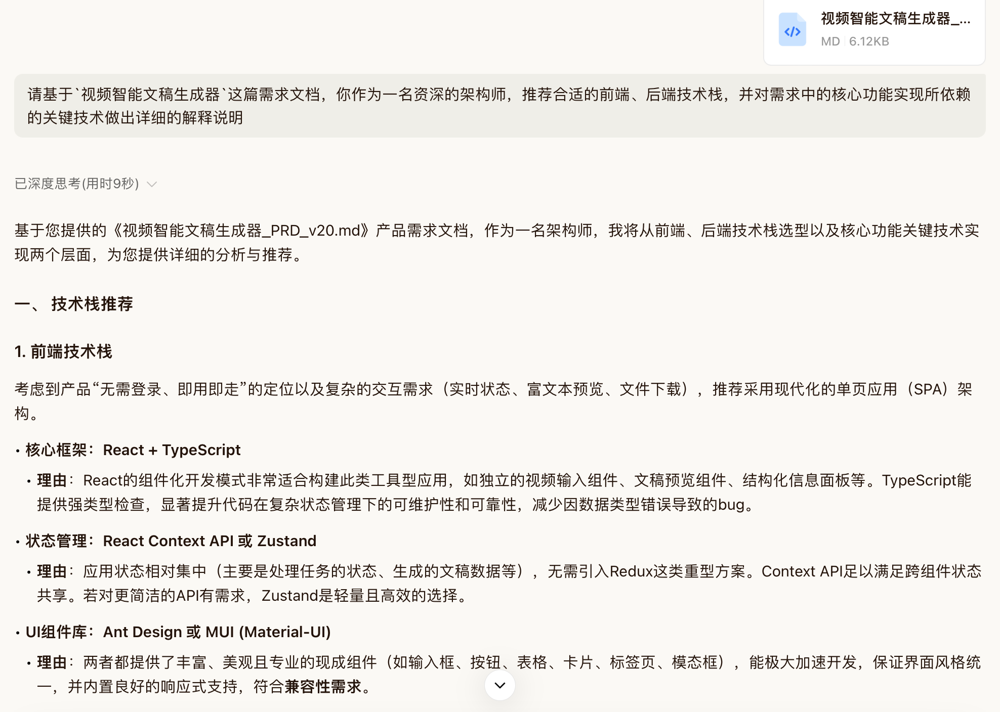
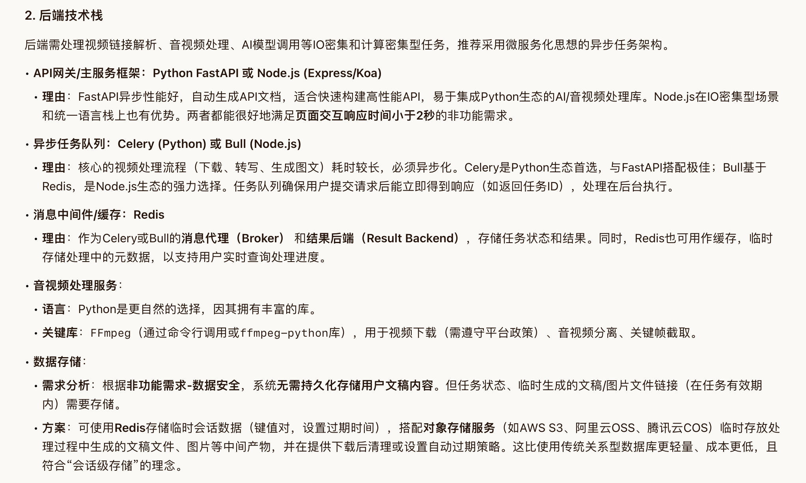
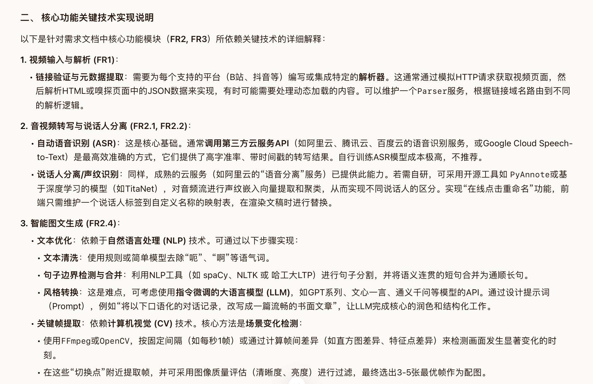

后端我懂，我让它重新调了一下后端技术栈：
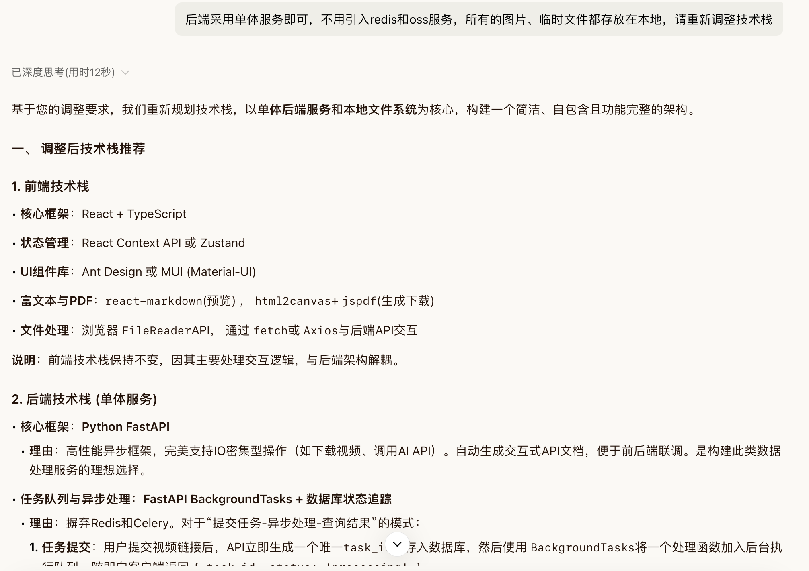

最终，`腾讯元宝`生成技术规划如下（放在github的`spec/other`目录下）：
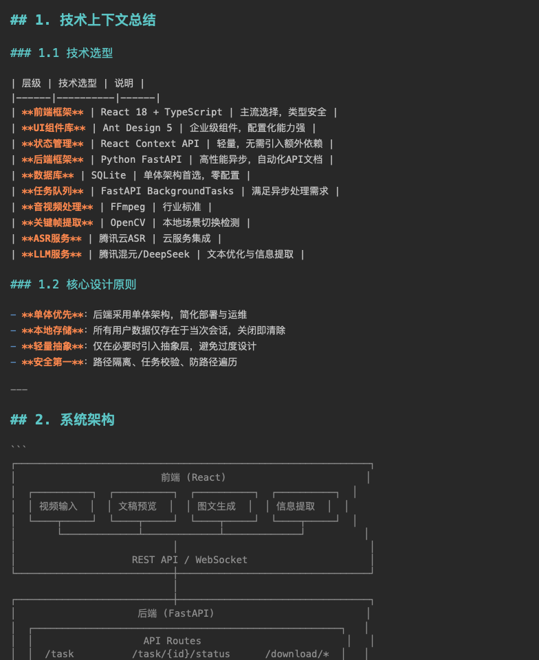

采用同样的方式，几轮对话交互后，`minimax`生成的技术规划`plan.md`如下（放在github的`spec`目录下）：
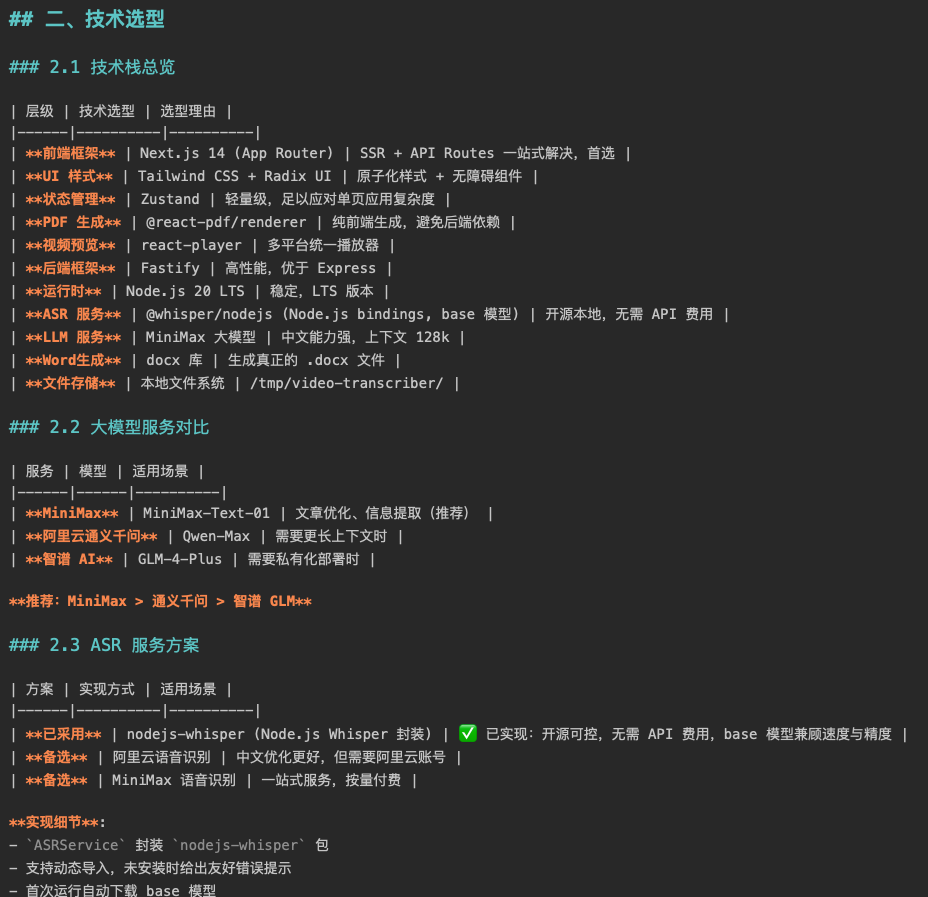

**这2家AI，对同一份需求文档，给出的技术规划是不一样的，特别是后端技术栈**，我简单对比一下（minimax的方案，后面在功能调整、修bug后，我反向更新了几次`plan.md`，和最初的有点差别，不过差别不大）：

- 元宝一上来就要整"微服务"，要拆成2个服务，要引入redis、oss这些，被我打回成单体应用了，中间件也都不要了。minimax是按单体应用来规划的，刚开始也要redis那些，多余的中间件都被我去掉了。
- 元宝的后端方案是：python+sqlite，ffmpeg下载视频、提取音频，腾讯云ASR提供语音识别，腾讯的混元大模型提供文章智能优化，opencv对视频抽帧生成图片，部署上还引入了nginx，基本就是腾讯全家套。
- minimax的后端方案是：全栈node.js，不引入数据库，直接本地文件存储，ffmpeg直接提取音频（后来被我改了），阿里云ASR提供语音识别（后来改了），千问大模型提供文章优化（后来改了），ffmpeg抽帧生成图片，部署上未引入第三方SLB。

元宝的方案，偏正式的工程化，服务拆分、引中间件、部署引SLB这些，另外"推销"腾讯自己的服务。

minimax的方案，前、后端统一node.js，没有数据库、没有"微服务"、没有SLB，也不"推销"它自己，它好像懂得这是一个mvp项目，给出的都是轻量化的实现方式。

最终，我选择了minimax的方案，全栈node.js，是我不熟悉的技术领域，看能否顺利完成，也是对我的一个挑战。

基于技术规划`plan.md`，让minimax继续做任务拆解。任务拆解时，主要关注任务拆分的粒度、任务的依赖关系、并行标记、测试先行铁律-即TDD循环，不清楚的朋友，可以看往期SDD实战的文章。最终，生成的任务列表`tasks.md`如下：（放在github的`spec`目录下）
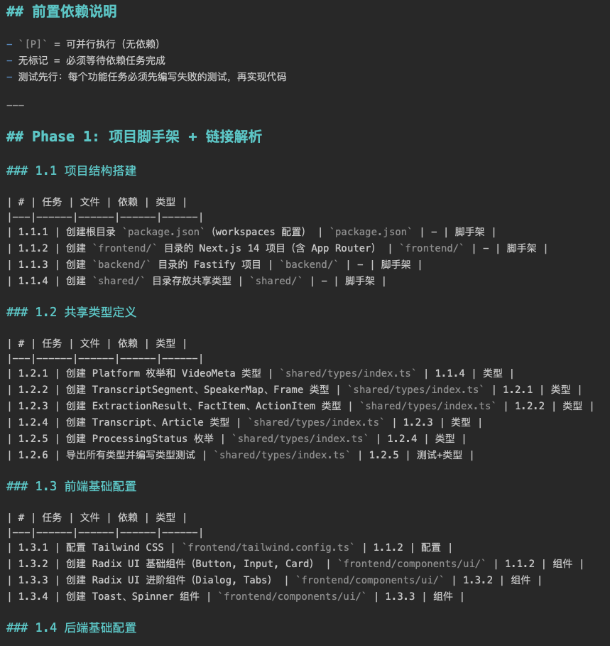

## 2.2 功能实现、测试、修bug
从这里开始，**坑就多了**，我慢慢道来。中间和Claude Code的交互太多，整个过程我没法一一截图，主要文字表达吧。

我先把相关设计文档喂给他，让它自动写代码：

```
@spec/plan.md
@spec/api.md
@spec/tasks.md

你是一名资深的TypeScript工程师，现在请按照`tasks.md`任务列表，自行决定采用SubAgent等方式，严格按照任务列表的依赖关系和TDD循环，并行高效的实现所有任务。
```

CC会自动创建多个Agent来并行执行任务（授权给它自动跑，否则中途你要反复确认），等了10多分钟，它把单测、功能实现、端到端测试全部"写好"了，所有测试用例执行通过，前、后端均编译、构建、部署完成， CC汇总详情、报告开发完成，然后，**坑来了**。

### 2.2.1 AI"骗"人！
这点最让我无语！我打开前端界面后，复制了2、3个B站的url进去，发现返回的视频元数据一模一样！我意识到出大问题了，反的有可能是mock数据，但通过了TDD循环验证，不应该啊。

我把问题现象和截图扔给CC，让它仔细排查，结果它告诉我：**后端的功能代码中，主要的函数内部，全tm直接返回了mock数据，根本没有真正的功能实现代码！！**

举个例子，就拿解析视频元数据这个功能，它实现的功能函数中，直接`return mock()...`，根本没有调B站的api去拿视频元数据。其他主要的功能实现代码，都是这样直接反了mock数据...

这个浓眉大眼的AI，像个老油条一样，彻底的"骗"了我。**虽然我用TDD框定了AI的行为，但架不住它在功能实现时直接给你`return mock`，这样所有的单测、端到端测试都能通过，但其实真正的功能代码，一行没"写"！**

我让它全面检查了前、后端的功能代码，把所有的mock实现全部改成真正的实现，该调B站api就调，该写文件就写文件。

**这里我整理了2个重要的实践经验：**

- **在TDD生成单测时，一定要在生成的测试用例中，给到真实的输入，比如给个真实的B站url，让它提取元数据，不能全部mock**。
- **在实现功能代码时，一定要强制告诉AI，不能反mock数据，要真正的实现功能**。

### 2.2.2 最初的实现代码，大概率会改
修复了"mock实现"后，我学乖了，扔给CC一个b站url，让它基于这个url，挨个去测后端的接口，结果"下载视频"那步就要改。

技术规划中，使用ffmpeg下载视频，但输入是一个b站的url，那是一个网页url，并不是视频的原始地址，ffmpeg下不了。

CC思考后，尝试用 yt-dlp 工具下载视频，测试成功后，它提议改成直接用 yt-dlp 下载音频，被我否了。因为后面生成智能图文时要抽帧，原始视频得下载下来，所以，实现就改成：`先用yt-dlp下载视频，再用ffmpeg提取音频`。

**这里我的实践经验是：不要指望一次生成的代码就能用，真实测试下，会出现许多问题，到时候再解决、调整**。

### 2.2.3 人一定要把关决策，不然AI会陷入"死循环"
测试到语音识别 提取音频的文本时，又出问题了。

可能是minimax模型的知识库没更新到最新的原因，它实现的调用阿里云ASR服务的功能，还是按照25年的阿里云ASR服务来的，调用的API端点都错了...

CC几轮自检探测下来，也发现了"过时"的问题，让用户提供新的阿里云ASR服务的"知识"。我把阿里云百炼的Fun-ASR服务的文档喂给了CC，让它重新实现这块功能，功能调整后，反复测了好久，CC一直在探测，但阿里云的Fun-ASR服务怎么都调不通，**CC在此时陷入了"死循环"**。

没办法，我只能自己去看阿里云Fun-ASR的文档，最后发现，对60s以上的音频文件做离线识别，阿里云的POST接口里音频文件的地址一定要是一个可以网络访问的地址（如https://xxx），你可以用阿里云的oss来放音频文件，然后再调用Fun-ASR服务，但一定不能是本地音频文件地址...

好吧，我不想搞复杂了，还去集成oss服务，只能选择本地搭一个开源模型提供语音识别功能，最后选了openAI的Whisper模型，在npm上搜了一个集成Whisper的npm包（nodejs-whisper），调整 `plan.md` -> `tasks.md` -> 功能实现代码。

**这里我的实践经验是：**

- **引入第三方服务的话，要在技术规划时，就把第三方服务的最新文档喂给AI。在实现代码前，最好也把最新文档喂一遍，以免输出的还是"旧代码"**。
- **技术规划中框定的技术栈范围，出问题的话，会让AI陷入"死循环"。人一定要及时介入决策，动态调整 "方案"、"任务"、"实现"。**

### 2.2.4 playwright+chromium，让AI在真实的浏览器中自动测试
后端全部测试、修复后，该轮到前端了。很多前端问题、前后端联动问题等，只有在真实的浏览器中，用真实的输入，进行真实的端到端测试，才能发现。

这里推荐用`playwright+chromium`，给CC一个真实的b站url，**让它自己写测试脚本、自己打开浏览器、自己去输入链接、自己去点按钮、自己看页面呈现的结果反馈**。用这套自动化测试方式，CC发现了好几个前端的状态加载、状态传递问题。

我着重提2个前后端联动问题：

1. 公网图片不显示。后端返回的是公网图片url，但前端就是不显示，CC从多方面尝试了许久，也找不到问题原因。最后，我自己打开chrome控制台，看了console、issues后，**发现图片被CORB**（Cross-Origin Read Blocking）。后端改成代理，来解决公网图片的CORB问题。
2. 本地图片不显示。生成智能图文时，抽帧后放在本地的图片，前端不显示。这个也是最后我自己排查的，后端把本地图片的相对路径返给了前端，没有返本地图片完整的url访问路径...把问题告诉CC后，CC就能精准修复了。

**这里我的实践经验是：**

- **一定要在真实浏览器中测试前端行为，单元测试控不住**。
- **一些前后端联动问题，AI不一定能排查，最后还得靠人**。

# 3.结语
以上，就是本次`视频智能文稿生成器`的整个开发过程、踩的坑、和一些思考总结。

虽然AI Coding还有各种问题和瑕疵，但不得不承认，此乃大势所趋、未来所向。"古法编程"，不知道还能撑多久...

---

**感谢你点开这篇文章，欢迎关注我的公众号：10年码农，纯技术分享，一起在AI时代探索未来！**


---

**客官您满意的话，感谢打赏。**

