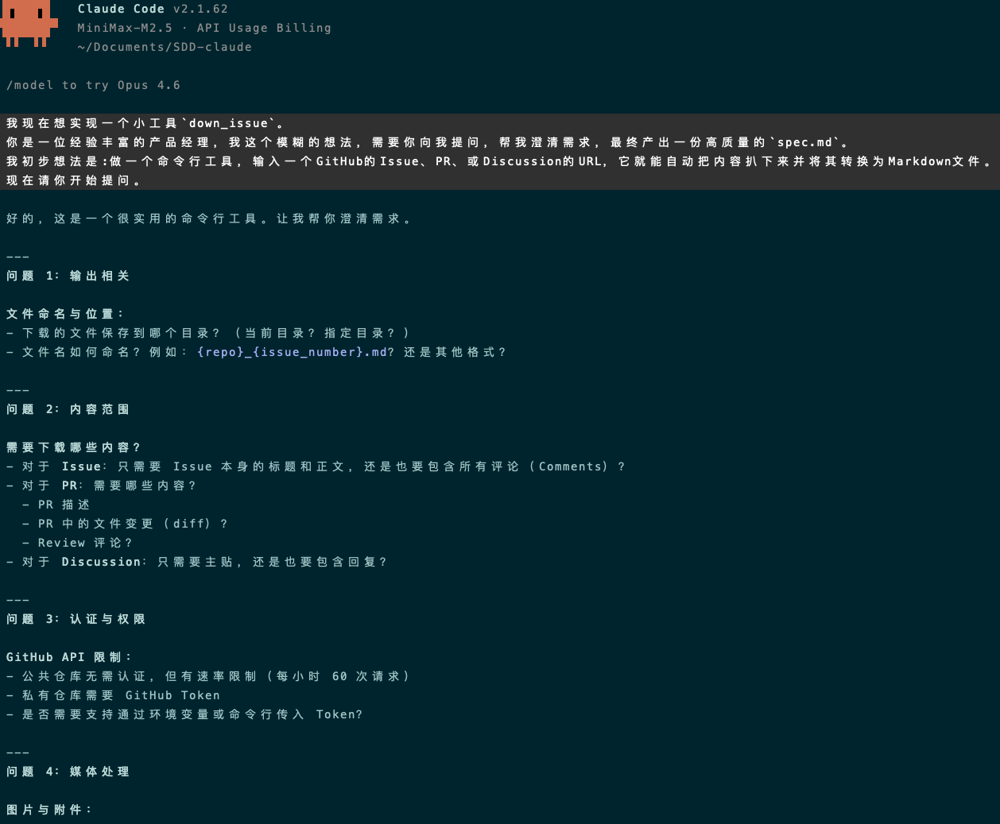
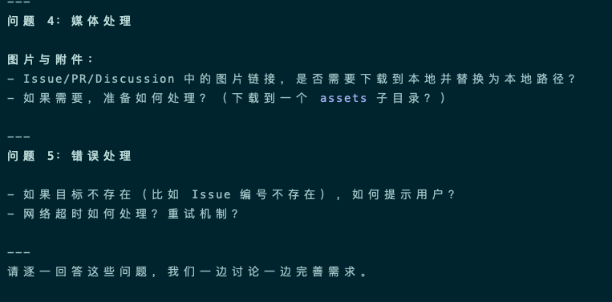
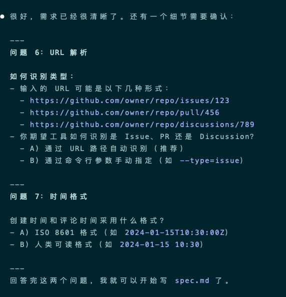
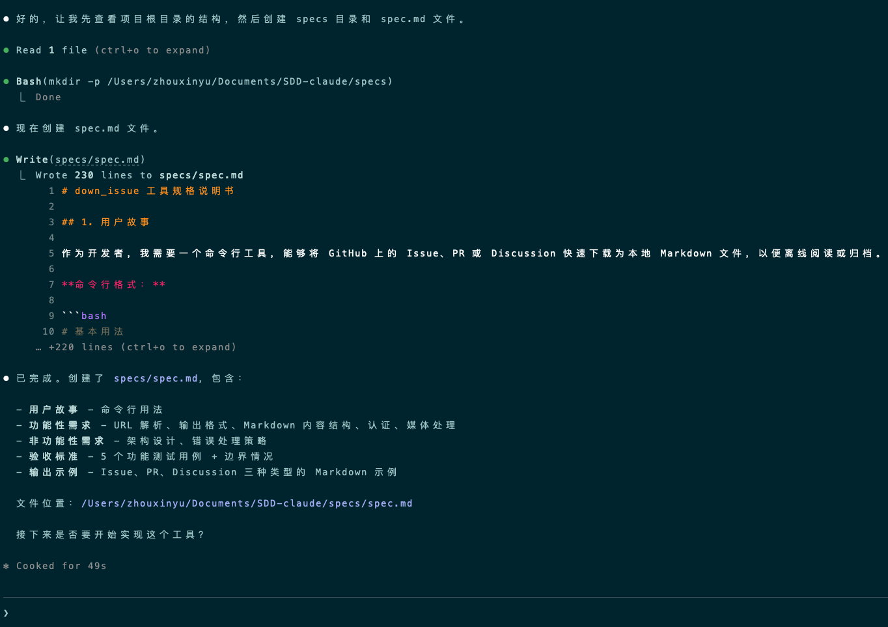

+++
date = '2026-03-19T00:28:42+08:00'
title = '基于Claude Code的SDD实战（一）：定义意图'
+++

大家好，我是bytezhou，今天实践SDD研发范式，直观感受一下SDD的强大威力！

# 环境：
macOS：14.8.4

Claude Code：v2.1.26

模型：MiniMax-M2.5（非广告，它的Coding Plan套餐性价比高，这儿有邀请链接https://platform.minimaxi.com/subscribe/token-plan?code=9BE5kxxIhC&source=link，刚在码字时，MiniMax-M2.7发布了...）

（另外，关于Claude Code的安装配置和基本使用，这里就不详细展开了，后面打算单独出一个Claude Code系列，给大家分享一下我的使用心得）

# 需求的萌芽：
每次逛github的时候，对于一些我感兴趣的开源项目，它的Issues、PR、Discussions我都会去看，里面一些讨论挺有价值的，有时候就想能不能把它们留个档，但打开github页面一个个去复制也太傻了，此时，做个小工具的想法油然而生。

# 模糊的想法：
"我要做个小工具，给它一个github的URL链接，就能把对应的Issues、PR、或Discussions的内容扒下来，不用存数据库，转成一个带格式的markdown文件就行。这个小工具就做成命令行的形式吧，简单方便。"

传统范式中，这种模糊的想法，需要产品经理和"用户"反复沟通、来回掰扯、深度挖掘，最终达成一致，输出一份PRD（需求文档）。

SDD范式下，由AI作为产品经理，开发者作为"用户"，**我们开发者和AI通过多轮的探索式对话**，来进行"需求澄清"，把"模糊的想法"转化成结构化的需求规范spec.md，这就是SDD的第一步，**意图定义**。下面，我们进入正题。

# 第一轮对话：
打开终端，创建一个目录，切进去 启动Claude Code，输入下面的Prompt，向AI提问：

```markdown
我现在想实现一个小工具`down_issue`。
你是一位经验丰富的产品经理，现在需要你向我提问，帮我澄清需求，最终产出一份高质量的`spec.md`。
我初步想法是:做一个命令行工具，输入一个GitHub的Issue、PR、或Discussion的URL，它就能自动把内容扒下来并将其转换为Markdown文件。

现在请开始提问。
```

AI作为产品经理，会向你输出一系列高质量问题：



# 第二轮对话：
基于第一轮对话AI提出的问题，我做出了如下回复：

```markdown
**1. 关于输出：**
- 文件默认保存在当前目录。**可选** 可通过命令行参数 -o 来指定输出目录。
- 文件名采用 {user}_{repo}_{issue_number}.md，或者 {user}_{repo}_{pr_number}.md

**2. 关于内容范围：**
  Issue/PR/Discussion都必须包含：标题、作者、创建时间、主要内容、所有评论。
  **差异处理**：
    - 对于PR：不用下载diff。
  **必须**：保留原始URL链接。
 
**3. 关于认证与权限：**
  默认支持公开仓库即可。
  **认证方式（可选）：**仅支持通过环境变量 `GITHUB_TOKEN`传入PAT。

**4. 关于媒体处理：**
- 仅保留图片的引用（URL引用）即可，无需下载图片。

**5. 关于错误处理：**
- 如果Issue不存在，直接报错退出即可，错误信息打在标准输出上。
- 超时直接透传错误信息即可，不用重试。
```

AI思考后，会进一步帮你"具象化"问题，下面是它给到的回复：


# 最后一轮对话：
基于第二轮对话AI提出的问题，我进一步做出了回复；同时，下达了特定的prompt来规范spec.md的生成，如下：

```markdown
**6. 关于URL解析：**
- 直接通过URL路径自动识别Issue、PR还是Discussion。

**7. 关于时间格式：**
- 采用人类可读的格式（2024-01-15 10:30:00）


目前，需求已经基本清晰，请作为"需求生成器"，执行以下操作：
1. 在项目根目录下，创建一个名为specs的目录。
2. 在specs目录下创建spec.md文件，文件内容必须包含：   
 **用户故事**（命令行格式）；    
 **功能性需求**（包括我们讨论的所有细节：输出格式、生成的markdown内容、安全认证、URL解析等）；
 **非功能性需求**（架构解耦、错误处理）
 **验收标准**（列出具体的测试用例）
 **输出示例**（包含你刚才设计的markdown结构）
```

**"探索式对话"完毕**，AI根据我们最后的输入，去生成我们想要的文件，以下是我环境中Claude Code执行过程的截图：


可以看到，AI先是调用Bash工具创建了specs目录，然后调用Write工具生成了specs/spec.md文件。

以下是生成的**spec.md**文件的详细内容：

````markdown
# down_issue 工具规格说明书
 
## 1. 用户故事
 
作为开发者，我需要一个命令行工具，能够将 GitHub 上的 Issue、PR 或 Discussion 快速下载为本地 Markdown 文件，以便离线阅读或归档。
 
**命令行格式：**
 
```bash
# 基本用法
down_issue <url>
 
# 指定输出目录
down_issue <url> -o /path/to/output
```
 
---
 
## 2. 功能性需求
 
### 2.1 URL 解析
 
- 工具通过 URL 路径自动识别目标类型：
  - `/issues/` → Issue
  - `/pull/` → Pull Request
  - `/discussions/` → Discussion
 
- 支持的 URL 格式：
  - `https://github.com/{owner}/{repo}/issues/{number}`
  - `https://github.com/{owner}/{repo}/pull/{number}`
  - `https://github.com/{owner}/{repo}/discussions/{number}`
 
### 2.2 输出文件
 
- **文件名格式**：
  - Issue: `{owner}_{repo}_issue_{number}.md`
  - PR: `{owner}_{repo}_pr_{number}.md`
  - Discussion: `{owner}_{repo}_discussion_{number}.md`
 
- **保存位置**：
  - 默认保存到当前目录
  - 可通过 `-o` 或 `--output` 参数指定输出目录
 
### 2.3 Markdown 内容结构
 
每个下载的文件必须包含以下内容：
 
```markdown
# {标题}
 
- **作者**: {author}
- **创建时间**: {created_at}
- **原始链接**: {original_url}
 
---
 
## 主要内容
 
{正文内容}
 
---
 
## 评论 ({comment_count} 条)
 
### 评论 1
 
- **作者**: {author}
- **时间**: {created_at}
 
{评论内容}
 
### 评论 2
...
```
 
### 2.4 认证
 
- 默认支持公开仓库，无需认证
- 可选：通过环境变量 `GITHUB_TOKEN` 传入 Personal Access Token，用于私有仓库或提高 API 速率限制
 
### 2.5 媒体处理
 
- 图片保持 URL 引用，不下载到本地
 
---
 
## 3. 非功能性需求
 
### 3.1 架构解耦
 
- 使用清晰的模块划分：
  - `cmd/down_issue/main.go` - CLI 入口
  - `internal/fetcher/` - GitHub API 获取逻辑
  - `internal/parser/` - URL 解析逻辑
  - `internal/markdown/` - Markdown 生成逻辑
  - `internal/github/` - GitHub API 客户端封装
 
### 3.2 错误处理
 
- 如果目标不存在（如 Issue 编号不存在），输出错误信息到标准输出并以非零状态码退出
- 网络错误直接透传错误信息，不做重试
 
### 3.3 依赖管理
 
- 优先使用 Go 标准库
- 仅在必要时引入第三方库（如需要 GitHub API 客户端）
 
---
 
## 4. 验收标准
 
### 4.1 功能测试用例
 
| 用例 | 输入 | 预期输出 |
|------|------|----------|
| 下载 Issue | `down_issue https://github.com/gorilla/mux/issues/123` | 生成 `gorilla_mux_issue_123.md`，包含标题、作者、创建时间、正文、所有评论 |
| 下载 PR | `down_issue https://github.com/golang/go/pull/12345` | 生成 `golang_go_pr_12345.md`，包含标题、作者、创建时间、PR 描述、所有评论 |
| 下载 Discussion | `down_issue https://github.com/golang/go/discussions/123` | 生成 `golang_go_discussion_123.md`，包含标题、作者、创建时间、主贴、所有回复 |
| 指定输出目录 | `down_issue <url> -o ./docs` | 文件保存到 `./docs/` 目录 |
| Issue 不存在 | `down_issue https://github.com/owner/repo/issues/999999` | 输出错误信息并退出（状态码非 0） |
 
### 4.2 边界情况
 
- URL 格式不正确时，应给出明确的错误提示
- 带有 `GITHUB_TOKEN` 环境变量时，应正确使用 token 进行认证
 
---
 
## 5. 输出示例
 
### 5.1 Issue 输出示例
 
**文件**: `torvalds_linux_issue_123.md`
 
```markdown
# Kernel panic during heavy I/O operations
 
- **作者**: kernel_developer
- **创建时间**: 2024-03-15 14:30:00
- **原始链接**: https://github.com/torvalds/linux/issues/123
 
---
 
## 主要内容
 
I'm experiencing kernel panics when running heavy I/O operations on the latest mainline kernel...
 
---
 
## 评论 (2 条)
 
### 评论 1
 
- **作者**: maintainer
- **时间**: 2024-03-15 15:45:00
 
Can you provide the kernel log?
 
### 评论 2
 
- **作者**: kernel_developer
- **时间**: 2024-03-15 16:00:00
 
Here is the log output...
```
 
### 5.2 PR 输出示例
 
**文件**: `gorolang_go_pr_456.md`
 
```markdown
# Add new feature: enhanced error handling
 
- **作者**: developer
- **创建时间**: 2024-03-10 09:00:00
- **原始链接**: https://github.com/golang/go/pull/456
 
---
 
## 主要内容
 
This PR adds enhanced error handling capabilities to the standard library...
 
---
 
## 评论 (1 条)
 
### 评论 1
 
- **作者**: reviewer
- **时间**: 2024-03-11 10:20:00
 
LGTM, but please add more tests.
```
 
### 5.3 Discussion 输出示例
 
**文件**: `docker_community_discussion_789.md`
 
```markdown
# Best practices for Docker networking
 
- **作者**: docker_user
- **创建时间**: 2024-02-20 11:00:00
- **原始链接**: https://github.com/docker/community/discussions/789
 
---
 
## 主要内容
 
What are the recommended practices for setting up Docker networking in production?
 
---
 
## 回复 (2 条)
 
### 回复 1
 
- **作者**: docker_expert
- **时间**: 2024-02-20 12:30:00
 
I recommend using Docker Compose for local development...
 
### 回复 2
 
- **作者**: docker_user
- **时间**: 2024-02-21 09:15:00
 
Thanks! That helped a lot.
```
````

**特别说明：**spec.md 中"3. 非功能性需求"部分，生成了golang的项目结构，是因为我在当前目录下的CLAUDE.md文件中，指定了golang技术栈，这部分内容待后续分享Claude Code时再详细说明。

至此，我们通过与AI探索式对话，把一个模糊的想法，成功的"编译"为一份结构化的、无歧义的需求规范 spec.md，这就是SDD范式的第一步：意图定义。

---

**感谢你点开这篇文章，欢迎关注我的公众号：10年码农，纯技术分享，一起在AI时代探索未来！**


---

**客官您满意的话，感谢打赏。**


