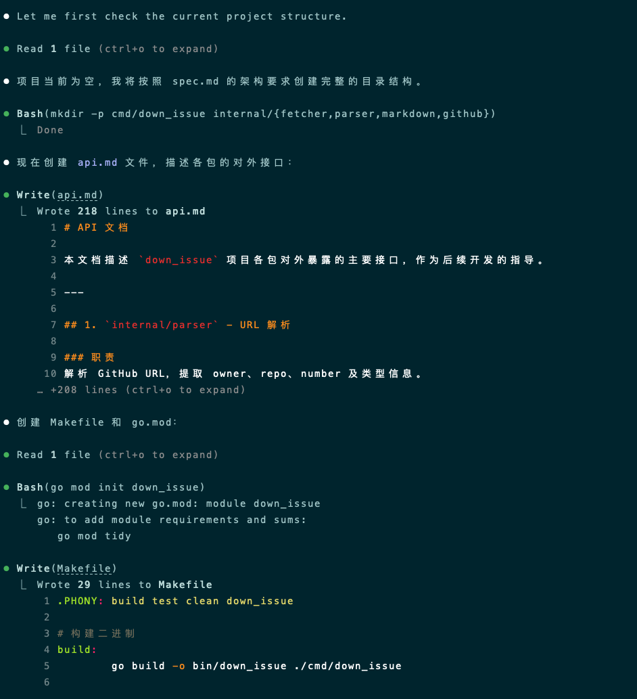
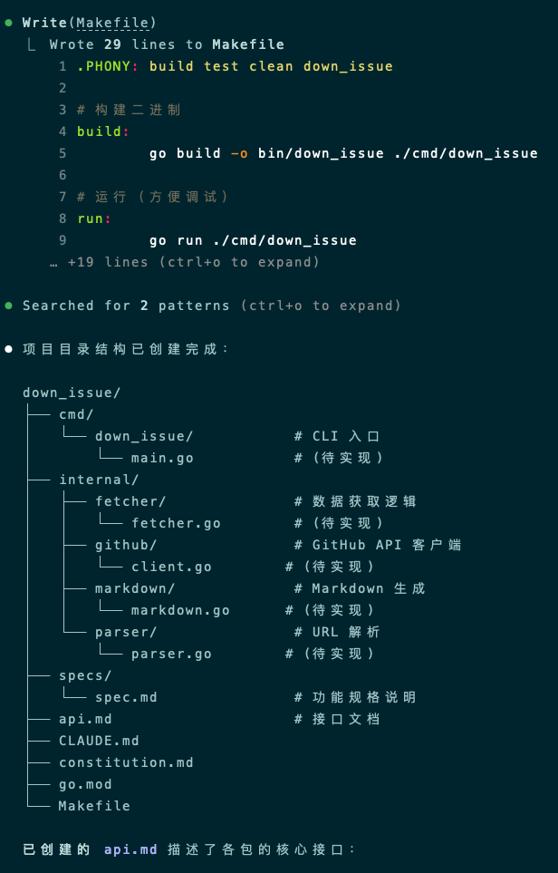
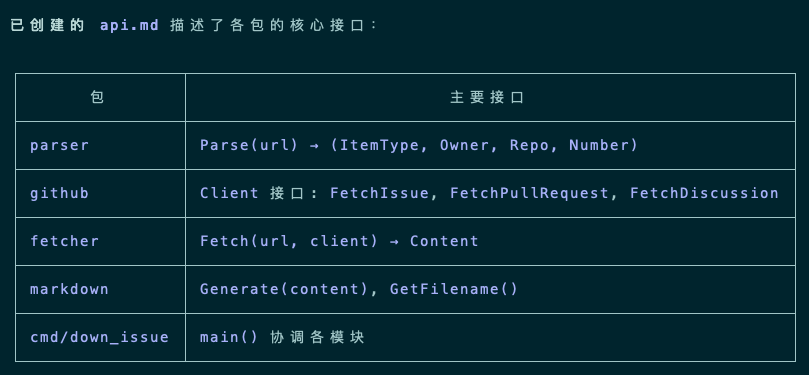
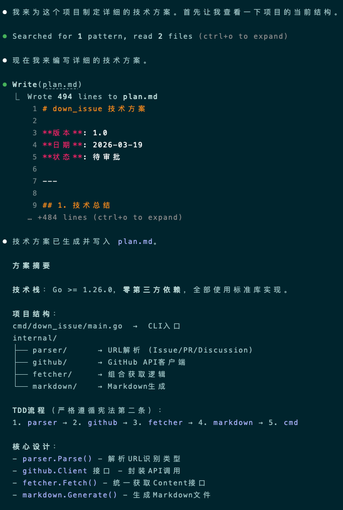
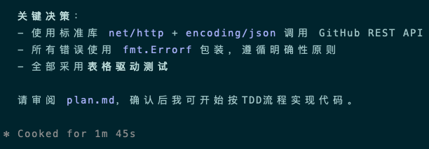

+++
date = '2026-03-19T22:28:42+08:00'
title = '基于Claude Code的SDD实战（二）：技术规划'
+++

大家好，我是bytezhou，上一篇给大家实践了SDD第一步-定义意图，接下来进入SDD第二步：技术规划。

传统范式下，产品经理输出PRD后，架构师拿着这份PRD进行技术选型（用Java还是Go）、架构设计（整体流程、分层设计）、模块划分（微服务拆分、数据建模）、API设计（前后端交互接口等）等，产出项目概要设计、详细设计文档等。

SDD范式下，"业务"映射在澄清后的、结构化的需求规范spec.md中，AI作为"架构师"，我们开发者则作为"工作流设计者"，指挥引导"AI架构师"把高层级的spec.md，"编译"成一份详尽的、结构化的技术规划方案 plan.md。废话不多说，我们进入正题。

切回项目目录，打开Claude Code（关闭plan mode），我们先来根据spec.md，指定技术栈，生成项目结构，同时让AI生成一份API声明（不一定严格遵守），作为后续输入（指导它思考）。输入以下Prompt：

```markdown
@specs/spec.md

你是一名资深的Go语言架构师，请严格参考Go语言最佳实践（特别注意包内聚原则），根据`spec.md`，规划并创建整体的项目目录结构。

生成目录后，请在项目根目录下创建`api.md`文件，描述一下各个包对外暴露的主要接口（Interface/Function签名），作为后续开发的指导。
```

AI会迅速执行以上操作，按照Go最佳实践来生成项目结构，下面是它的执行过程：







可以看到，AI不仅创建了项目目录、生成了api.md，还进行了go mod初始化和makefile的生成，一气呵成。

以下是生成的 **api.md**：

````
# API 文档
 
本文档描述 `down_issue` 项目各包对外暴露的主要接口，作为后续开发的指导。
 
---
 
## 1. `internal/parser` - URL 解析
 
### 职责
解析 GitHub URL，提取 owner、repo、number 及类型信息。
 
### 接口签名
 
```go
// ItemType 表示 GitHub 内容的类型
type ItemType int
 
const (
    TypeIssue ItemType = iota
    TypePullRequest
    TypeDiscussion
)
 
// ParseResult 解析结果
type ParseResult struct {
    Type   ItemType // 类型：Issue、PR、Discussion
    Owner  string   // 仓库所有者
    Repo   string   // 仓库名
    Number int      // 编号
}
 
// Parse(url string) (*ParseResult, error)
// 解析 GitHub URL，返回解析结果
// 支持格式：
//   - https://github.com/{owner}/{repo}/issues/{number}
//   - https://github.com/{owner}/{repo}/pull/{number}
//   - https://github.com/{owner}/{repo}/discussions/{number}
// 错误：URL 格式不正确时返回错误
```
 
---
 
## 2. `internal/github` - GitHub API 客户端
 
### 职责
封装 GitHub REST API 调用，获取 Issue、PR、Discussion 及其评论。
 
### 接口签名
 
```go
// Issue 表示 GitHub Issue 数据结构
type Issue struct {
    Number    int
    Title     string
    Body      string
    Author    string
    CreatedAt time.Time
    URL       string
    Comments  []Comment
}
 
// PullRequest 表示 GitHub Pull Request 数据结构
type PullRequest struct {
    Number    int
    Title     string
    Body      string
    Author    string
    CreatedAt time.Time
    URL       string
    Comments  []Comment
}
 
// Discussion 表示 GitHub Discussion 数据结构
type Discussion struct {
    Number     int
    Title      string
    Body       string
    Author     string
    CreatedAt  time.Time
    URL        string
    Comments   []Comment
}
 
// Comment 表示评论/回复
type Comment struct {
    Body      string
    Author    string
    CreatedAt time.Time
}
 
// Client GitHub API 客户端接口
type Client interface {
    // FetchIssue 获取 Issue 及其评论
    FetchIssue(owner, repo string, number int) (*Issue, error)
 
    // FetchPullRequest 获取 PR 及其评论
    FetchPullRequest(owner, repo string, number int) (*PullRequest, error)
 
    // FetchDiscussion 获取 Discussion 及其评论
    FetchDiscussion(owner, repo string, number int) (*Discussion, error)
}
 
// NewClient(token string) Client
// 创建 GitHub API 客户端
// token: 可选的 GITHUB_TOKEN，用于私有仓库或提高 API 速率限制
```
 
---
 
## 3. `internal/fetcher` - 数据获取逻辑
 
### 职责
组合 parser 和 github 包，提供高层的数据获取接口。
 
### 接口签名
 
```go
// Content 统一的内容接口
type Content interface {
    GetTitle() string
    GetBody() string
    GetAuthor() string
    GetCreatedAt() time.Time
    GetURL() string
    GetComments() []github.Comment
}
 
// Fetch(url string, client github.Client) (Content, error)
// 根据 URL 自动识别类型，获取对应内容
// 返回 Content 接口，支持 Issue、PR、Discussion 的统一处理
```
 
---
 
## 4. `internal/markdown` - Markdown 生成
 
### 职责
将获取的内容转换为格式化的 Markdown 文件。
 
### 接口签名
 
```go
// GenerateIssue(issue *github.Issue) string
// 将 Issue 转换为 Markdown 格式字符串
 
// GeneratePullRequest(pr *github.PullRequest) string
// 将 PullRequest 转换为 Markdown 格式字符串
 
// GenerateDiscussion(discussion *github.Discussion) string
// 将 Discussion 转换为 Markdown 格式字符串
 
// Generate(content github.Content) string
// 统一生成接口，根据 content 类型自动选择对应生成函数
```
 
### 输出文件名格式
 
```go
// GetFilename(itemType parser.ItemType, owner, repo string, number int) string
// 返回格式：
//   - Issue:       {owner}_{repo}_issue_{number}.md
//   - PullRequest: {owner}_{repo}_pr_{number}.md
//   - Discussion:  {owner}_{repo}_discussion_{number}.md
```
 
---
 
## 5. `cmd/down_issue` - CLI 入口
 
### 职责
命令行接口，协调各模块完成下载任务。
 
### main.go 逻辑
 
```go
// 用法：
//   down_issue <url>           # 下载到当前目录
//   down_issue <url> -o <path> # 下载到指定目录
 
// 主要流程：
//   1. 解析命令行参数（url, -o output-dir）
//   2. 调用 parser.Parse() 解析 URL
//   3. 创建 github.Client（可选使用 GITHUB_TOKEN）
//   4. 调用 fetcher.Fetch() 获取内容
//   5. 调用 markdown.Generate() 生成 Markdown
//   6. 调用 markdown.GetFilename() 获取文件名
//   7. 写入文件到指定目录
```
 
---
 
## 模块依赖关系
 
```
cmd/down_issue/main.go
    │
    ├── parser.Parse()
    │       └── 返回 ItemType, Owner, Repo, Number
    │
    ├── github.NewClient(token)
    │       └── 返回 github.Client 接口
    │
    ├── fetcher.Fetch(url, client)
    │       ├── 调用 parser.Parse()
    │       ├── 调用 github.Client.Fetch*()
    │       └── 返回 Content 接口
    │
    └── markdown.Generate(content)
            └── markdown.GetFilename()
```
 
---
 
## 错误处理约定
 
- 所有错误使用 `fmt.Errorf("包名: 描述: %w", err)` 包装
- 网络错误、解析错误、API 错误直接透传
- 不存在的资源返回标准 error，由 main.go 输出到 stderr 并以非零状态码退出
````

这是一份非常详尽的api文档，包含了各模块的职责描述、核心数据结构定义、主要接口声明、模块间的依赖关系等，项目已经初具"骨架"。

接下来，我们要指挥AI进行真正的技术方案规划了，输入以下Prompt：

```markdown
@specs/spec.md
@api.md

你现在是资深架构师。请根据需求规范`spec.md`和api说明`api.md`，为项目进行技术方案规划，最终生成一份详细的技术方案`plan.md`。

**技术要求 (必须遵守):**
1. **语言**: Go (>=1.26.0)
2. **Web框架**: 请遵循简单性原则，尽量只使用标准库。**注意：** 若要引入第三方库，请一定要先找我确认。
3. **测试先行（务必遵守，不可协商）**：所有的功能，都必须从编写一个（或多个）失败的测试用例开始。
    - **TDD**：严格遵循“Red-Green-Refactor”循环。
    - **表格驱动**：必须优先采用表格驱动测试（Table-Driven Tests）的风格。
4. **Markdown处理**: 尽量不使用第三方库。
5. **数据获取**: 所有数据通过API实时获取。
 
**技术方案内容输出要求 (必须遵守):**
1. **技术总结:** 明确上面的技术要求。
2. **审查:** 检查并确认本技术方案符合go语言最佳实践（如包内聚、错误处理、TDD等）。
3. **项目结构细化:** 明确`cmd`、`internal`下各包的具体职责和依赖关系。
4. **核心数据结构:** 定义在模块间流转的核心数据结构，必须包含`spec.md`中要求的所有字段（作者, 标题等）。
5. **接口设计:** 定义`internal`包对外暴露的关键接口。
 
请自行设计一个结构清晰的Markdown格式来组织你的输出。
 
完成后，将生成的`plan.md`内容写入到项目根目录下。
```

AI收到指令后，会开始规划并生成技术方案plan.md，如下：





最终生成的plan.md大概有500行，我把plan.md完整的贴出来：

````
# down_issue 技术方案
 
**版本**: 1.0
**日期**: 2026-03-19
**状态**: 已审批
 
---
 
## 1. 技术总结
 
### 1.1 技术栈
 
| 项目 | 选择 | 理由 |
|------|------|------|
| **语言** | Go >= 1.26.0 | 项目要求 |
| **HTTP 客户端** | 标准库 `net/http` | 简单性原则，无需第三方库 |
| **JSON 解析** | 标准库 `encoding/json` | 简单性原则 |
| **URL 解析** | 标准库 `net/url` + `path` | 简单性原则 |
| **Markdown 生成** | 字符串拼接 | 简单性原则，无需第三方库 |
| **CLI 参数解析** | 标准库 `flag` | 简单性原则，满足需求 |
| **错误处理** | `fmt.Errorf` + 错误包装 | 符合宪法第三条 |
 
### 1.2 依赖策略
 
**零第三方依赖** - 所有功能优先使用 Go 标准库实现。
 
### 1.3 TDD 实施计划
 
严格遵循测试先行铁律：
1. **Red**: 先编写失败测试
2. **Green**: 实现最小代码使测试通过
3. **Refactor**: 清理代码，保持测试通过
 
每个模块的开发顺序：
```
parser → github → fetcher → markdown → cmd
```
 
---
 
## 2. 项目结构
 
### 2.1 目录结构
 
```
down_issue/
├── cmd/
│   └── down_issue/
│       └── main.go              # CLI 入口
├── internal/
│   ├── parser/
│   │   ├── parser.go            # URL 解析逻辑
│   │   └── parser_test.go       # 测试文件
│   ├── github/
│   │   ├── github.go            # GitHub API 客户端
│   │   ├── github_test.go       # 测试文件
│   │   └── types.go             # 数据结构定义
│   ├── fetcher/
│   │   ├── fetcher.go           # 数据获取逻辑
│   │   └── fetcher_test.go      # 测试文件
│   └── markdown/
│       ├── markdown.go           # Markdown 生成
│       └── markdown_test.go      # 测试文件
├── go.mod
├── Makefile
└── plan.md
```
 
### 2.2 包职责与依赖关系
 
```
┌─────────────────────────────────────────────────────────┐
│                    cmd/down_issue/main.go                │
│                         (CLI 入口)                       │
└─────────────────────────┬───────────────────────────────┘
                          │
          ┌───────────────┼───────────────┐
          ▼               ▼               ▼
    ┌──────────┐   ┌──────────┐   ┌──────────┐
    │  parser  │   │  github  │   │ markdown │
    └────┬─────┘   └────┬─────┘   └────▲─────┘
         │              │              │
         └──────────────┼──────────────┘
                        ▼
                 ┌──────────────┐
                 │   fetcher    │
                 └──────┬───────┘
                        │
                        ▼
                 ┌──────────────┐
                 │   (输出)     │
                 └──────────────┘
```
 
| 包 | 职责 | 依赖 | 对外接口 |
|----|------|------|----------|
| `parser` | 解析 GitHub URL | 无 | `Parse(url) (*ParseResult, error)` |
| `github` | GitHub API 调用 | 无 | `Client` 接口, `NewClient(token) Client` |
| `fetcher` | 组合获取内容 | parser, github | `Fetch(url string, client Client) (Content, error)` |
| `markdown` | 生成 Markdown | github | `Generate(content) string`, `GetFilename(...) string` |
| `cmd/down_issue` | CLI 协调 | parser, github, fetcher, markdown | 主程序入口 |
 
---
 
## 3. 核心数据结构
 
### 3.1 parser 包
 
```go
// ItemType 表示 GitHub 内容的类型
type ItemType int
 
const (
    TypeIssue ItemType = iota
    TypePullRequest
    TypeDiscussion
)
 
// ParseResult 解析结果
type ParseResult struct {
    Type   ItemType
    Owner  string
    Repo   string
    Number int
}
```
 
### 3.2 github 包
 
```go
// Issue 表示 GitHub Issue
type Issue struct {
    Number    int
    Title     string
    Body      string
    Author    string
    CreatedAt time.Time
    URL       string
    Comments  []Comment
}
 
// PullRequest 表示 GitHub Pull Request
type PullRequest struct {
    Number    int
    Title     string
    Body      string
    Author    string
    CreatedAt time.Time
    URL       string
    Comments  []Comment
}
 
// Discussion 表示 GitHub Discussion
type Discussion struct {
    Number    int
    Title     string
    Body      string
    Author    string
    CreatedAt time.Time
    URL       string
    Comments  []Comment
}
 
// Comment 表示评论/回复
type Comment struct {
    Body      string
    Author    string
    CreatedAt time.Time
}
 
// Client GitHub API 客户端接口
type Client interface {
    FetchIssue(owner, repo string, number int) (*Issue, error)
    FetchPullRequest(owner, repo string, number int) (*PullRequest, error)
    FetchDiscussion(owner, repo string, number int) (*Discussion, error)
}
```
 
### 3.3 fetcher 包
 
```go
// Content 统一的内容接口
type Content interface {
    GetTitle() string
    GetBody() string
    GetAuthor() string
    GetCreatedAt() time.Time
    GetURL() string
    GetComments() []github.Comment
}
```
 
### 3.4 markdown 包
 
```go
// 输出文件名格式
// Issue:       {owner}_{repo}_issue_{number}.md
// PullRequest: {owner}_{repo}_pr_{number}.md
// Discussion:  {owner}_{repo}_discussion_{number}.md
```
 
---
 
## 4. 接口设计
 
### 4.1 parser.Parse
 
```go
// Parse 解析 GitHub URL
// 支持格式:
//   - https://github.com/{owner}/{repo}/issues/{number}
//   - https://github.com/{owner}/{repo}/pull/{number}
//   - https://github.com/{owner}/{repo}/discussions/{number}
// 返回: ParseResult 包含类型、owner、repo、number
// 错误: URL 格式不正确时返回 error
func Parse(url string) (*ParseResult, error)
```
 
### 4.2 github.Client
 
```go
type Client interface {
    // FetchIssue 获取 Issue 及其评论
    FetchIssue(owner, repo string, number int) (*Issue, error)
 
    // FetchPullRequest 获取 PR 及其评论
    FetchPullRequest(owner, repo string, number int) (*PullRequest, error)
 
    // FetchDiscussion 获取 Discussion 及其评论
    FetchDiscussion(owner, repo string, number int) (*Discussion, error)
}
 
// NewClient 创建 GitHub API 客户端
// token: 可选，用于私有仓库或提高 API 速率限制
func NewClient(token string) Client
```
 
### 4.3 fetcher.Fetch
 
```go
// Fetch 根据 URL 获取内容
// 内部调用 parser.Parse 和 github.Client.Fetch*
// 返回统一的 Content 接口
func Fetch(url string, client github.Client) (Content, error)
```
 
### 4.4 markdown 生成函数
 
```go
// Generate 统一生成接口
func Generate(content github.Content) string
 
// GenerateIssue 单独生成 Issue
func GenerateIssue(issue *github.Issue) string
 
// GeneratePullRequest 单独生成 PR
func GeneratePullRequest(pr *github.PullRequest) string
 
// GenerateDiscussion 单独生成 Discussion
func GenerateDiscussion(discussion *github.Discussion) string
 
// GetFilename 获取输出文件名
func GetFilename(itemType parser.ItemType, owner, repo string, number int) string
```
 
---
 
## 5. API 端点设计
 
### 5.1 GitHub REST API 调用
 
| 资源 | API 端点 | 说明 |
|------|----------|------|
| Issue | `GET /repos/{owner}/{repo}/issues/{number}` | 获取 Issue |
| Issue Comments | `GET /repos/{owner}/{repo}/issues/{number}/comments` | 获取评论 |
| PR | `GET /repos/{owner}/{repo}/pulls/{number}` | 获取 PR |
| PR Comments | `GET /repos/{owner}/{repo}/issues/{number}/comments` | 获取评论（PR 评论也走此 API） |
| Discussion | `GET /repos/{owner}/{repo}/discussions/{number}` | 获取 Discussion |
| Discussion Comments | `GET /repos/{owner}/{repo}/discussions/{number}/comments` | 获取回复 |
 
**注意**: GitHub API URL 前缀为 `https://api.github.com`
 
### 5.2 请求头
 
```
Authorization: token {GITHUB_TOKEN}  // 仅当 token 存在时
Accept: application/vnd.github.v3+json
```
 
---
 
## 6. 实现顺序（TDD 流程）
 
### 阶段一：parser 包
1. 编写 `parser_test.go` - 测试 URL 解析
2. 实现 `Parse()` 函数
3. 验证测试通过
 
### 阶段二：github 包
1. 定义 `types.go` - 数据结构
2. 编写 `github_test.go` - 测试 GitHub API 调用（使用真实 HTTP mock）
3. 实现 `Client` 接口和 `NewClient()`
4. 验证测试通过
 
### 阶段三：fetcher 包
1. 编写 `fetcher_test.go` - 测试内容获取
2. 实现 `Content` 接口和 `Fetch()` 函数
3. 验证测试通过
 
### 阶段四：markdown 包
1. 编写 `markdown_test.go` - 测试 Markdown 生成
2. 实现 `Generate*()` 和 `GetFilename()` 函数
3. 验证测试通过
 
### 阶段五：cmd/down_issue
1. 实现 `main.go` - CLI 入口
2. 集成测试
 
---
 
## 7. 错误处理约定
 
所有错误遵循宪法第三条：
 
```go
// 使用 fmt.Errorf 包装错误
fmt.Errorf("parser: invalid URL format: %w", err)
fmt.Errorf("github: failed to fetch issue: %w", err)
fmt.Errorf("fetcher: parse error: %w", err)
fmt.Errorf("markdown: generation failed: %w", err)
```
 
### 错误场景
 
| 场景 | 处理方式 |
|------|----------|
| URL 格式错误 | `parser.Parse()` 返回 error，主程序输出到 stderr，退出码 1 |
| 资源不存在 | `github.Client.Fetch*()` 返回 404 error，主程序输出到 stderr，退出码 1 |
| 网络错误 | 错误透传，主程序输出到 stderr，退出码 1 |
| 文件写入错误 | 主程序输出到 stderr，退出码 1 |
 
---
 
## 8. 命令行接口
 
```go
// 用法
down_issue <url>           // 下载到当前目录
down_issue <url> -o <path> // 下载到指定目录
 
// 参数
//   url: GitHub Issue/PR/Discussion URL（必需）
//   -o, --output: 输出目录（可选，默认当前目录）
```
 
### 退出码
 
| 退出码 | 含义 |
|--------|------|
| 0 | 成功 |
| 1 | 失败（错误信息输出到 stderr） |
 
---
 
## 9. 文件输出格式
 
### 9.1 文件名格式
 
```
{owner}_{repo}_{type}_{number}.md
```
 
示例：
- `gorilla_mux_issue_123.md`
- `golang_go_pr_456.md`
- `docker_community_discussion_789.md`
 
### 9.2 Markdown 内容格式
 
```markdown
# {标题}
 
- **作者**: {author}
- **创建时间**: {created_at}
- **原始链接**: {original_url}
 
---
 
## 主要内容
 
{正文内容}
 
---
 
## 评论 ({count} 条)
 
### 评论 1
 
- **作者**: {author}
- **时间**: {created_at}
 
{评论内容}
...
```
 
---
 
## 10. 测试策略
 
### 10.1 表格驱动测试
 
所有测试优先采用表格驱动测试风格：
 
```go
func TestParse(t *testing.T) {
    tests := []struct {
        name    string
        url     string
        want    *ParseResult
        wantErr bool
    }{
        {
            name: "valid issue URL",
            url:  "https://github.com/gorilla/mux/issues/123",
            want: &ParseResult{
                Type:   TypeIssue,
                Owner:  "gorilla",
                Repo:   "mux",
                Number: 123,
            },
            wantErr: false,
        },
        // ... more cases
    }
 
    for _, tt := range tests {
        t.Run(tt.name, func(t *testing.T) {
            got, err := Parse(tt.url)
            // assertions
        })
    }
}
```
 
### 10.2 Mock 策略
 
**拒绝Mocks** - 优先使用真实的依赖或简单的 HTTP test server 进行集成测试。
 
---
 
## 11. Makefile 目标
 
```makefile
go build     # 构建项目
go test      # 运行所有测试
go vet       # 代码检查
clean        # 清理构建产物
```
 
---
 
## 12. 审查确认
 
### 12.1 Go 语言最佳实践
 
| 检查项 | 状态 | 说明 |
|--------|------|------|
| 错误处理 | ✅ | 所有错误使用 `fmt.Errorf` 包装 |
| 包内聚 | ✅ | 每包职责单一，依赖清晰 |
| 命名规范 | ✅ | 遵循 Go 命名约定 |
| 文档注释 | ✅ | 关键接口有文档 |
| 测试覆盖 | ✅ | TDD，表格驱动测试 |
 
### 12.2 宪法遵循
 
| 宪法条款 | 遵循情况 |
|----------|----------|
| 第一条：简单性原则 | ✅ 零第三方依赖，标准库优先 |
| 第二条：测试先行 | ✅ 每个模块先写测试 |
| 第三条：明确性原则 | ✅ 显式错误处理，无全局变量 |
 
---
 
## 13. 风险与缓解
 
| 风险 | 缓解措施 |
|------|----------|
| GitHub API 变更 | 使用稳定的 v3 API，错误信息明确 |
| 复杂 Markdown 处理 | 当前方案保持简单字符串拼接 |
| 大量评论性能 | API 已经支持分页，可后续优化 |
 
---
````

**【提示：一定要审查！】**

AI生成的plan.md，只是一份"草稿"，请仔细审查，确保技术选型、结构设计、模块依赖、核心数据结构等符合预期。

人工审查，是确保我们的意图被正确执行的唯一保障！

至此，我们完成了SDD范式的第二步：技术规划。

---

**感谢你点开这篇文章，欢迎关注我的公众号：10年码农，纯技术分享，一起在AI时代探索未来！**


---

**客官您满意的话，感谢打赏。**


