+++
date = '2026-03-21T19:13:42+08:00'
title = '基于Claude Code的SDD实战（三）：任务拆解及自动实现'
+++

大家好，我是bytezhou，上一篇进行了SDD第二步-技术规划，今天将进入本次SDD实战的收尾-任务拆解及自动实现。

# 1、任务拆解
AI技术规划后输出 plan.md，距离代码，中间还缺少一步：把宏观的plan.md，拆分成一系列带依赖关系的、原子化的具体开发任务 tasks.md。技术细节已经齐全，但这个阶段要注意拆分的任务粒度和执行顺序。输入以下Prompt：

```
@specs/spec.md
@plan.md

你现在是技术leader，请根据`spec.md`和`plan.md`，**将`plan.md`中的技术方案，拆分成原子化的、详细的、带依赖关系的、可被直接执行的任务列表。**

核心要求：
1. 任务粒度：每个任务只实现最小化的功能（只涉及一个文件的变更）。**务必禁止："实现所有功能"的大任务。**
2. TDD：必须遵守"测试先行"，先生成测试、再去实现。
3. 并行标记：对没有依赖关系的任务，标记【P】。
4. 执行顺序（以下面的为准）：
  **1: 数据结构定义**
  **2: Github数据获取（请遵循TDD）**
  **3: 生成Markdown文件（请遵循TDD）**
  **4: 程序入口集成（请遵循TDD）**
  
完成后，将生成的任务列表写入到项目根目录下的tasks.md文件中。
```

下面是AI拆分任务的过程：

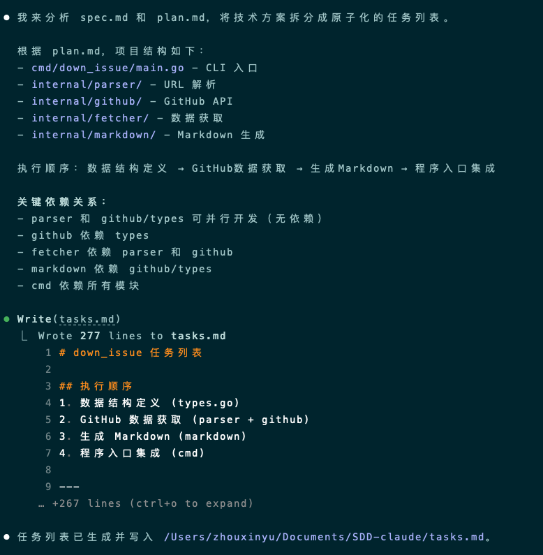

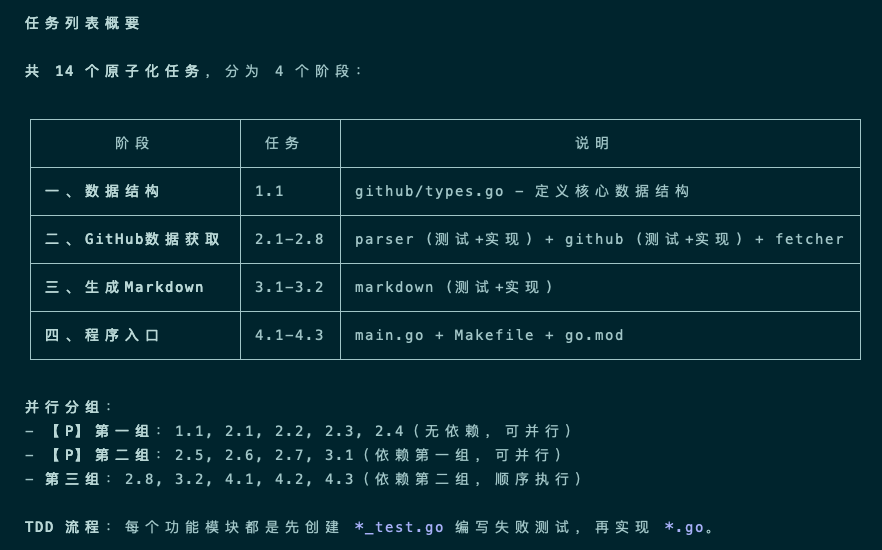

最终，AI会生成一份详尽的任务列表 tasks.md，我把它贴出来：

````
# down_issue 任务列表
 
## 执行顺序
1. 数据结构定义 (types.go)
2. GitHub 数据获取 (parser + github)
3. 生成 Markdown (markdown)
4. 程序入口集成 (cmd)
 
---
 
## 阶段一：数据结构定义
 
### 1.1 【P】创建 github/types.go - 定义数据结构
 
**文件**: `internal/github/types.go`
 
**内容**: 定义 Issue、PullRequest、Discussion、Comment 结构体，以及 ItemType 枚举和 Content 接口
 
**依赖**: 无
 
**任务**: 实现以下数据结构和接口
 
```go
// ItemType 表示 GitHub 内容的类型
type ItemType int
 
const (
    TypeIssue ItemType = iota
    TypePullRequest
    TypeDiscussion
)
 
// Issue 表示 GitHub Issue
type Issue struct {
    Number    int
    Title     string
    Body      string
    Author    string
    CreatedAt time.Time
    URL       string
    Comments  []Comment
}
 
// PullRequest 表示 GitHub Pull Request
type PullRequest struct {
    Number    int
    Title     string
    Body      string
    Author    string
    CreatedAt time.Time
    URL       string
    Comments  []Comment
}
 
// Discussion 表示 GitHub Discussion
type Discussion struct {
    Number    int
    Title     string
    Body      string
    Author    string
    CreatedAt time.Time
    URL       string
    Comments  []Comment
}
 
// Comment 表示评论/回复
type Comment struct {
    Body      string
    Author    string
    CreatedAt time.Time
}
 
// Content 统一的内容接口
type Content interface {
    GetTitle() string
    GetBody() string
    GetAuthor() string
    GetCreatedAt() time.Time
    GetURL() string
    GetComments() []Comment
}
```
 
---
 
## 阶段二：GitHub 数据获取
 
### 2.1 【P】创建 parser/parser_test.go - URL 解析测试
 
**文件**: `internal/parser/parser_test.go`
 
**依赖**: 无
 
**任务**: 编写表格驱动测试，覆盖以下用例：
- 有效的 Issue URL (`https://github.com/owner/repo/issues/123`)
- 有效的 PR URL (`https://github.com/owner/repo/pull/123`)
- 有效的 Discussion URL (`https://github.com/owner/repo/discussions/123`)
- 无效 URL 格式
- 缺失关键部分
 
### 2.2 【P】创建 parser/parser.go - URL 解析实现
 
**文件**: `internal/parser/parser.go`
 
**依赖**: 无
 
**任务**: 实现 `Parse(url string) (*ParseResult, error)` 函数
- 解析 GitHub URL，识别类型（issue/pull/discussions）
- 提取 owner、repo、number
- 返回 ParseResult 或错误
 
### 2.3 【P】创建 github/github_test.go - GitHub API 测试
 
**文件**: `internal/github/github_test.go`
 
**依赖**: types.go
 
**任务**: 编写表格驱动测试，使用 HTTP test server mock GitHub API
- 测试 FetchIssue
- 测试 FetchPullRequest
- 测试 FetchDiscussion
- 测试 404 错误处理
- 测试网络错误处理
 
### 2.4 【P】创建 github/github.go - GitHub API 客户端
 
**文件**: `internal/github/github.go`
 
**依赖**: types.go
 
**任务**: 实现 `Client` 接口和 `NewClient(token string) Client`
- FetchIssue(owner, repo string, number int) (*Issue, error)
- FetchPullRequest(owner, repo string, number int) (*PullRequest, error)
- FetchDiscussion(owner, repo string, number int) (*Discussion, error)
- 使用 net/http 调用 GitHub REST API
- 支持 GITHUB_TOKEN 认证
 
### 2.5 【P】创建 parser/parser.go 的 GetFilename 函数测试
 
**文件**: `internal/parser/parser_test.go` (追加)
 
**依赖**: parser.go
 
**任务**: 追加测试用例测试 GetFilename 函数
- Issue: `{owner}_{repo}_issue_{number}.md`
- PR: `{owner}_{repo}_pr_{number}.md`
- Discussion: `{owner}_{repo}_discussion_{number}.md`
 
### 2.6 【P】创建 parser/parser.go 的 GetFilename 函数实现
 
**文件**: `internal/parser/parser.go` (追加)
 
**依赖**: parser.go
 
**任务**: 实现 `GetFilename(itemType ItemType, owner, repo string, number int) string`
 
### 2.7 创建 fetcher/fetcher_test.go - fetcher 测试
 
**文件**: `internal/fetcher/fetcher_test.go`
 
**依赖**: parser, github
 
**任务**: 编写表格驱动测试
- 测试 Fetch 成功获取 Issue
- 测试 Fetch 成功获取 PR
- 测试 Fetch 成功获取 Discussion
- 测试无效 URL 错误
 
### 2.8 创建 fetcher/fetcher.go - 数据获取实现
 
**文件**: `internal/fetcher/fetcher.go`
 
**依赖**: parser, github
 
**任务**: 实现 `Fetch(url string, client github.Client) (Content, error)`
- 组合 parser.Parse 和 github.Client.Fetch*
- 返回统一的 Content 接口
 
---
 
## 阶段三：生成 Markdown
 
### 3.1 创建 markdown/markdown_test.go - Markdown 生成测试
 
**文件**: `internal/markdown/markdown_test.go`
 
**依赖**: github/types.go
 
**任务**: 编写表格驱动测试
- 测试 GenerateIssue 生成正确格式
- 测试 GeneratePullRequest 生成正确格式
- 测试 GenerateDiscussion 生成正确格式
- 测试 GetFilename 返回正确文件名
 
### 3.2 创建 markdown/markdown.go - Markdown 生成实现
 
**文件**: `internal/markdown/markdown.go`
 
**依赖**: github/types.go
 
**任务**: 实现以下函数
- `Generate(content github.Content) string`
- `GenerateIssue(issue *github.Issue) string`
- `GeneratePullRequest(pr *github.PullRequest) string`
- `GenerateDiscussion(discussion *github.Discussion) string`
- `GetFilename(itemType parser.ItemType, owner, repo string, number int) string`
 
---
 
## 阶段四：程序入口集成
 
### 4.1 创建 cmd/down_issue/main.go - CLI 入口
 
**文件**: `cmd/down_issue/main.go`
 
**依赖**: parser, github, fetcher, markdown
 
**任务**: 实现 CLI 入口
- 解析命令行参数 (flag)
- 处理 -o/--output 输出目录参数
- 调用 fetcher.Fetch 获取内容
- 调用 markdown.Generate 生成文件
- 错误处理和退出码
 
### 4.2 创建 Makefile - 构建脚本
 
**文件**: `Makefile`
 
**依赖**: 无
 
**任务**: 定义以下目标
- `go build` - 构建项目
- `go test` - 运行所有测试
- `go vet` - 代码检查
- `clean` - 清理构建产物
 
### 4.3 创建 go.mod - 模块定义
 
**文件**: `go.mod`
 
**依赖**: 无
 
**任务**: 定义模块名 `github.com/user/down_issue`，Go 版本 >= 1.26
 
---
 
## 任务状态汇总
 
| 序号 | 任务 | 文件 | 依赖 | 状态 |
|------|------|------|------|------|
| 1.1 | 创建 github/types.go | internal/github/types.go | 无 | ⬜ |
| 2.1 | 创建 parser/parser_test.go | internal/parser/parser_test.go | 无 | ⬜ |
| 2.2 | 创建 parser/parser.go | internal/parser/parser.go | 无 | ⬜ |
| 2.3 | 创建 github/github_test.go | internal/github/github_test.go | types.go | ⬜ |
| 2.4 | 创建 github/github.go | internal/github/github.go | types.go | ⬜ |
| 2.5 | 追加 parser GetFilename 测试 | internal/parser/parser_test.go | parser.go | ⬜ |
| 2.6 | 实现 parser GetFilename | internal/parser/parser.go | parser.go | ⬜ |
| 2.7 | 创建 fetcher/fetcher_test.go | internal/fetcher/fetcher_test.go | parser, github | ⬜ |
| 2.8 | 创建 fetcher/fetcher.go | internal/fetcher/fetcher.go | parser, github | ⬜ |
| 3.1 | 创建 markdown/markdown_test.go | internal/markdown/markdown_test.go | github/types | ⬜ |
| 3.2 | 创建 markdown/markdown.go | internal/markdown/markdown.go | github/types | ⬜ |
| 4.1 | 创建 cmd/down_issue/main.go | cmd/down_issue/main.go | 所有模块 | ⬜ |
| 4.2 | 创建 Makefile | Makefile | 无 | ⬜ |
| 4.3 | 创建 go.mod | go.mod | 无 | ⬜ |
 
---
 
## 并行执行分组
 
**【P】第一组（无依赖，可并行）**:
- 1.1, 2.1, 2.2, 2.3, 2.4
 
**【P】第二组（依赖第一组，可并行）**:
- 2.5, 2.6, 2.7, 3.1
 
**第三组（依赖第二组，顺序执行）**:
- 2.8, 3.2, 4.1, 4.2, 4.3
````

**【再次提醒：一定要审查！】**

同样，AI生成的任务列表tasks.md也需要仔细审查，依赖关系对不对？有没有遵循TDD等？如果发现问题，直接告诉AI：“XXX依赖有问题，请重新调整”，改到你满意为止。现在仔细审查，可以有效减少"返工"的概率。

# 2、自动实现
接下来，就是让AI作为"码农"，开始真正"写代码"了。

实现阶段，我们指挥AI严格遵循TDD的**"Red-Green-Refactor"**循环：

- Red：将功能转化为"失败的测试用例"，保证AI不“乱跑”。
- Green：以通过测试用例为目标，让AI编写基本代码。
- Refactor：在测试用例的框定下，让AI优化代码。

## 2.1 实现：阶段一
根据上面生成的tasks.md，我们先执行"阶段一：数据结构定义"（注：该阶段是基础数据结构定义，无需TDD），输入以下Prompt：

```
@plan.md
@tasks.md

请执行`阶段一`所有任务，无需TDD，直接生成代码。
```

AI收到指令后，开始疯狂输出：
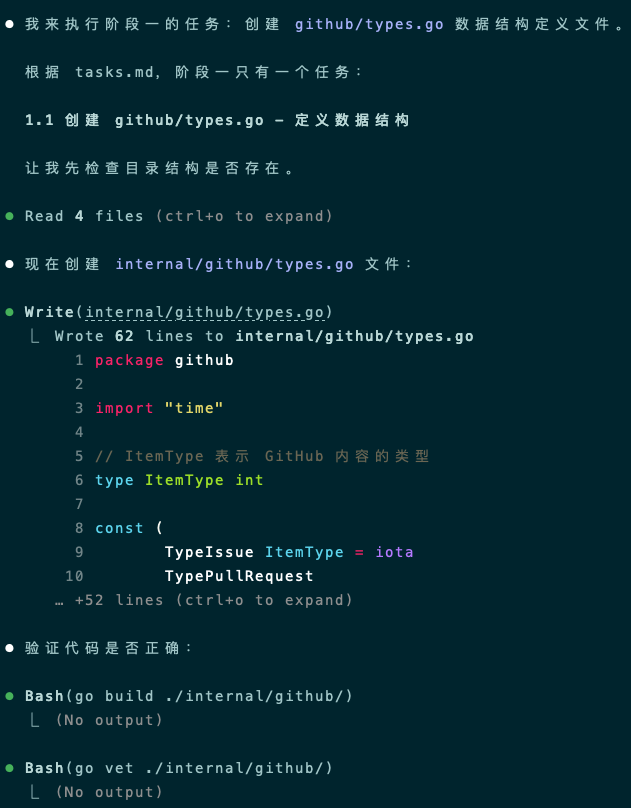

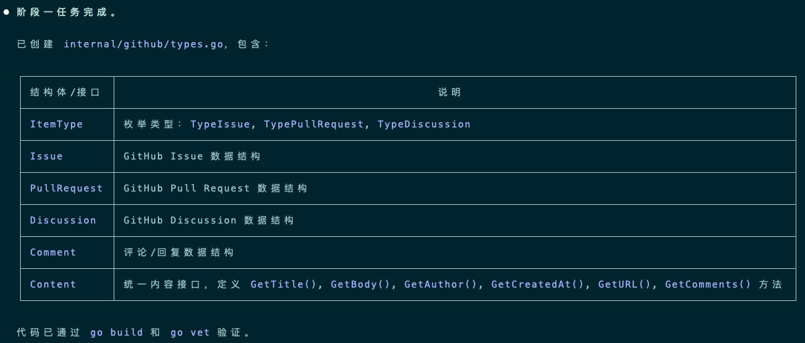

可以看到，它不仅创建了数据结构，还通过go build和go vet去验证代码，是一个能"编写-编译-验证"闭环的"工程师"。

## 2.2 实现：阶段二
"阶段二：GitHub数据获取"的实现，就要按照TDD进行了，首先是**"Red"步骤**，输入以下Prompt：

```
现在进入阶段二。
请严格遵循TDD流程，先不要实现功能代码。

此时 `*.go` 中可能还没有函数实现、或者是空的。请确保测试代码能够通过编译（可以先在 `*.go` 中生成一个空的函数签名），但**执行测试必须失败**。
```

期间，AI会多次找你确认，生成的测试用例代码是否ok，若有编译错误，AI也会自动寻找原因、自动修复。我把一些执行过程截取下来，贴在这儿：
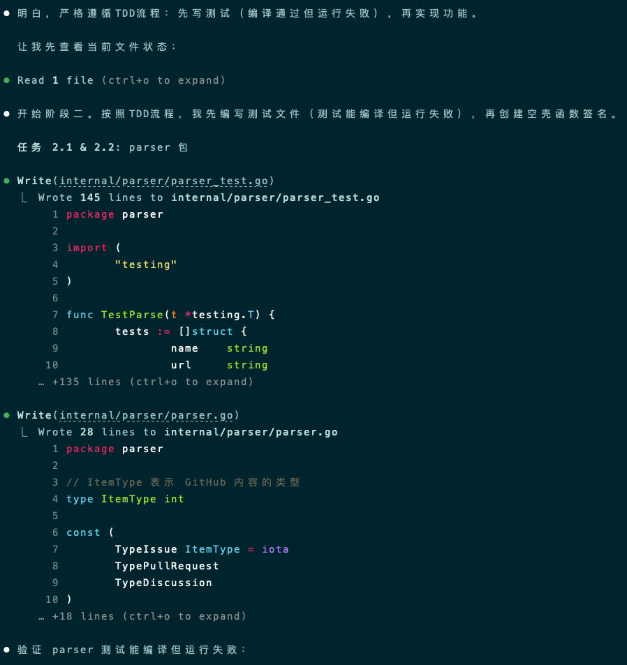

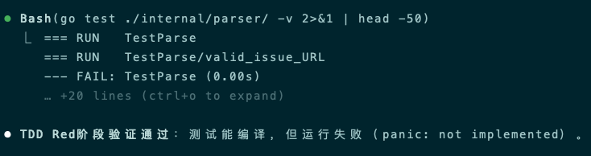

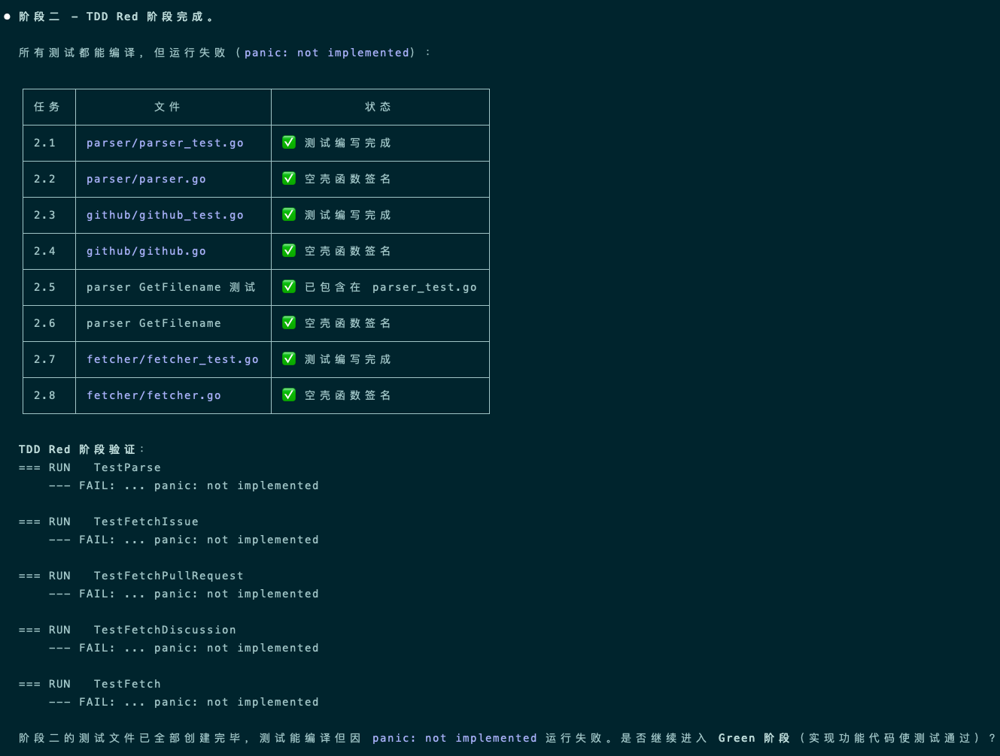

接下来进入**"Green"步骤**，输入Prompt：

```
现在实现`*.go`。
 
要求：
1.实现的逻辑必须能通过刚才编写的所有测试用例。
2.严格遵守简单性原则，不要过度设计，只写能通过测试的代码。
```

生成实现代码的过程并非一帆风顺，存在一些逻辑漏洞、方法缺失等问题，但AI经过几轮"编码-测试-修复"循环后，顺利完成所有功能实现，全部通过测试用例。我截取部分执行过程：
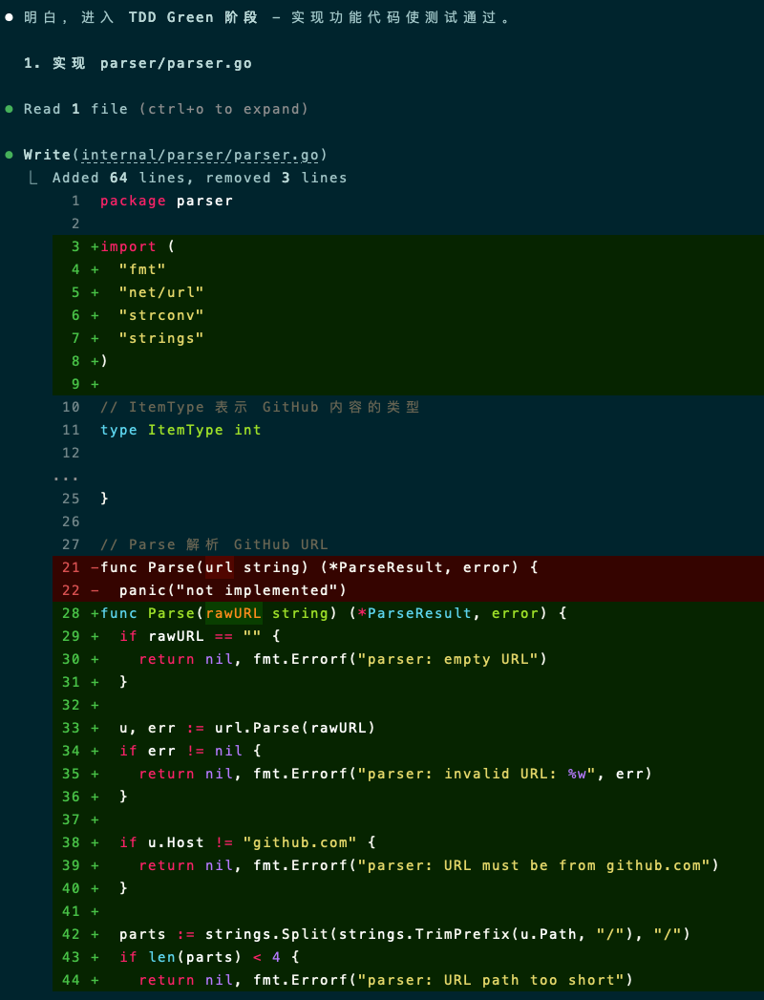

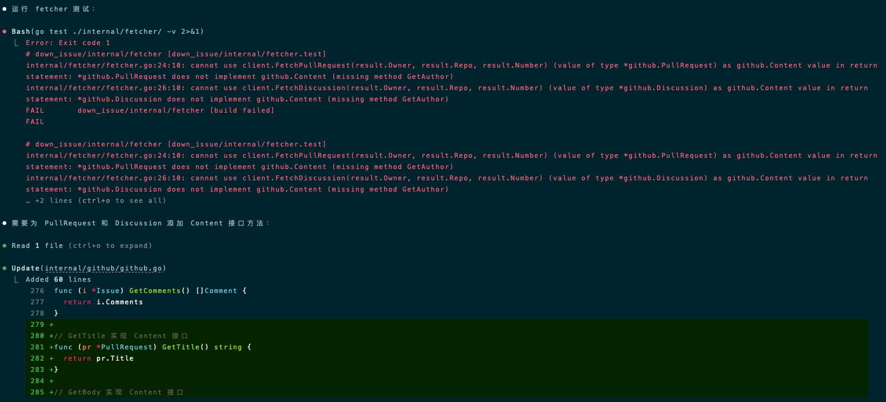

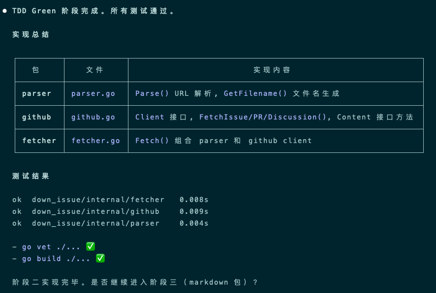

若对上面的实现不满意，可以进入**"Refactor"步骤**，输入以下Prompt：

```
阶段二的`*.go`实现代码通过了测试，请详细分析上述实现代码是否有优化空间，如果可以优化，请一一列出所有优化点，自行组织一份结构清晰的Markdown格式输出优化报告。
```

AI分析后，会给出一份优化报告，报告比较长，我也只截取部分：
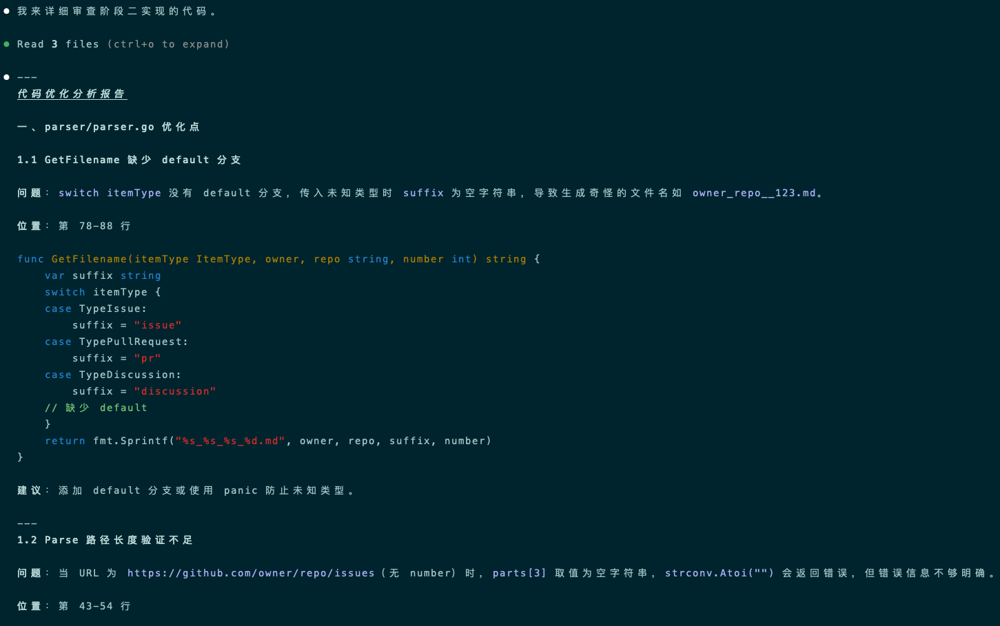

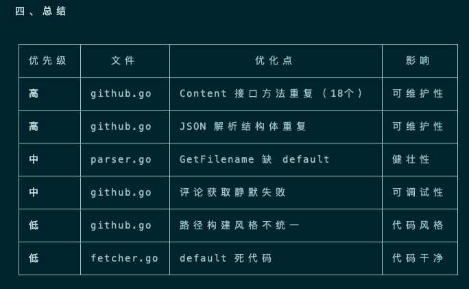

你可以让AI优化代码实现，但一定记住，优化后务必再次进行测试确保改的代码没问题：

```
请按照上述的优化分析报告，优化阶段二的`*.go`代码。
优化完成后，**必须重新执行并通过所有测试，确保没有破坏现有逻辑**。
```

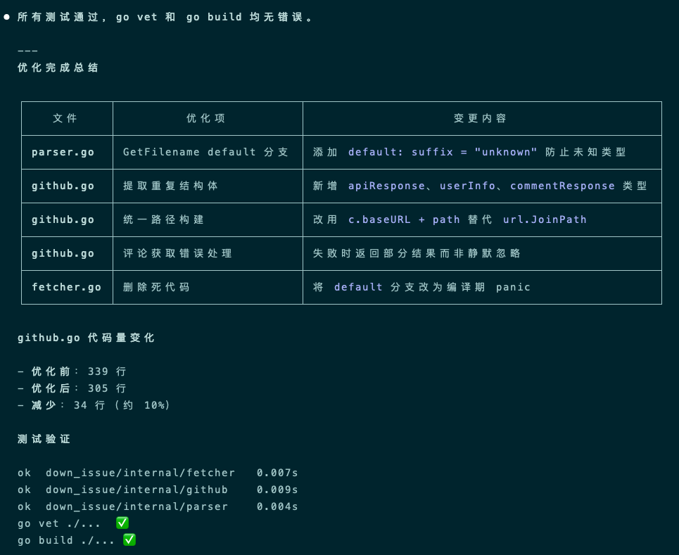

"阶段三：生成Markdown"的实现和阶段二类似，按照TDD进行即可，在此不再赘述了。
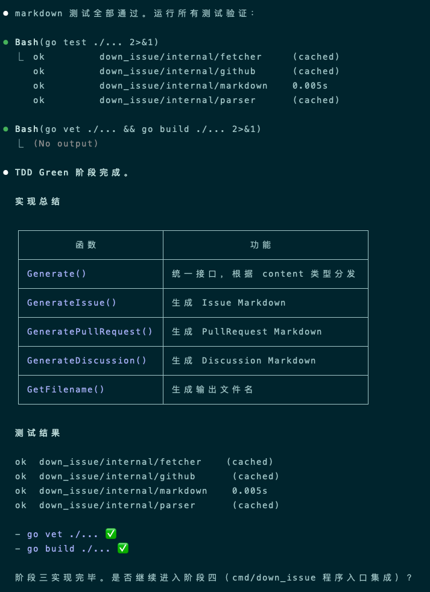

## 2.3 实现：阶段四
最后，我们将进入"阶段四-程序入口集成"，直接告知AI执行即可：

```
请执行阶段四的所有任务。
```

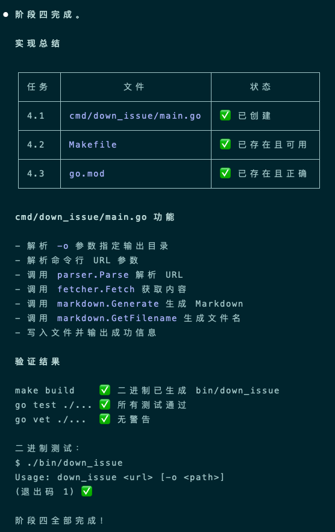

最终，tasks.md中所有任务执行完毕，测试、编译、集成、构建均通过，直接交付了一整套项目代码、和最终的可执行程序。

# 3、使用
扒Github Issue/PR/Discussion的小工具开发完了，现在让我们简单使用一下，看看效果（要指定环境变量 GITHUB_TOKEN）。

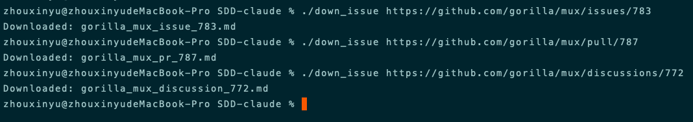

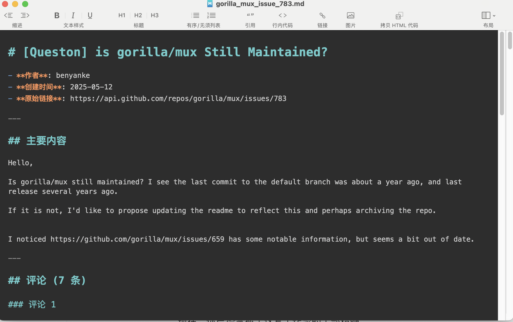

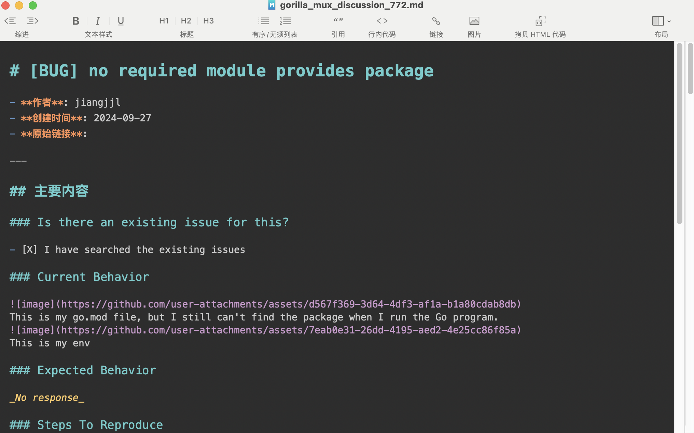

小工具运行正常，成功从GitHub扒下来Issue/PR/Discussion。

# 4、结束语
至此，我们用SDD范式来开发一个小工具的实战就告一段落了。

我们一步步的 从 "模糊的想法" -> spec.md -> plan.md -> tasks.md -> 可执行的代码和程序，虽然拆成了三篇文章来写，但其实整个过程非常迅速，不到1h就完成了全流程。AI忠实的扮演着多种"角色"，尽心尽力的搬砖；我们开发者则是"监工"，审查各种"方案".md，"指挥"AI干活。

---

**感谢你点开这篇文章，欢迎关注我的公众号：10年码农，纯技术分享，一起在AI时代探索未来！**


---

**客官您满意的话，感谢打赏。**


