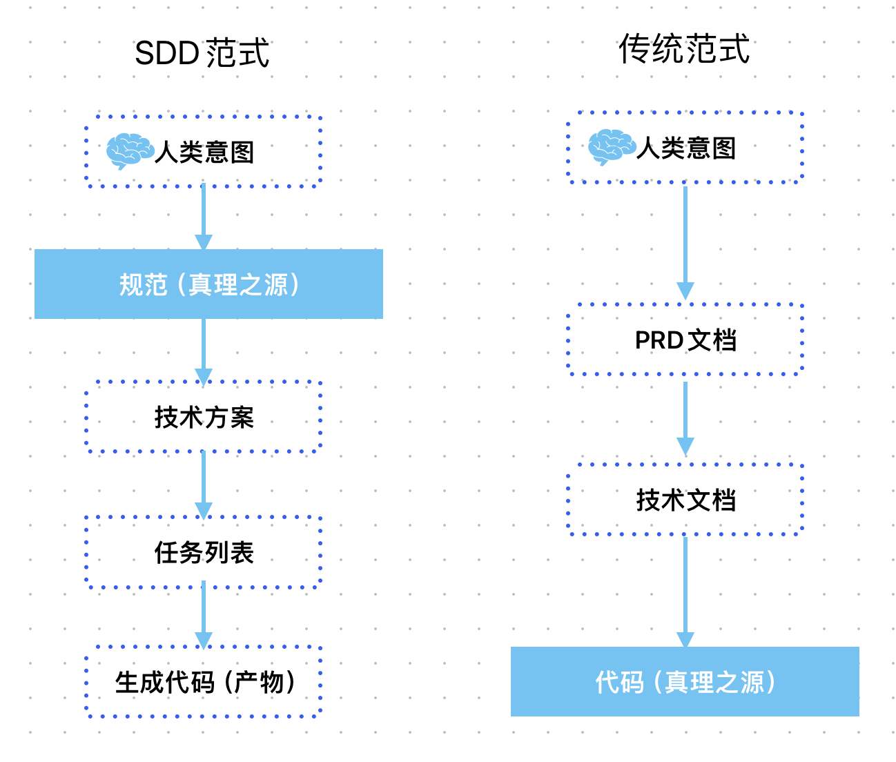
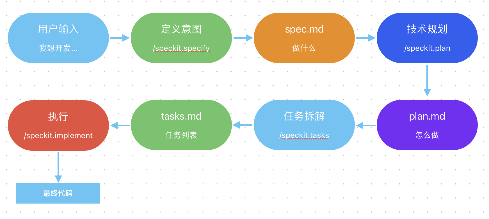
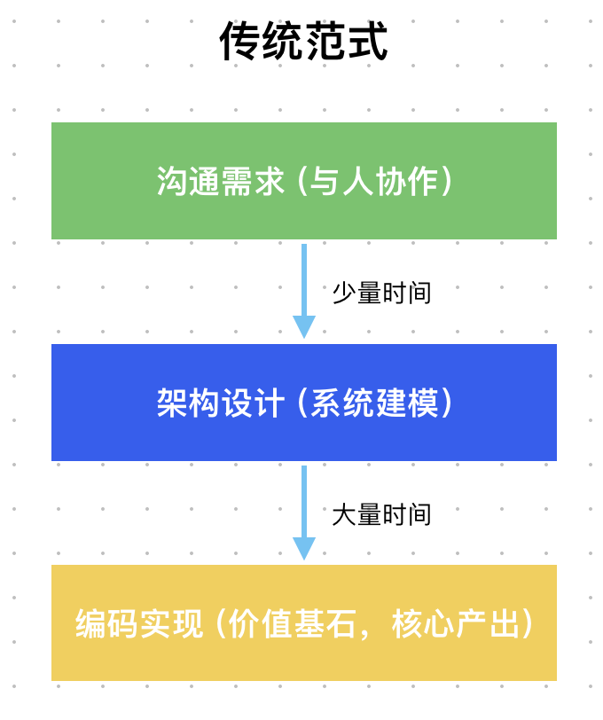
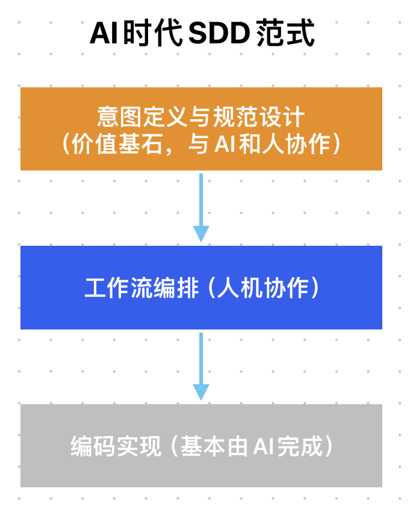

+++
date = '2026-03-18T00:21:42+08:00'
title = 'AI原生时代的全新开发范式-SDD方法论详解'
+++

SDD（Spec-Driven Development），规范驱动开发，是AI原生时代一种全新的开发范式。

很多人初识SDD可能是通过Vibe Coding，刚入行的工程师、缺少技术背景的使用者或许仅仅把SDD当成一种工具，其实不然，在从业多年的工程师看来，**SDD这种范式对软件工程领域来说是一次巨大的突破和革新，也是AI原生时代研发工作的＂第一性原理＂**。

下面，跟着我进行一次思维升维之旅，为你全面拆解SDD方法论！

# 一、AI驱动的研发范式演进过程
首先，请让我带你回顾一下，AI爆发带来的研发范式演进过程，看看SDD是在什么背景下诞生的。

开发者都感受过 AI 的高效，但也有点感觉别扭，究其根源，在于目前我们与AI的协作模式，这种协作模式的演进，大致分为三个阶段：

## Phase 1：AI作为外部知识引擎
这是最初的协作模式，比如网页版的DeepSeek等。在这个模式下，我们把AI当做外部知识库，手动把问题或代码复制给它，再把它吐出的答案＂搬＂回来（这也是大多数普通用户的使用方式）。

每次交互，我们都是“人肉序列化器”，将复杂的场景上下文，“压缩”成文本再与AI交互。

## Phase 2：AI作为嵌入式辅助
这是当前最主流的协作模式，比如VS Code中的AI插件、或者Cursor这样的"AI原生IDE"。

AI “嵌入”到我们的IDE里，能“看到”打开的文件、能智能补全、能在侧边栏与你对话。这相比于 phase 1 是一个飞跃，极大地减少了"人肉切换"的摩擦。

但是，这个"辅助"依然有着局限性：

- 视野受限：它的上下文，局限在"当前工作区"，对当前打开的文件理解透彻，但对整个项目架构、服务间的依赖等认知不足，缺少全局视野。
- 环境绑定、行动受限：它的行动被囚禁在IDE上下文环境中，无法作为一个独立代理被部署到任意环境去执行任务，如CI/CD流水线、远程服务器环境等。

phase 2极大增强了我们的编码能力，但本质上仍未脱离“辅助开发者”的范畴，是许多人停留的"局部最优解"。

## Phase 3：AI作为原生工作流的智能体
这个阶段，AI从"被动辅助"变成了能"主动"工作的智能体，它能够感知项目全局、能理解人类意图并自主分解成一系列具体执行步骤（如重构这个包）、能利用工具与环境交互（跑shell命令、写文件等）。

AI成为了将人类意图转化为一系列实际行动的"执行者"，典型代表，就是以Claude Code为首的CLI AI Agent（命令行AI智能体）。

SDD正是在Phase 3背景下提出的人机协同研发的一种全新范式。

# 二、软件工程中"信息的丢失"问题
深入 SDD 之前，我们先看一个软件行业几十年来的根本矛盾：人类意图与代码实现之间的巨大鸿沟。

通常在开发中，各角色是这样协作的：

- 产品经理 把业务过程 翻译成 用人类语言描述的PRD（需求文档）。
- 架构师 把PRD 翻译成 技术设计方案。
- 开发者 再把技术设计方案 翻译成 一行行代码。

这个逐步"翻译"的过程，充满了"信息的丢失"，人类语言的歧义、主观臆断等。比如，产品说"这个按钮点了要立马能显示"，开发者可能理解成"API响应时间小于200ms"，也可能忽略了这句话。

更麻烦的是，文档（PRD、技术方案等）与最终的代码，基本上是脱节的。项目在迭代，代码飞速向前，而文档的更新"看心情"，最终文档在角落慢慢腐朽，成为"代码考古"的障碍。

数十年来，人们发明了UML、敏捷、Scrum等各种方法和工具，想缝合这条鸿沟，收效甚微。我们始终认为：**文档只是"指南"，代码才是"真理"！
**

AI时代的爆发，给了我们颠覆这个"真理"的机会。

# 三、SDD：规范(Spec)成为"真理之源"
SDD实现了一次**"权利反转"**，其核心思想就一句话：**规范才是"真理之源"**。

SDD范式，是代码服务于规范，那份无歧义、可被机器理解的、结构化的"规范"，成为项目唯一的至高无上的"真理之源"。而代码，则降级为"真理之源"在某种特定技术栈（如Java + SpringBoot + Mysql）下的编译产物。如下图所示：

在这场"权利反转"中：

- 项目的核心："修改代码" 变成 "维护规范"。
- 重构的核心："大规模迁移代码" 变成 "基于同一份规范，生成另一个技术栈的全新实现方式"。
- 解决bug的核心："修正错误代码" 变成 "修正错误的规范"。

要实现上述"权利反转"，"规范"必须具备一个特性：**能被机器理解和执行**。这就是 AI Agent 要扮演的新角色：**"编译"人类的意图**。

# 四、AI Agent：编译人类意图
这里的“编译”不是指将高级编程语言（如 Java）转换为字节码。

在AI原生的开发范式中，“编译”是指由 AI 驱动，将模糊的人类意图，逐步转换细化为精确的、结构化的可执行指令（代码）的全过程。在这个过程中，AI Agent进行了多种"编译"：

- 编译需求：你用人类语言描述模糊想法，AI"编译"成一份澄清后的、无歧义的、结构化的需求规范（spec.md）。
- 编译技术方案：将需求规范和具体的技术栈（如Java）结合，"编译"成一份详细的技术方案规划（plan.md）。
- 编译任务：把技术方案规划，"编译"成一份带依赖关系的、也有可并行的、原子化的任务列表集合（tasks.md）。
- 编译代码（生成）：最后，AI根据任务列表集合，生成最终的可执行代码。

# 五、SDD方法论详解："四步走"
现在，让我们来看看SDD的通用工作流，主要分为4个步骤：

## 第一步：定义意图
- 目的：澄清"做什么"（what）。
- 输入：人类的模糊想法。
- 活动：人机对话进行头脑风暴，澄清需求，确定验收标准。
- 输出：需求规范 spec.md。spec.md中只有功能需求、用户故事、验收标准，**和技术实现完全解耦**，是后续所有步骤的唯一输入。

## 第二步：技术方案规划
- 目的：决定"如何做"（how）。
- 输入：需求规范 spec.md，开发者提供的具体技术栈。
- 活动：AI基于spec.md和具体技术栈，进行技术选型、架构设计、结构划分、API设计等。
- 输出：技术方案 plan.md，及其他相关设计文档（如 model.md、api.json 等）。

## 第三步：任务拆解
- 目的：将"如何做"拆解为"一步一步的任务"。
- 输入：技术方案 plan.md，及其他相关设计文档。
- 活动：AI分析plan.md，拆解成一系列带依赖关系的、原子化的、具体的开发任务。
- 输出：任务列表 tasks.md。

## 第四步：自动实现
- 目的：完成所有任务，输出最终产物。
- 输入：任务列表 tasks.md。
- 活动：AI根据 tasks.md 执行任务，生成代码、执行测试等。开发者的职责变成了监督、审批、验收。
- 输出：代码、单元测试、可执行程序等。

上述4个步骤，构成了从“人类意图”到“落地实现”的完整链条。

# 六、SDD的一个杰出实现：spec-kit
业界领先的开源项目：spec-kit（https://github.com/github/spec-kit）是SDD方法论的一个杰出实现。它通过一系列标准命令来实现上述4个步骤，我们来看一个例子。

1. **人类的意图输入（/speckit.specify）**：你通过/speckit.specify命令 告诉AI 你的一个模糊想法 "我想要开发一个图片管理工具……"。此时AI作为产品经理，跟你互动对话，把你的想法逐步"编译"成需求规范spec.md。
2. **技术方案规划（/speckit.plan）**：你通过/speckit.plan命令 告诉AI "根据刚才生成的spec.md，我想用Vue框架来做前端…...用SpringBoot做后端…..."。此时AI作为架构师，把spec.md和具体技术栈结合，"编译"成一份详细的技术方案plan.md。
3. **生成任务列表（/speckit.tasks）**：你执行 /speckit.tasks 命令（不需要参数）。此时AI作为技术leader，它根据 plan.md，将其"编译"为一系列带依赖关系的、具体的原子化任务，生成任务列表task.md。
4. **执行（/speckit.implement）**：你执行 /speckit.implement 命令（不需要参数）。此时AI作为程序员，严格按照tasks.md中的任务，生成代码、执行测试等，最终交付一套可执行的代码、程序。

# 七、SDD带来的价值倒转：开发者的价值演进
由此可见，AI时代的SDD研发范式，使得开发者的角色和价值，发生了惊人的"倒转"。

传统范式下：

- **价值基石是"编码"**：我们花大量时间（70%、80%）写代码，**代码能力**是我们开发者的核心价值。
- **中间是"架构设计"**：花部分时间进行系统设计。
- **上层是"沟通需求"**：我们花费少量时间与产品沟通，澄清需求，明确"做什么"。

这种范式下，越具体、离机器越近的工作，成了我们开发者的主要工作，也是我们的核心壁垒。

"倒转"后：

- **价值基石是"意图定义与规范设计"**：我们开发者最有价值的工作，向上迁移，变成了去定义那个"清晰的意图"。与产品经理一起，在AI的帮助下，把模糊的业务想法"编译"成一份准确的规范。
- **中间是"工作流编排"**：此时，我们开发者的主要工作变成了设计人机协作流程，如何把最佳实践封装成AI可以重复调用的工具？如何设计测试流程以确保质量？如何设计代码审查流程？这也是我们开发者新的价值区间。
- **最后是"AI编码"**：写代码并没有消失，我们开发者写少量的核心代码，大部分代码工作由AI自动完成，开发者更多的花时间"审查与验收"AI生成的代码。

这种"价值倒转"，是我们开发者在AI时代寻找我们自身新的定位与新的价值体现，**这不是一种取代，而是推动我们"向上走'，去思考、去从事那些更贴近业务、更有创造力的工作**。

# 八、SDD范式：AI时代-软件工程的未来
所以，AI时代的SDD范式，不仅是一种新的方法论，更是与AI原生能力天然契合的"核心引擎"。

- **SDD加速了软件的"迭代"**：传统范式下，变需求意味着昂贵的改代码成本。SDD范式下，"业务"被映射在spec.md中，改需求只用改规范，然后快速"编译"新的实现。软件的迭代，从"天/周"级别，可能提升到"分钟/小时"级别，这才是"真正的敏捷"。
- **SDD创造了"活的文档"**：需求规范 spec.md 成为唯一的"真理之源"时，"文档与代码不一致"这个毒瘤才彻底根除。活的文档=规范=代码=最终实现。
- **SDD最终赋能开发者**：SDD把开发者从代码细节中解放出来，让我们有更多精力去参与更有价值的工作，如业务讨论、工作流优化等。

当然，现在要实现一套100%的SDD流程，仍然有着制约和门槛，比如大语言模型在处理长任务、复杂推理时没有那么高的稳定性，AI Agent的上下文感知受限等。但我们能清晰的看到，SDD是AI时代研发终局的蓝图，是必然的未来！

---

**感谢你点开这篇文章，欢迎关注我的公众号：10年码农，纯技术分享，一起在AI时代探索未来！**

---

**客官您满意的话，感谢打赏。**

